# 使用示例与最佳实践

<cite>
**本文档引用的文件**
- [README.md](file://README.md)
- [mootdx_worklog.md](file://mootdx_worklog.md)
- [113678_daily.json](file://113678_daily.json)
- [113678_detail.json](file://113678_detail.json)
- [603220_detail.json](file://603220_detail.json)
- [113678_f10.json](file://113678_f10.json)
- [113678_f10_summary.json](file://113678_f10_summary.json)
- [113678_f10_raw.md](file://113678_f10_raw.md)
- [get_f10.py](file://get_f10.py)
- [extract_f10_fields.py](file://extract_f10_fields.py)
</cite>

## 更新摘要
**变更内容**
- 新增F10数据获取和处理功能的完整使用示例
- 添加可转债财务数据提取的最佳实践指南
- 更新数据处理流程和输出格式说明
- 增强错误处理和异常管理指导
- 完善性能优化和安全使用建议

## 目录
1. [简介](#简介)
2. [项目结构](#项目结构)
3. [核心组件](#核心组件)
4. [架构概览](#架构概览)
5. [详细组件分析](#详细组件分析)
6. [F10数据处理流程](#f10数据处理流程)
7. [依赖关系分析](#依赖关系分析)
8. [性能考虑](#性能考虑)
9. [故障排除指南](#故障排除指南)
10. [结论](#结论)
11. [附录](#附录)

## 简介

mootdx是一个Python库，专门用于获取和处理通达信金融数据。该项目提供了多种数据获取方式，包括离线数据读取、在线行情获取和财务数据下载等功能。本文档旨在为不同技术水平的用户提供完整的使用示例和最佳实践指南，特别强化了F10数据处理功能的使用指导。

## 项目结构

该项目采用简洁的文件组织结构，主要包含以下几类文件：

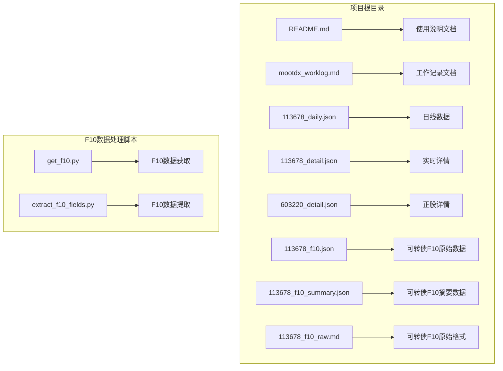

**图表来源**
- [README.md:1-129](file://README.md#L1-L129)
- [mootdx_worklog.md:1-134](file://mootdx_worklog.md#L1-L134)
- [get_f10.py:1-75](file://get_f10.py#L1-L75)
- [extract_f10_fields.py:1-228](file://extract_f10_fields.py#L1-L228)

**章节来源**
- [README.md:1-129](file://README.md#L1-L129)
- [mootdx_worklog.md:1-134](file://mootdx_worklog.md#L1-L134)

## 核心组件

### 数据获取模块

mootdx提供了三个主要的数据获取模块：

1. **Reader模块** - 用于离线通达信数据读取
2. **Quotes模块** - 用于在线行情数据获取
3. **Affair模块** - 用于财务数据下载

### F10数据处理模块

**新增** 项目现在包含专门的F10数据处理功能：

1. **get_f10.py** - 获取F10原始数据并保存为结构化JSON格式
2. **extract_f10_fields.py** - 从F10数据中提取关键字段，输出干净的JSON摘要

### 数据类型

项目展示了多种数据类型的结构：

| 数据类型 | 文件示例 | 描述 |
|---------|----------|------|
| 日线数据 | 113678_daily.json | K线数据，包含开盘、收盘、最高、最低价 |
| 实时详情 | 113678_detail.json | 当前市场报价详情 |
| F10原始数据 | 113678_f10.json | 可转债完整财务数据，包含多个分类 |
| F10摘要数据 | 113678_f10_summary.json | 清洗后的关键字段摘要 |
| F10原始格式 | 113678_f10_raw.md | Markdown格式的原始F10数据 |

**章节来源**
- [README.md:61-112](file://README.md#L61-L112)
- [mootdx_worklog.md:26-94](file://mootdx_worklog.md#L26-L94)

## 架构概览

mootdx采用模块化的架构设计，支持多种数据源和获取方式：

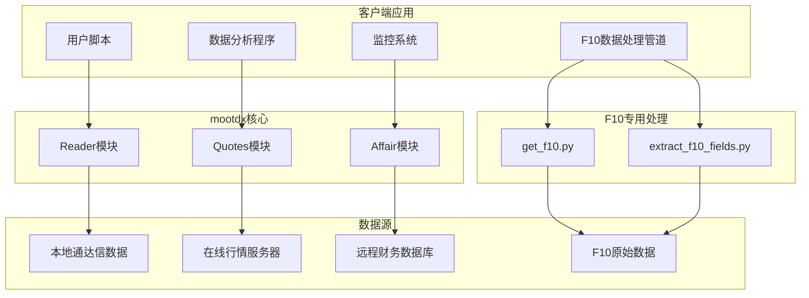

**图表来源**
- [README.md:61-112](file://README.md#L61-L112)
- [get_f10.py:1-75](file://get_f10.py#L1-L75)
- [extract_f10_fields.py:1-228](file://extract_f10_fields.py#L1-L228)

## 详细组件分析

### Reader模块使用示例

Reader模块适用于离线数据读取，支持多种数据类型的获取：

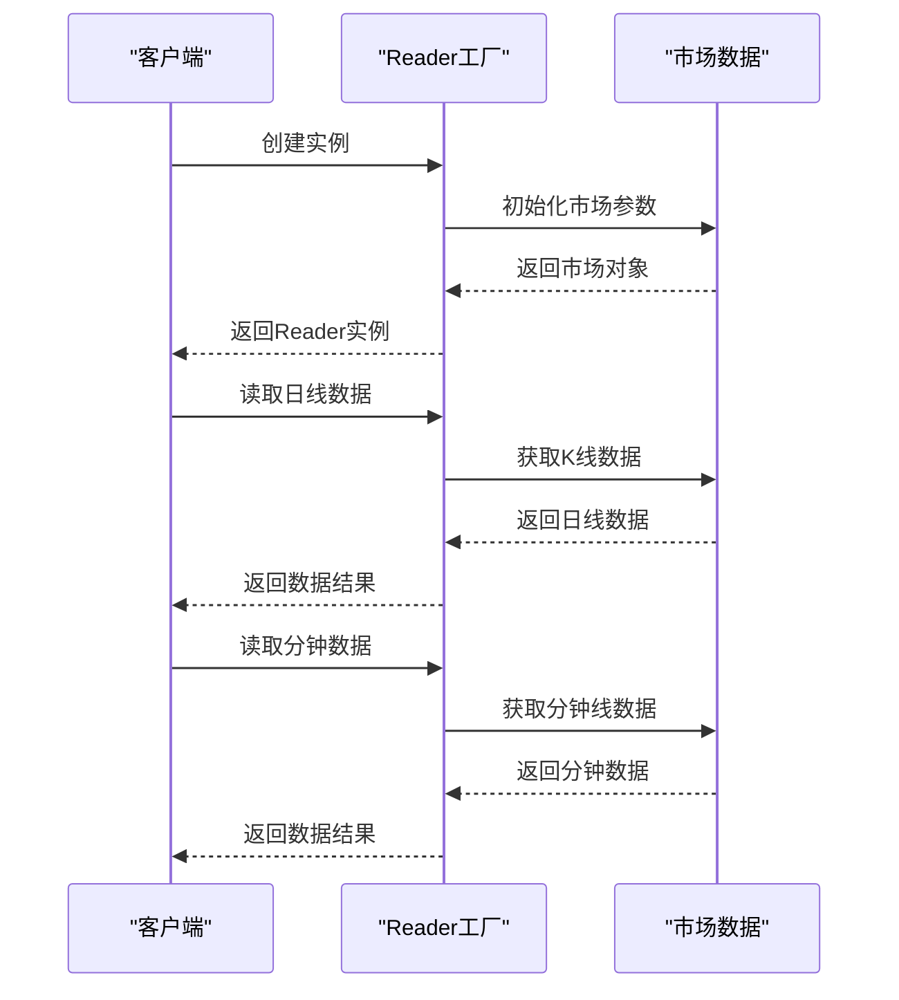

**图表来源**
- [README.md:61-79](file://README.md#L61-L79)

### Quotes模块使用示例

Quotes模块提供在线行情数据获取功能：

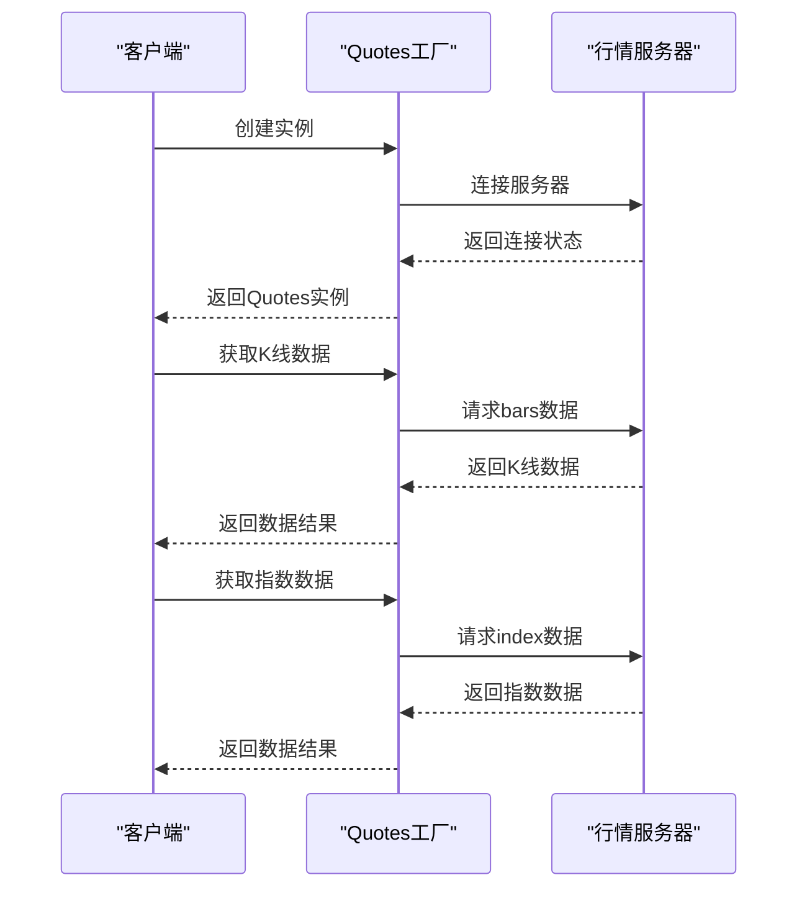

**图表来源**
- [README.md:81-97](file://README.md#L81-L97)

### Affair模块使用示例

Affair模块用于财务数据的远程获取：

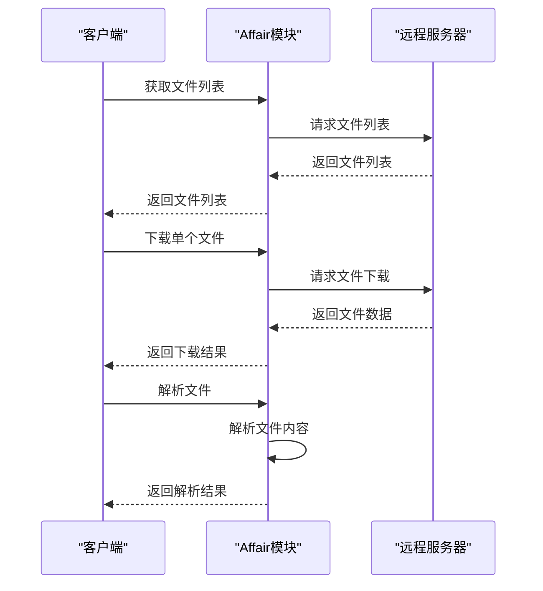

**图表来源**
- [README.md:99-112](file://README.md#L99-L112)

### 数据结构分析

#### 日线数据结构

日线数据采用JSON格式存储，包含完整的K线信息：

| 字段名 | 类型 | 描述 | 示例值 |
|--------|------|------|--------|
| open | float | 开盘价 | 130.0 |
| close | float | 收盘价 | 157.3 |
| high | float | 最高价 | 157.3 |
| low | float | 最低价 | 130.0 |
| vol | float | 成交量 | 267.0 |
| amount | float | 成交额 | 40505632.0 |
| year | int | 年份 | 2023 |
| month | int | 月份 | 11 |
| day | int | 日期 | 21 |
| hour | int | 小时 | 15 |
| minute | int | 分钟 | 0 |
| datetime | string | 标准日期时间 | "2023-11-21 15:00:00" |
| volume | float | 成交量 | 267.0 |

#### 实时详情数据结构

实时详情包含市场报价和买卖盘信息：

| 字段名 | 类型 | 描述 | 示例值 |
|--------|------|------|--------|
| market | int | 市场代码 | 1 |
| code | string | 证券代码 | "113678" |
| price | float | 当前价格 | 195.25 |
| last_close | float | 昨收价 | 191.97500000000002 |
| open | float | 开盘价 | 190.45600000000002 |
| high | float | 最高价 | 197.0 |
| low | float | 最低价 | 190.45600000000002 |
| vol | float | 总成交量 | 162774 |
| amount | float | 总成交额 | 317067040.0 |
| bid1-5 | float | 买一到买五价 | 195.107, 195.092 |
| ask1-5 | float | 卖一到卖五价 | 195.204, 195.249 |
| bid_vol1-5 | float | 买一到买五量 | 5, 2 |
| ask_vol1-5 | float | 卖一到卖五量 | 23, 10 |

#### F10数据结构

**新增** F10数据采用分层结构存储：

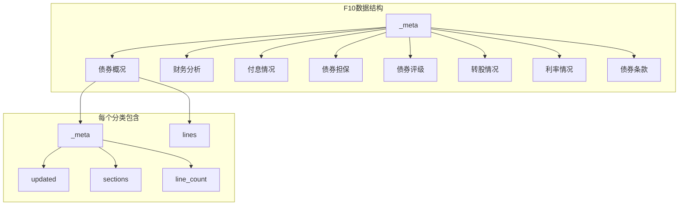

**图表来源**
- [113678_f10.json:1-1092](file://113678_f10.json#L1-L1092)

**章节来源**
- [mootdx_worklog.md:26-59](file://mootdx_worklog.md#L26-L59)

## F10数据处理流程

### F10数据获取流程

**新增** 项目提供了完整的F10数据处理管道：

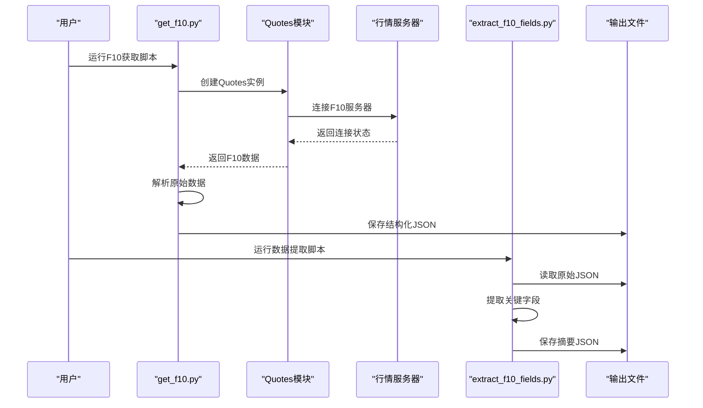

**图表来源**
- [get_f10.py:1-75](file://get_f10.py#L1-L75)
- [extract_f10_fields.py:1-228](file://extract_f10_fields.py#L1-L228)

### F10数据提取功能

**新增** extract_f10_fields.py提供了专业的数据提取功能：

1. **字段提取**：从复杂的表格数据中提取关键字段
2. **数据清洗**：去除格式化字符，提取纯文本内容
3. **数值解析**：将字符串转换为数值类型
4. **结构化输出**：生成标准化的JSON格式

#### 提取的关键字段

| 字段类别 | 提取字段 | 数据类型 | 示例值 |
|---------|----------|----------|--------|
| 基本信息 | 债券代码 | string | "113678" |
| 基本信息 | 债券简称 | string | "中贝转债" |
| 基本信息 | 交易场所 | string | "上交所" |
| 基本信息 | 发行规模(亿元) | float | 5.17 |
| 基本信息 | 最新规模(亿元) | float | 5.1079 |
| 基本信息 | 到期日期 | string | "2029-10-19" |
| 发行人信息 | 公司网址 | string | "www.whbester.com" |
| 正股信息 | 正股代码 | string | "603220" |
| 正股信息 | 正股名称 | string | "中贝通信" |
| 转股信息 | 最新转股价(元) | float | 20.54 |
| 债券条款 | 条件赎回触发比例(%) | float | 130.0 |
| 评级信息 | 最新评级 | object | {"等级":"A+","机构":"中证鹏元","日期":"2025-06-27"} |
| 公告信息 | 最新公告 | array | [{"date":"2026-05-15","title":"...","link":"..."}] |

**章节来源**
- [extract_f10_fields.py:157-205](file://extract_f10_fields.py#L157-L205)

## 依赖关系分析

### 数据依赖关系

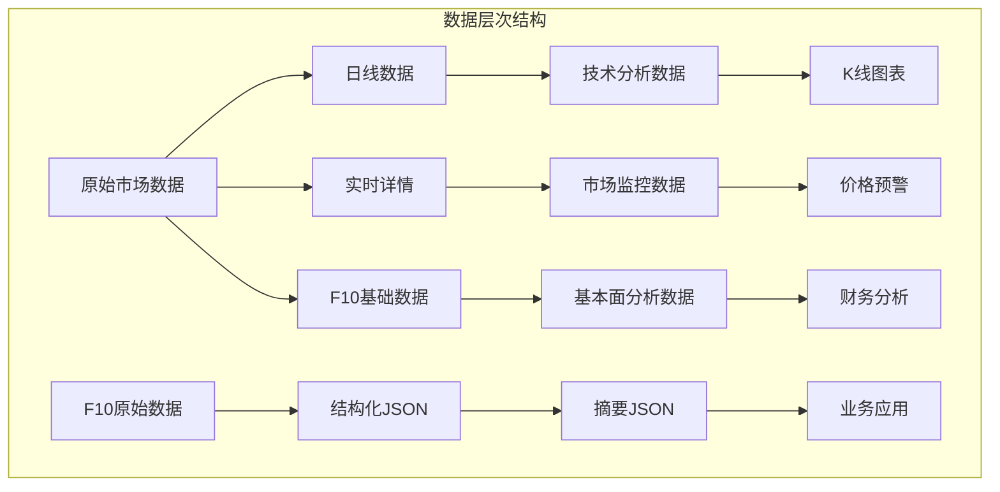

### 模块间依赖

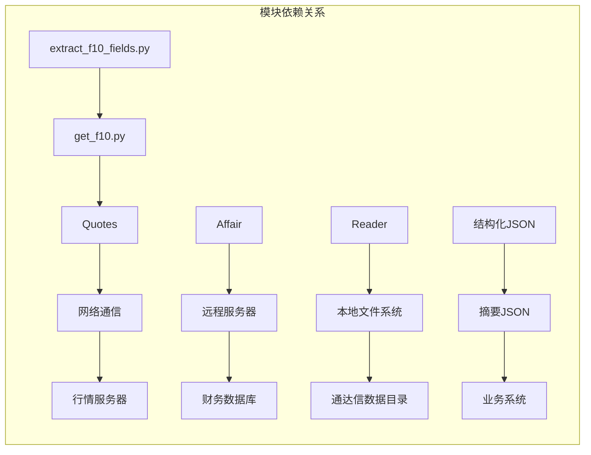

**图表来源**
- [README.md:61-112](file://README.md#L61-L112)
- [get_f10.py:7-7](file://get_f10.py#L7-L7)
- [extract_f10_fields.py:1-6](file://extract_f10_fields.py#L1-L6)

**章节来源**
- [README.md:61-112](file://README.md#L61-L112)

## 性能考虑

### 批量数据获取优化

1. **连接池管理**：对于在线数据获取，建议复用连接以减少建立连接的开销
2. **数据缓存策略**：对频繁访问的数据建立本地缓存
3. **批量请求优化**：合理设置批量大小，避免单次请求过大

### F10数据处理性能优化

**新增** 针对F10数据处理的性能优化建议：

1. **增量更新**：只处理自上次更新以来变化的数据
2. **并行处理**：利用多进程处理不同债券的F10数据
3. **内存管理**：大文件处理时采用流式读取方式
4. **缓存策略**：对解析后的结构化数据建立缓存

### 内存管理最佳实践

1. **流式处理**：对于大数据集，采用流式处理方式逐行读取
2. **数据类型优化**：选择合适的数据类型以减少内存占用
3. **及时释放资源**：确保不再使用的数据及时释放内存

### 并发处理策略

1. **异步I/O**：利用异步特性提高网络请求效率
2. **多线程处理**：合理使用多线程处理独立的数据任务
3. **队列管理**：使用队列机制平衡生产者和消费者的速度

## 故障排除指南

### 常见问题及解决方案

#### 服务器连接问题

**问题描述**：无法连接到行情服务器
**解决方案**：
1. 检查网络连接状态
2. 尝试不同的服务器地址
3. 验证防火墙设置

#### F10数据获取失败

**问题描述**：F10数据获取返回空
**解决方案**：
1. 检查Quotes实例的服务器配置
2. 验证债券代码的有效性
3. 确认网络连接状态
4. 查看服务器响应状态

#### 数据格式问题

**问题描述**：DataFrame转换为JSON时出现Timestamp类型错误
**解决方案**：
1. 使用适当的日期格式化函数
2. 确保时间戳转换为字符串格式
3. 验证数据类型兼容性

#### 扩展市场接口失效

**问题描述**：扩展市场(ext)接口无法使用
**解决方案**：
1. 使用标准市场(std)接口替代
2. 检查接口版本兼容性
3. 关注官方更新通知

### 错误处理最佳实践

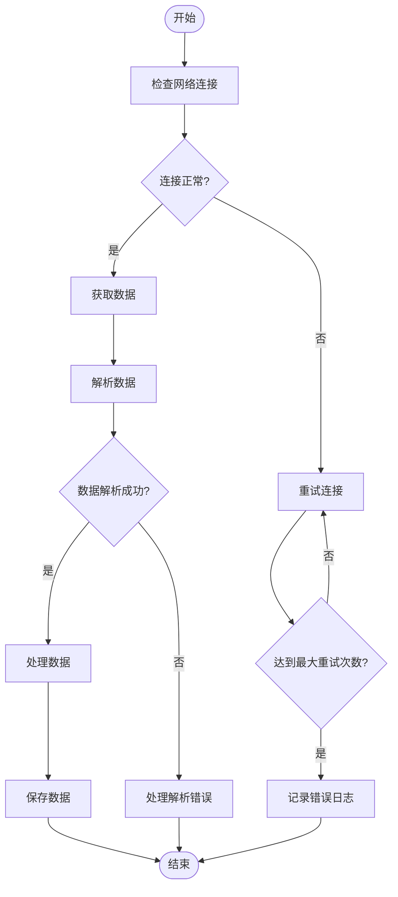

**图表来源**
- [mootdx_worklog.md:129-134](file://mootdx_worklog.md#L129-L134)

### F10数据处理错误处理

**新增** F10数据处理的特殊错误处理：

1. **文件不存在**：检查F10数据文件路径
2. **JSON解析错误**：验证JSON格式的正确性
3. **字段提取失败**：检查数据格式是否符合预期
4. **编码问题**：确保UTF-8编码处理

**章节来源**
- [mootdx_worklog.md:119-134](file://mootdx_worklog.md#L119-L134)

## 结论

mootdx为金融数据获取提供了强大而灵活的解决方案。通过合理的使用模式和最佳实践，用户可以高效地获取、处理和分析各类金融数据。特别地，新增的F10数据处理功能为可转债分析提供了完整的工具链，从原始数据获取到结构化摘要输出，涵盖了金融数据处理的全流程。

建议用户根据具体需求选择合适的模块和数据类型，并遵循本文档提供的性能优化和故障排除指导。对于F10数据处理，建议建立定期更新机制，确保数据的时效性和准确性。

## 附录

### 快速开始示例

#### 基础使用模式

```python
# 基础数据获取示例
from mootdx.reader import Reader
from mootdx.quotes import Quotes
from mootdx.affair import Affair

# 离线数据读取
reader = Reader.factory(market='std', tdxdir='C:/new_tdx')
daily_data = reader.daily(symbol='600036')

# 在线行情获取
client = Quotes.factory(market='std', multithread=True, heartbeat=True)
bars_data = client.bars(symbol='600036', frequency=9, offset=10)
```

### F10数据处理快速开始

**新增** F10数据处理的完整使用流程：

```python
# 步骤1：获取F10原始数据
# python get_f10.py

# 步骤2：提取关键字段
# python extract_f10_fields.py

# 输出文件位置：
# convertible_bond/113678_f10.json (原始数据)
# convertible_bond/113678_f10_summary.json (摘要数据)
```

### 高级应用场景

#### 批量数据处理流程

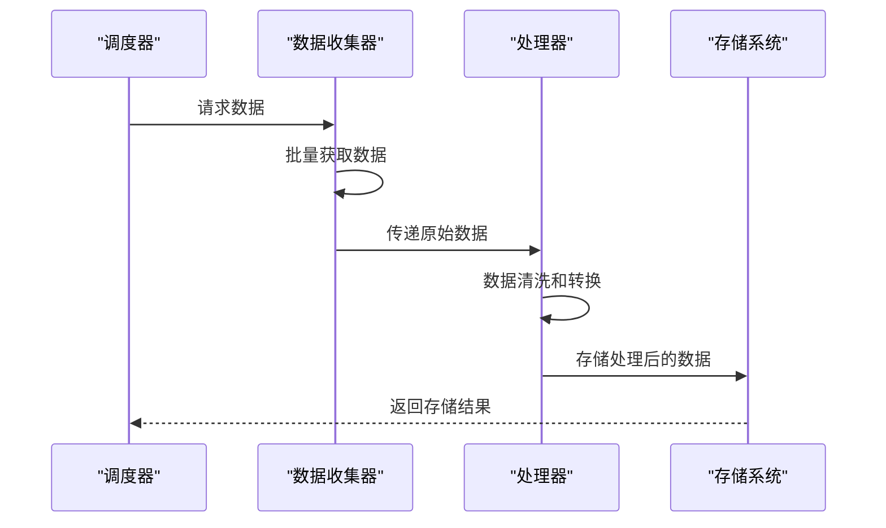

#### 数据分析管道集成

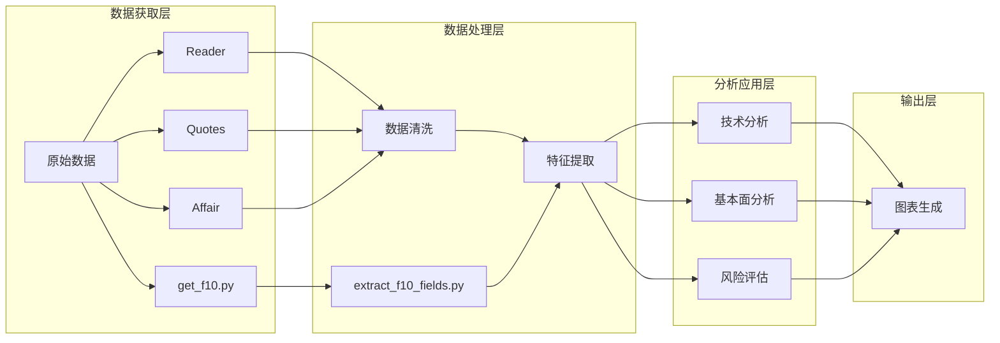

#### F10数据处理管道

**新增** 专门的F10数据处理管道：

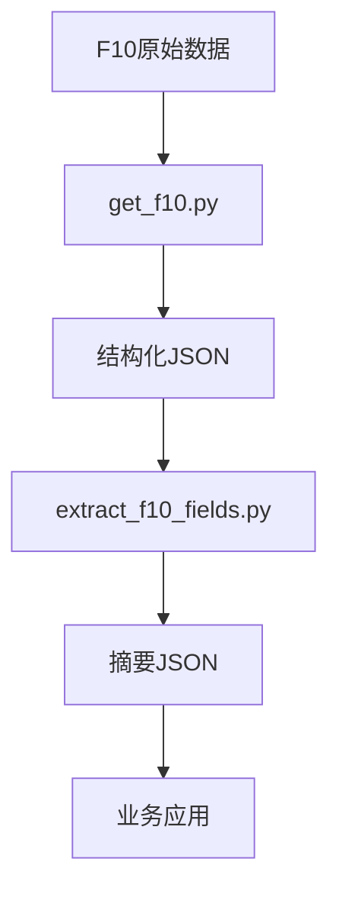

### 安全使用建议

**新增** F10数据处理的安全建议：

1. **数据保护**：敏感财务数据应加密存储
2. **访问控制**：限制对F10数据的访问权限
3. **数据备份**：定期备份重要的F10数据
4. **隐私考虑**：遵守相关数据保护法规
5. **网络安全**：使用安全的网络连接获取数据
6. **数据验证**：验证获取数据的完整性和准确性

### 性能优化技巧

**新增** F10数据处理的性能优化：

1. **缓存机制**：缓存已解析的F10数据
2. **增量处理**：只处理变化的数据
3. **并行处理**：多进程处理多个债券的F10数据
4. **内存优化**：大文件采用流式处理
5. **网络优化**：合理设置超时和重试机制
6. **磁盘I/O优化**：批量写入文件，减少磁盘操作