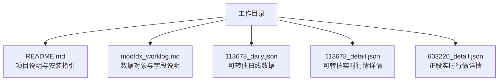
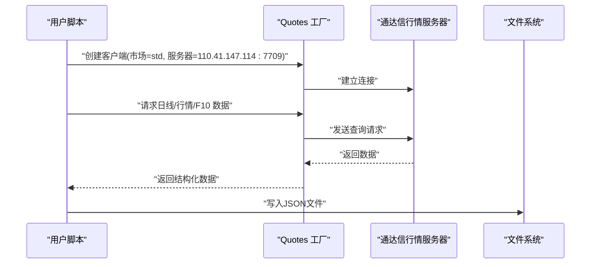

# 快速开始

<cite>
**本文引用的文件**
- [README.md](file://README.md)
- [mootdx_worklog.md](file://mootdx_worklog.md)
- [113678_daily.json](file://113678_daily.json)
- [113678_detail.json](file://113678_detail.json)
- [603220_detail.json](file://603220_detail.json)
- [mootdx_cloudbase_deployment_report.md](file://mootdx_cloudbase_deployment_report.md)
</cite>

## 目录
1. [简介](#简介)
2. [项目结构](#项目结构)
3. [核心组件](#核心组件)
4. [架构概览](#架构概览)
5. [详细组件分析](#详细组件分析)
6. [依赖分析](#依赖分析)
7. [性能考虑](#性能考虑)
8. [故障排除指南](#故障排除指南)
9. [结论](#结论)
10. [附录](#附录)

## 简介
本指南面向首次接触 mootdx 数据获取库的新用户，帮助你在约 30 分钟内完成环境准备、安装库、运行第一个数据获取示例，并理解数据文件的命名规则与基本结构。你将学会：
- 准备 Python 3.8+ 运行环境
- 安装 mootdx 库（推荐使用包含所有扩展依赖的方式）
- 连接通达信行情服务器，获取 A 股市场数据、可转债与正股的实时行情
- 将结果保存为 JSON 文件
- 识别数据文件命名规则与字段含义

## 项目结构
当前工作目录包含一个最小化的示例集合，展示了可转债与正股的实时行情与日线数据文件，便于快速理解数据形态与命名规范。

图表来源
- [README.md:1-129](file://README.md#L1-L129)
- [mootdx_worklog.md:1-134](file://mootdx_worklog.md#L1-L134)
- [113678_daily.json:1-800](file://113678_daily.json#L1-L800)
- [113678_detail.json:1-50](file://113678_detail.json#L1-L50)
- [603220_detail.json:1-50](file://603220_detail.json#L1-L50)

章节来源
- [README.md:1-129](file://README.md#L1-L129)
- [mootdx_worklog.md:1-134](file://mootdx_worklog.md#L1-L134)

## 核心组件
- mootdx 库：提供通达信离线与在线数据读取能力，包括行情、K 线、财务与 F10 等数据接口。
- 通达信行情服务器：默认使用标准市场（std），端口 7709，IP 范围包括 110.41.147.x、123.125.108.x 等。
- 数据文件：以“代码.json”命名，如 113678_daily.json、113678_detail.json、603220_detail.json 等；日线数据为数组结构，行情详情为键值对结构。

章节来源
- [README.md:24-54](file://README.md#L24-L54)
- [mootdx_worklog.md:9-24](file://mootdx_worklog.md#L9-L24)

## 架构概览
mootdx 的典型数据获取流程如下：应用通过 mootdx 的 Quotes 工厂创建客户端，连接通达信行情服务器，发起查询请求，返回结构化数据后保存为 JSON 文件。

图表来源
- [mootdx_worklog.md:97-127](file://mootdx_worklog.md#L97-L127)
- [README.md:81-97](file://README.md#L81-L97)

## 详细组件分析

### 环境准备与安装
- Python 版本：3.8 及以上
- 安装方式：推荐使用包含所有扩展依赖的安装命令，便于一次性满足各类功能需求
- 升级安装：若已有旧版本，可通过升级命令统一更新

章节来源
- [README.md:24-54](file://README.md#L24-L54)

### 第一个数据获取示例（完整流程）
以下为“第一个示例”的步骤说明，涵盖连接服务器、设置参数、获取数据与保存文件的全流程。你可以按此顺序在本地运行，或参考示例代码片段路径进行对照。

- 连接服务器
  - 使用 Quotes 工厂创建客户端，指定市场为标准市场（std），并设置服务器地址与端口
  - 示例代码片段路径：[连接服务器:97-103](file://mootdx_worklog.md#L97-L103)

- 获取日线数据
  - 通过 bars 方法获取日线数据，频率参数使用 9 表示日线，offset 控制返回条数
  - 示例代码片段路径：[获取日线数据:105-109](file://mootdx_worklog.md#L105-L109)

- 获取实时行情详情
  - 通过 quotes 方法获取指定代码的实时行情详情
  - 示例代码片段路径：[获取行情详情:111-115](file://mootdx_worklog.md#L111-L115)

- 获取 F10 详细数据
  - 通过 F10 方法获取可转债与正股的 F10 详情，返回字典结构，包含多个分类
  - 示例代码片段路径：[获取 F10 详细数据:117-127](file://mootdx_worklog.md#L117-L127)

- 保存数据到文件
  - 将返回的数据结构序列化为 JSON 并写入文件，文件名为“代码.json”
  - 示例文件命名：113678_daily.json、113678_detail.json、603220_detail.json

章节来源
- [mootdx_worklog.md:97-127](file://mootdx_worklog.md#L97-L127)
- [README.md:81-97](file://README.md#L81-L97)

### 数据文件命名规则与基本结构
- 命名规则
  - 文件名采用“代码.json”的形式，如 113678_daily.json、113678_detail.json、603220_detail.json
  - 日线数据文件通常包含大量历史记录，行情详情文件为单条记录

- 日线数据结构（daily.json）
  - 字段包括开盘价、收盘价、最高价、最低价、成交量、成交额、时间分解字段（year/month/day/hour/minute）、标准日期时间、成交量等
  - 示例字段说明：[日线数据字段说明:28-41](file://mootdx_worklog.md#L28-L41)

- 行情详情结构（detail.json）
  - 字段包括市场代码、证券代码、当前价格、昨收价、开盘价、最高价、最低价、成交量、成交额、买卖盘口（bid/ask）与量（bid_vol/ask_vol）等
  - 示例字段说明：[行情详情字段说明:42-59](file://mootdx_worklog.md#L42-L59)

- F10 数据结构
  - 可转债 F10：债券概况、财务分析、付息情况、债券担保、债券评级、转股情况、利率情况、债券条款、债券公告等分类
  - 正股 F10：最新提示、公司概况、财务分析、股本结构、股东研究、机构持股、分红融资、高管治理、资金动向、资本运作、热点题材、公司公告、公司报道、经营分析、行业分析、研报评级等分类
  - 示例分类说明：[可转债 F10:60-73](file://mootdx_worklog.md#L60-L73)、[正股 F10:74-94](file://mootdx_worklog.md#L74-L94)

- 示例文件
  - 日线数据示例：[113678_daily.json:1-800](file://113678_daily.json#L1-L800)
  - 可转债实时行情详情示例：[113678_detail.json:1-50](file://113678_detail.json#L1-L50)
  - 正股实时行情详情示例：[603220_detail.json:1-50](file://603220_detail.json#L1-L50)

章节来源
- [mootdx_worklog.md:16-94](file://mootdx_worklog.md#L16-L94)
- [113678_daily.json:1-800](file://113678_daily.json#L1-L800)
- [113678_detail.json:1-50](file://113678_detail.json#L1-L50)
- [603220_detail.json:1-50](file://603220_detail.json#L1-L50)

### 常见使用示例
- 通达信离线数据读取（Reader）
  - 适用于读取本地通达信离线数据，支持日线、分钟线、时间线等
  - 示例代码片段路径：[离线数据读取示例:61-79](file://README.md#L61-L79)

- 通达信线上行情读取（Quotes）
  - 适用于在线获取行情、K 线、指数、分钟数据等
  - 示例代码片段路径：[线上行情读取示例:81-97](file://README.md#L81-L97)

- 通达信财务数据读取（Affair）
  - 适用于远程文件列表、下载与解析财务数据
  - 示例代码片段路径：[财务数据读取示例:99-112](file://README.md#L99-L112)

章节来源
- [README.md:61-112](file://README.md#L61-L112)

## 依赖分析
- 运行环境
  - 操作系统：Windows / macOS / Linux
  - Python：3.8 及以上版本

- 安装方式
  - 核心依赖安装：pip install 'mootdx'
  - 命令行依赖安装：pip install 'mootdx[cli]'
  - 所有扩展依赖安装：pip install 'mootdx[all]'（推荐新手）

- 升级安装
  - pip install -U tdxpy mootdx 或 pip install -U 'mootdx[all]'

- 依赖兼容性与风险点
  - 关键依赖 py-mini-racer 需要 V8 引擎，Linux 环境建议使用多阶段构建或预编译 wheel
  - 网络访问：通达信服务器使用 TCP 协议，端口 7709，部分服务器可能对非国内 IP 有限制

章节来源
- [README.md:24-54](file://README.md#L24-L54)
- [mootdx_cloudbase_deployment_report.md:65-177](file://mootdx_cloudbase_deployment_report.md#L65-L177)

## 性能考虑
- 多服务器自动切换：当某个服务器不可用时，自动尝试其他服务器，提升稳定性
- 多线程与心跳：启用多线程与心跳机制，提高并发与连接稳定性
- 缓存策略：对高频查询结果进行缓存，减少重复请求
- 重试机制：对网络异常进行指数退避重试，降低失败概率

章节来源
- [mootdx_cloudbase_deployment_report.md:1345-1407](file://mootdx_cloudbase_deployment_report.md#L1345-L1407)

## 故障排除指南
- PyMiniRacer 安装问题
  - 症状：在 Linux 环境安装 py-mini-racer 失败
  - 解决方案：使用多阶段构建，在构建阶段先安装 py-mini-racer，再安装其余依赖；或使用预编译 wheel
  - 参考路径：[依赖风险与解决方案:82-114](file://mootdx_cloudbase_deployment_report.md#L82-L114)

- 网络访问限制
  - 症状：无法连接到通达信服务器或连接不稳定
  - 解决方案：确认出站访问允许；实现多服务器自动切换；在代码中增加重试与健康检查
  - 参考路径：[网络访问限制:106-114](file://mootdx_cloudbase_deployment_report.md#L106-L114)

- 数据格式兼容性
  - 症状：DataFrame 转 JSON 时出现时间戳类型问题
  - 解决方案：在转换前处理时间字段，确保可序列化
  - 参考路径：[注意事项:129-134](file://mootdx_worklog.md#L129-L134)

- 常见安装问题
  - 症状：安装命令执行失败或依赖冲突
  - 解决方案：优先使用 pip install -U 'mootdx[all]'；确保 Python 版本满足要求；升级 pip 与 setuptools
  - 参考路径：[安装方法:30-54](file://README.md#L30-L54)

章节来源
- [mootdx_cloudbase_deployment_report.md:82-114](file://mootdx_cloudbase_deployment_report.md#L82-L114)
- [mootdx_cloudbase_deployment_report.md:106-114](file://mootdx_cloudbase_deployment_report.md#L106-L114)
- [mootdx_worklog.md:129-134](file://mootdx_worklog.md#L129-L134)
- [README.md:30-54](file://README.md#L30-L54)

## 结论
通过本指南，你已经完成了环境准备、安装库、运行第一个数据获取示例，并理解了数据文件的命名规则与基本结构。建议在实际项目中结合多服务器自动切换、缓存与重试机制，进一步提升稳定性与性能。遇到安装或网络问题时，可参考故障排除指南中的具体方案。

## 附录
- 在线文档与社区：项目文档、镜像与问题交流渠道
- 示例代码片段路径
  - 连接服务器：[连接服务器:97-103](file://mootdx_worklog.md#L97-L103)
  - 获取日线数据：[获取日线数据:105-109](file://mootdx_worklog.md#L105-L109)
  - 获取行情详情：[获取行情详情:111-115](file://mootdx_worklog.md#L111-L115)
  - 获取 F10 详细数据：[获取 F10 详细数据:117-127](file://mootdx_worklog.md#L117-L127)
  - 离线数据读取示例：[离线数据读取示例:61-79](file://README.md#L61-L79)
  - 线上行情读取示例：[线上行情读取示例:81-97](file://README.md#L81-L97)
  - 财务数据读取示例：[财务数据读取示例:99-112](file://README.md#L99-L112)