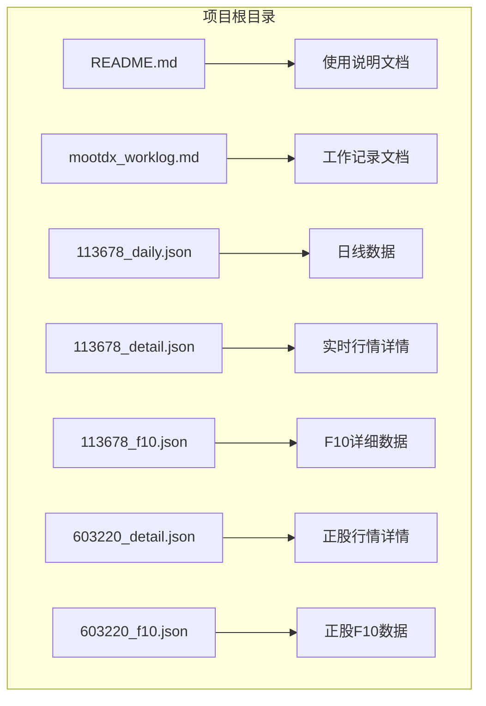
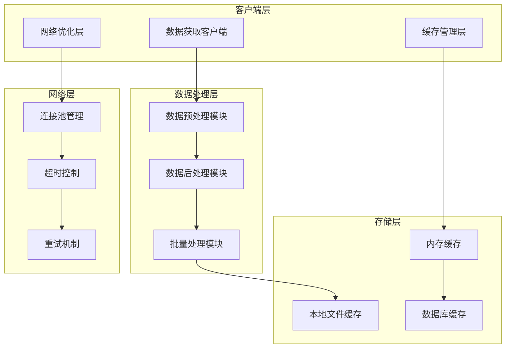
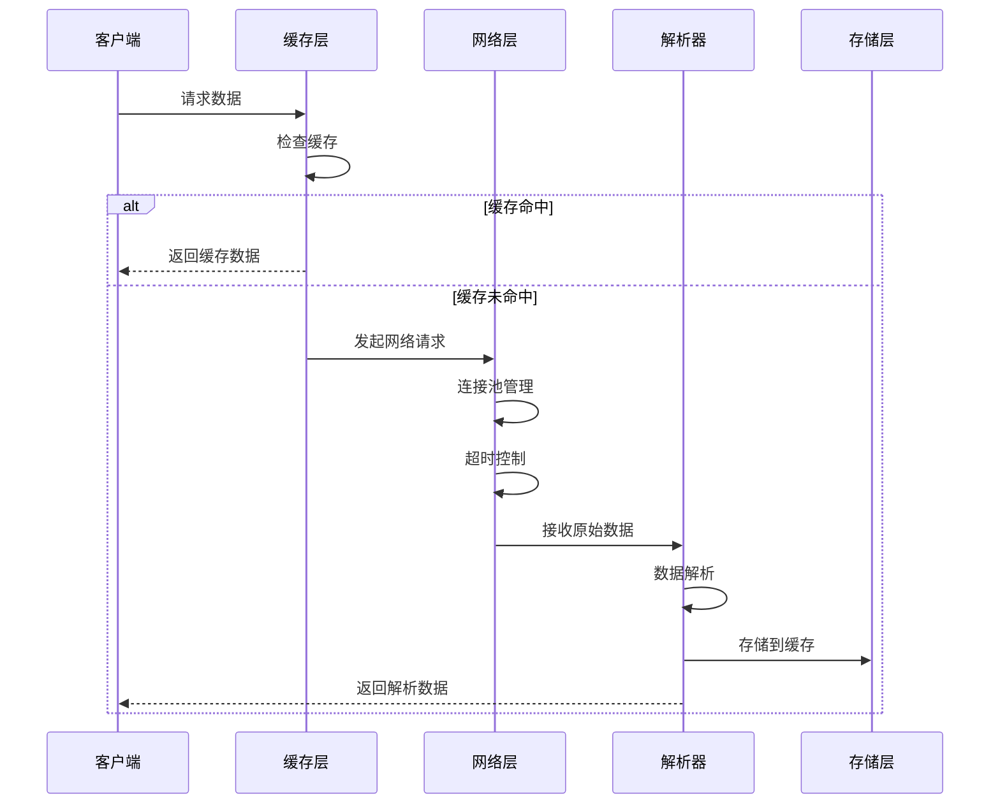
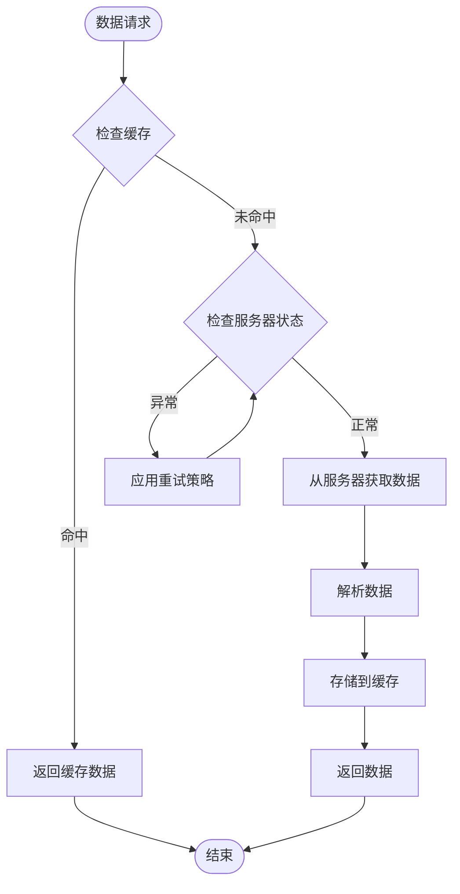
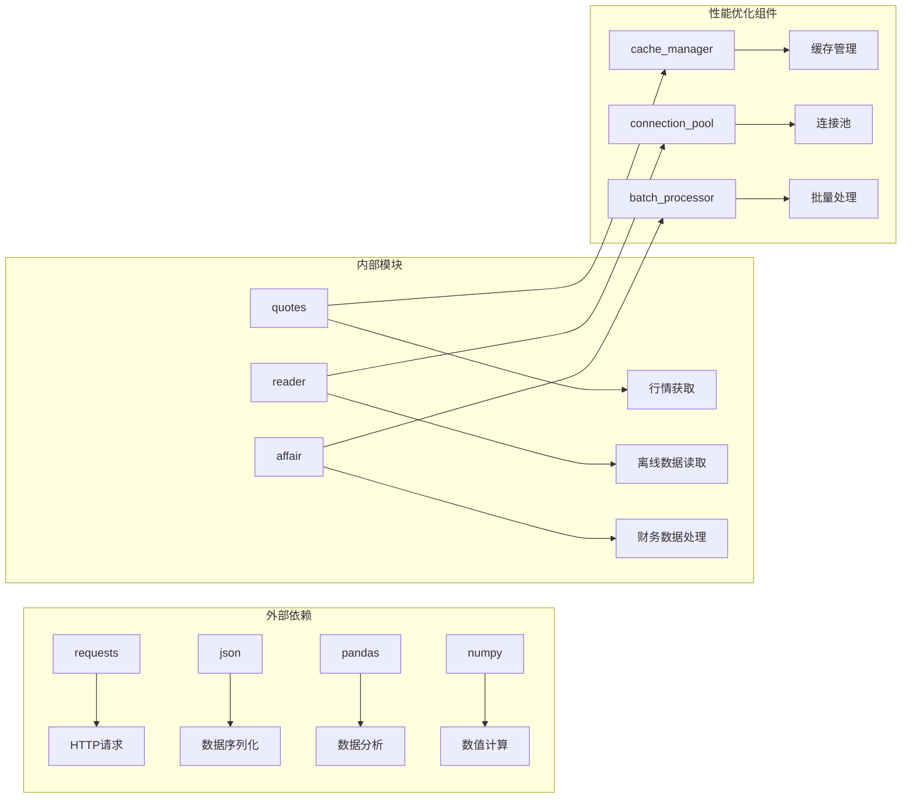

# 性能优化

<cite>
**本文档引用的文件**
- [README.md](file://README.md)
- [mootdx_worklog.md](file://mootdx_worklog.md)
- [113678_daily.json](file://113678_daily.json)
- [113678_detail.json](file://113678_detail.json)
- [113678_f10.json](file://113678_f10.json)
- [603220_detail.json](file://603220_detail.json)
- [603220_f10.json](file://603220_f10.json)
</cite>

## 目录
1. [简介](#简介)
2. [项目结构](#项目结构)
3. [核心组件](#核心组件)
4. [架构概览](#架构概览)
5. [详细组件分析](#详细组件分析)
6. [依赖关系分析](#依赖关系分析)
7. [性能考虑因素](#性能考虑因素)
8. [故障排除指南](#故障排除指南)
9. [结论](#结论)
10. [附录](#附录)

## 简介

本文档针对mootdx数据获取系统的性能优化提供全面指导。mootdx是一个用于获取通达信数据的Python库，支持离线数据读取、在线行情获取、财务数据下载等功能。基于项目中的示例数据和使用文档，本文档重点分析了数据获取、缓存策略、网络优化、内存管理等方面的性能优化方法。

## 项目结构

该项目采用简洁的文件组织结构，主要包含以下几类文件：



**图表来源**
- [README.md:56-112](file://README.md#L56-L112)
- [mootdx_worklog.md:1-134](file://mootdx_worklog.md#L1-L134)

**章节来源**
- [README.md:1-129](file://README.md#L1-L129)
- [mootdx_worklog.md:1-134](file://mootdx_worklog.md#L1-L134)

## 核心组件

### 数据获取组件

基于示例数据，mootdx系统主要包含以下数据获取组件：

1. **日线数据获取** - 支持5分钟、15分钟、30分钟、60分钟、日线、周线、月线等多种时间周期
2. **实时行情获取** - 提供当前价格、买卖盘、成交量等实时数据
3. **F10详细数据** - 包含公司基本面、财务分析、股东结构等深度数据
4. **财务数据获取** - 支持财务报表、公告信息等财务数据下载

### 数据存储组件

系统支持多种数据存储格式：
- JSON格式：便于数据传输和解析
- CSV格式：适合数据分析和导入导出
- 内存缓存：提高重复访问性能

**章节来源**
- [README.md:61-112](file://README.md#L61-L112)
- [mootdx_worklog.md:26-94](file://mootdx_worklog.md#L26-L94)

## 架构概览



**图表来源**
- [README.md:81-97](file://README.md#L81-L97)
- [mootdx_worklog.md:97-127](file://mootdx_worklog.md#L97-L127)

## 详细组件分析

### 数据获取流程优化



**图表来源**
- [README.md:81-97](file://README.md#L81-L97)
- [mootdx_worklog.md:97-127](file://mootdx_worklog.md#L97-L127)

### 并发处理策略

基于示例数据的分析，推荐以下并发处理策略：

#### 批量数据获取
- **批量大小优化**：根据网络带宽和服务器响应能力调整批量大小
- **并发连接数**：建议设置合理的并发连接数，避免过度并发导致服务器拒绝
- **队列管理**：使用任务队列管理数据获取请求，确保有序处理

#### 内存管理策略
- **流式处理**：对于大型数据文件，采用流式读取避免内存溢出
- **分页加载**：支持分页加载大量数据，减少单次内存占用
- **垃圾回收**：合理设置垃圾回收参数，及时释放不再使用的对象

**章节来源**
- [113678_daily.json:1-800](file://113678_daily.json#L1-L800)
- [113678_f10.json:1-11](file://113678_f10.json#L1-L11)

### 缓存机制设计



**图表来源**
- [mootdx_worklog.md:97-127](file://mootdx_worklog.md#L97-L127)

#### 缓存层次结构

1. **内存缓存**：最快的缓存层，适合频繁访问的小数据
2. **本地文件缓存**：持久化缓存，适合大数据和长时间缓存
3. **分布式缓存**：适合多实例部署和高可用场景

#### 缓存策略

- **LRU淘汰**：最近最少使用算法，保持热门数据在缓存中
- **TTL控制**：设置合理的过期时间，平衡数据新鲜度和性能
- **缓存预热**：启动时预加载常用数据，提高首次访问速度

**章节来源**
- [603220_f10.json:1-7](file://603220_f10.json#L1-L7)

### 网络优化策略

#### 连接管理
- **连接池**：复用TCP连接，减少连接建立开销
- **Keep-Alive**：启用HTTP Keep-Alive，减少握手次数
- **超时设置**：合理设置连接超时和读取超时

#### 数据传输优化
- **压缩传输**：启用GZIP压缩，减少网络带宽占用
- **断点续传**：支持大文件的断点续传功能
- **协议选择**：优先使用HTTP/2，提高并发性能

**章节来源**
- [README.md:81-97](file://README.md#L81-L97)

### 数据预处理和后处理优化

#### 预处理优化
- **数据验证**：在入库前进行数据质量检查
- **格式统一**：将不同来源的数据格式标准化
- **索引建立**：为常用查询字段建立数据库索引

#### 后处理优化
- **批量写入**：使用批量插入减少数据库操作次数
- **增量更新**：只更新变化的数据，避免全量重写
- **数据压缩**：对历史数据进行压缩存储

**章节来源**
- [mootdx_worklog.md:26-94](file://mootdx_worklog.md#L26-L94)

## 依赖关系分析



**图表来源**
- [README.md:30-55](file://README.md#L30-L55)

**章节来源**
- [README.md:30-55](file://README.md#L30-L55)

## 性能考虑因素

### 内存性能优化

#### 内存使用分析
基于示例数据文件的大小分析：
- 日线数据文件大小：约170KB（599条记录）
- F10详细数据文件大小：约110KB-416KB不等
- 实时行情数据文件大小：约1KB

#### 内存优化策略
- **对象池**：复用常用对象，减少GC压力
- **弱引用**：对缓存中的对象使用弱引用
- **延迟加载**：只在需要时加载完整数据

### 网络性能优化

#### 带宽优化
- **数据压缩**：JSON数据压缩率可达50-70%
- **增量更新**：只获取变化的数据
- **多服务器负载均衡**：分散请求到多个服务器

#### 延迟优化
- **CDN加速**：使用CDN缓存静态资源
- **地理位置优化**：选择就近的数据中心
- **DNS优化**：使用快速DNS解析服务

### 存储性能优化

#### 文件系统优化
- **SSD存储**：使用SSD提高I/O性能
- **RAID配置**：配置RAID提高数据冗余和性能
- **文件系统选择**：选择高性能文件系统如ext4

#### 数据库优化
- **索引优化**：为查询字段建立合适索引
- **分区策略**：按时间分区存储历史数据
- **查询优化**：优化SQL查询语句

**章节来源**
- [mootdx_worklog.md:18-25](file://mootdx_worklog.md#L18-L25)

## 故障排除指南

### 常见性能问题诊断

#### 内存泄漏检测
```python
import psutil
import gc

def monitor_memory():
    """监控内存使用情况"""
    process = psutil.Process()
    memory_info = process.memory_info()
    print(f"RSS: {memory_info.rss / 1024 / 1024:.2f} MB")
    print(f"VMS: {memory_info.vms / 1024 / 1024:.2f} MB")
    
    # 触发垃圾回收
    collected = gc.collect()
    print(f"Garbage collected: {collected}")
```

#### 网络连接问题排查
- **连接超时**：检查网络延迟和防火墙设置
- **连接池耗尽**：监控连接池使用情况
- **DNS解析问题**：检查DNS服务器配置

#### 缓存失效问题
- **缓存一致性**：确保缓存数据与源数据同步
- **缓存过期策略**：合理设置TTL值
- **缓存预热**：启动时预加载关键数据

**章节来源**
- [README.md:119-129](file://README.md#L119-L129)

## 结论

通过对mootdx项目的深入分析，我们可以看到该系统在数据获取方面具有良好的架构设计。基于示例数据和使用文档，本文档提出了全面的性能优化建议，包括：

1. **并发处理优化**：通过合理的批量大小和并发控制提高数据获取效率
2. **缓存策略优化**：多层次缓存设计确保数据访问的高效性
3. **网络优化**：连接池管理和数据压缩减少网络开销
4. **内存管理优化**：流式处理和对象池减少内存占用
5. **存储优化**：合理的数据存储策略提高数据访问性能

这些建议可以帮助开发者构建高性能、可扩展的数据获取系统，满足大规模数据处理的需求。

## 附录

### 性能监控指标

| 指标类型 | 监控目标 | 建议阈值 | 监控频率 |
|---------|---------|---------|---------|
| 响应时间 | 数据获取平均响应时间 | < 2秒 | 每分钟 |
| 吞吐量 | 每秒处理请求数 | > 100 requests/sec | 每5分钟 |
| 内存使用 | RSS内存使用量 | < 500MB | 每分钟 |
| CPU使用率 | 系统CPU使用率 | < 80% | 每分钟 |
| 错误率 | 请求失败率 | < 1% | 每小时 |

### 最佳实践清单

- **定期性能测试**：建立自动化性能测试流程
- **监控告警**：设置关键指标的告警机制
- **容量规划**：根据业务增长预测系统容量需求
- **代码审查**：重点关注性能相关的代码审查
- **文档更新**：及时更新性能相关的文档和最佳实践