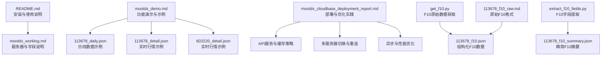
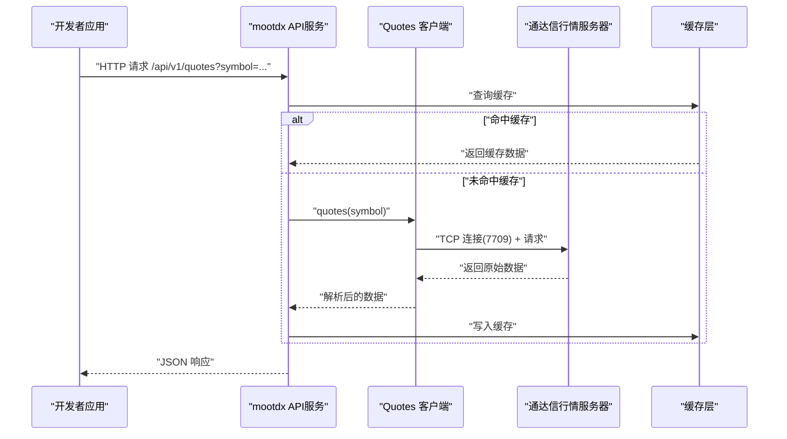
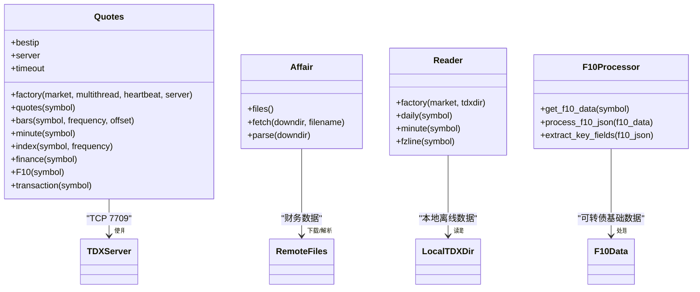
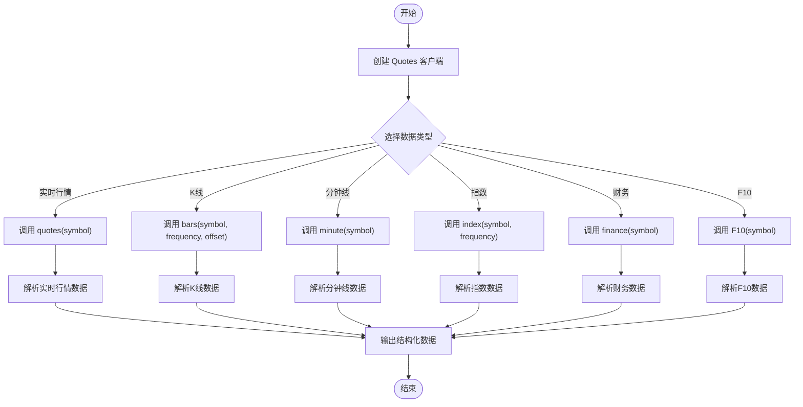
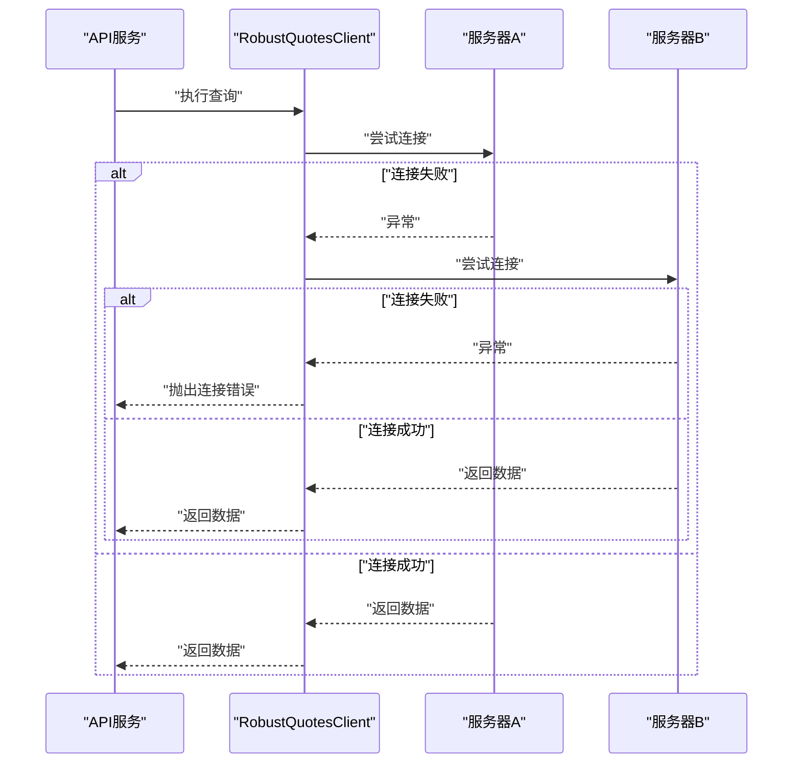
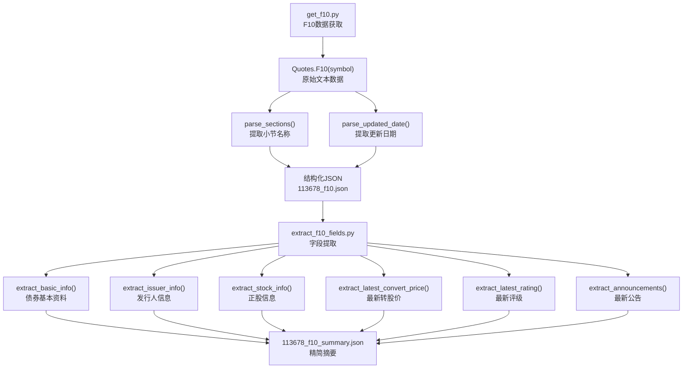
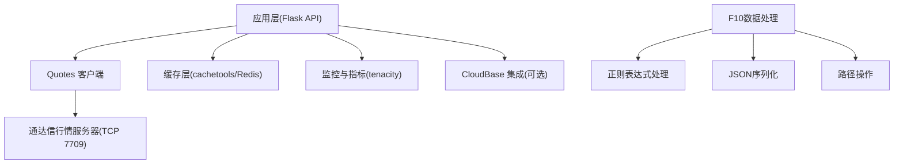

# 技术实现

<cite>
**本文引用的文件**
- [README.md](file://README.md)
- [mootdx_worklog.md](file://mootdx_worklog.md)
- [mootdx_demo.md](file://mootdx_demo.md)
- [mootdx_cloudbase_deployment_report.md](file://mootdx_cloudbase_deployment_report.md)
- [113678_daily.json](file://113678_daily.json)
- [113678_detail.json](file://113678_detail.json)
- [603220_detail.json](file://603220_detail.json)
- [get_f10.py](file://get_f10.py)
- [extract_f10_fields.py](file://extract_f10_fields.py)
- [113678_f10.json](file://convertible_bond/113678_f10.json)
- [113678_f10_summary.json](file://convertible_bond/113678_f10_summary.json)
- [113678_f10_raw.md](file://convertible_bond/113678_f10_raw.md)
</cite>

## 目录
1. [引言](#引言)
2. [项目结构](#项目结构)
3. [核心组件](#核心组件)
4. [架构总览](#架构总览)
5. [详细组件分析](#详细组件分析)
6. [F10数据提取处理流程](#f10数据提取处理流程)
7. [依赖分析](#依赖分析)
8. [性能考虑](#性能考虑)
9. [故障排查指南](#故障排查指南)
10. [结论](#结论)
11. [附录](#附录)

## 引言
本文件面向开发者，系统化阐述 mootdx 数据获取的技术实现，覆盖底层工作机制、客户端-服务器通信模式、错误处理与重连策略、性能优化、调试与故障诊断，以及扩展与定制指导。文档基于仓库中的使用说明、工作记录、演示文档与部署报告进行归纳总结，并结合示例数据文件帮助理解数据形态与字段含义。特别增加了新增的F10数据提取脚本和处理流程的详细分析。

## 项目结构
仓库包含以下关键内容：
- 使用说明与示例：README.md 提供安装、使用与常见问题说明
- 工作记录与数据字段说明：mootdx_worklog.md 记录了服务器信息、数据对象清单、字段说明与代码示例
- 功能演示与数据样例：mootdx_demo.md 展示了实时行情、K线、分钟线、指数、财务与F10等数据获取示例
- 部署与优化实践：mootdx_cloudbase_deployment_report.md 提供了API服务、缓存策略、多服务器切换、异步处理、监控与容错等工程实践
- 示例数据文件：113678_daily.json、113678_detail.json、603220_detail.json 展示了日线与实时行情数据形态
- **新增** F10数据处理：get_f10.py 和 extract_f10_fields.py 提供可转债F10数据的完整提取与处理流程

**图表来源**
- [README.md:1-129](file://README.md#L1-L129)
- [mootdx_worklog.md:1-134](file://mootdx_worklog.md#L1-L134)
- [mootdx_demo.md:1-411](file://mootdx_demo.md#L1-L411)
- [mootdx_cloudbase_deployment_report.md:218-1522](file://mootdx_cloudbase_deployment_report.md#L218-L1522)
- [get_f10.py:1-75](file://get_f10.py#L1-L75)
- [extract_f10_fields.py:1-228](file://extract_f10_fields.py#L1-L228)

**章节来源**
- [README.md:1-129](file://README.md#L1-L129)
- [mootdx_worklog.md:1-134](file://mootdx_worklog.md#L1-L134)
- [mootdx_demo.md:1-411](file://mootdx_demo.md#L1-L411)
- [mootdx_cloudbase_deployment_report.md:218-1522](file://mootdx_cloudbase_deployment_report.md#L218-L1522)
- [get_f10.py:1-75](file://get_f10.py#L1-L75)
- [extract_f10_fields.py:1-228](file://extract_f10_fields.py#L1-L228)

## 核心组件
- Quotes 客户端：负责与通达信行情服务器交互，提供实时行情、K线、分钟线、指数、财务与F10等数据获取能力；支持多线程与心跳保活
- Affair 服务：提供财务数据文件列表、下载与解析能力
- Reader：用于读取通达信本地离线数据（日线、分钟、时间线）
- **新增** F10数据处理组件：get_f10.py 负责原始F10数据获取与结构化存储，extract_f10_fields.py 负责从结构化数据中提取关键字段

**章节来源**
- [README.md:61-112](file://README.md#L61-L112)
- [mootdx_demo.md:391-411](file://mootdx_demo.md#L391-L411)
- [get_f10.py:1-75](file://get_f10.py#L1-L75)
- [extract_f10_fields.py:1-228](file://extract_f10_fields.py#L1-L228)

## 架构总览
mootdx 的典型数据获取路径如下：
- 客户端通过 Quotes.factory 创建行情客户端，选择市场、是否启用多线程与心跳
- 客户端连接通达信行情服务器（默认端口7709），发送请求并接收响应
- 服务器返回原始数据，客户端解析为结构化数据（如DataFrame或字典）
- 业务层可对数据进行缓存、裁剪与序列化，输出API响应

**图表来源**
- [mootdx_cloudbase_deployment_report.md:218-579](file://mootdx_cloudbase_deployment_report.md#L218-L579)
- [mootdx_cloudbase_deployment_report.md:757-837](file://mootdx_cloudbase_deployment_report.md#L757-L837)

**章节来源**
- [mootdx_cloudbase_deployment_report.md:218-579](file://mootdx_cloudbase_deployment_report.md#L218-L579)
- [mootdx_cloudbase_deployment_report.md:757-837](file://mootdx_cloudbase_deployment_report.md#L757-L837)

## 详细组件分析

### Quotes 客户端与服务器通信
- 工厂方法：通过 Quotes.factory(market, multithread, heartbeat, server) 创建客户端
- 连接特性：multithread=True 启用多线程；heartbeat=True 启用心跳保活；server 可指定服务器地址与端口
- 数据接口：quotes、bars、minute、index、finance、F10、transaction 等
- 服务器信息：client.bestip、client.server、client.timeout 等属性可用于诊断与配置

**图表来源**
- [README.md:61-112](file://README.md#L61-L112)
- [mootdx_demo.md:391-411](file://mootdx_demo.md#L391-L411)
- [get_f10.py:1-75](file://get_f10.py#L1-L75)
- [extract_f10_fields.py:1-228](file://extract_f10_fields.py#L1-L228)

**章节来源**
- [README.md:61-112](file://README.md#L61-L112)
- [mootdx_demo.md:391-411](file://mootdx_demo.md#L391-L411)
- [get_f10.py:1-75](file://get_f10.py#L1-L75)
- [extract_f10_fields.py:1-228](file://extract_f10_fields.py#L1-L228)

### 数据请求与响应处理流程
- 实时行情：client.quotes(symbol) 返回包含市场、代码、价格、昨收、开盘、最高、最低、成交量、成交额、买卖盘等字段的字典
- K线数据：client.bars(symbol, frequency, offset) 返回按偏移条数组织的日线/周线/月线数据
- 分钟线：client.minute(symbol) 返回分钟级数据
- 指数：client.index(symbol, frequency) 返回指数数据
- 财务与F10：client.finance(symbol)、client.F10(symbol) 返回结构化财务与基本面数据

**图表来源**
- [mootdx_demo.md:122-411](file://mootdx_demo.md#L122-L411)
- [mootdx_cloudbase_deployment_report.md:218-579](file://mootdx_cloudbase_deployment_report.md#L218-L579)

**章节来源**
- [mootdx_demo.md:122-411](file://mootdx_demo.md#L122-L411)
- [mootdx_cloudbase_deployment_report.md:218-579](file://mootdx_cloudbase_deployment_report.md#L218-L579)

### 错误处理机制、重连策略与异常恢复
- 装饰器与中间件：require_api_key 与 handle_errors 提供统一鉴权与错误捕获
- 自动重试与多服务器切换：RobustQuotesClient 使用 tenacity 的 retry 机制，尝试多个服务器，失败后自动重连
- 健康检查与指标：/health 与 /metrics 提供服务状态与性能指标观测
- 缓存降级：当外部服务不可用时，优先返回缓存数据

**图表来源**
- [mootdx_cloudbase_deployment_report.md:1345-1407](file://mootdx_cloudbase_deployment_report.md#L1345-L1407)
- [mootdx_cloudbase_deployment_report.md:1270-1328](file://mootdx_cloudbase_deployment_report.md#L1270-L1328)

**章节来源**
- [mootdx_cloudbase_deployment_report.md:1345-1407](file://mootdx_cloudbase_deployment_report.md#L1345-L1407)
- [mootdx_cloudbase_deployment_report.md:1270-1328](file://mootdx_cloudbase_deployment_report.md#L1270-L1328)

## F10数据提取处理流程

### F10数据获取原理
F10数据是通达信提供的上市公司综合资料，包含债券概况、财务分析、转股情况、债券条款、债券评级、债券公告等多个分类。mootdx通过Quotes.F10()接口获取原始文本数据，然后进行结构化处理。

**图表来源**
- [get_f10.py:1-75](file://get_f10.py#L1-L75)
- [extract_f10_fields.py:1-228](file://extract_f10_fields.py#L1-L228)

### F10数据处理流程详解

#### 1. 原始数据获取阶段
- **连接服务器**：使用Quotes.factory创建客户端，指定标准市场和服务器地址
- **获取F10数据**：调用client.F10('113678')获取可转债的基础信息
- **数据验证**：检查返回数据是否为空，为空则记录错误并退出

#### 2. 结构化处理阶段
- **元数据提取**：从原始文本中提取更新日期和小节名称
- **文本解析**：将原始文本按行分割，构建结构化数据结构
- **文件保存**：将处理后的数据保存为JSON格式文件

#### 3. 字段提取阶段
- **债券概况提取**：从"债券概况"分类中提取基本资料、发行人信息、十大持有人等
- **转股情况提取**：从"转股情况"分类中提取正股信息和最新转股价
- **债券条款提取**：提取条件赎回触发比例等关键条款
- **债券评级提取**：提取最新的信用评级信息
- **公告提取**：提取最新的公告列表，最多10条

### 错误处理机制
- **文件存在性检查**：在提取阶段检查F10数据文件是否存在
- **数据完整性验证**：验证提取的字段是否完整
- **格式转换处理**：对数值字段进行格式转换和类型处理
- **异常捕获**：对解析过程中的异常进行捕获和处理

**章节来源**
- [get_f10.py:1-75](file://get_f10.py#L1-L75)
- [extract_f10_fields.py:1-228](file://extract_f10_fields.py#L1-L228)

## 依赖分析
- 外部依赖：Flask、cachetools、tenacity、redis（可选）、CloudBase SDK（可选）
- 内部模块：Quotes、Affair、Reader
- 数据依赖：通达信行情服务器（TCP 7709）、财务数据文件（远程ZIP）
- **新增** F10处理依赖：正则表达式处理、JSON序列化、路径操作

**图表来源**
- [mootdx_cloudbase_deployment_report.md:218-579](file://mootdx_cloudbase_deployment_report.md#L218-L579)
- [mootdx_cloudbase_deployment_report.md:682-727](file://mootdx_cloudbase_deployment_report.md#L682-L727)
- [get_f10.py:1-75](file://get_f10.py#L1-L75)
- [extract_f10_fields.py:1-228](file://extract_f10_fields.py#L1-L228)

**章节来源**
- [mootdx_cloudbase_deployment_report.md:218-579](file://mootdx_cloudbase_deployment_report.md#L218-L579)
- [mootdx_cloudbase_deployment_report.md:682-727](file://mootdx_cloudbase_deployment_report.md#L682-L727)
- [get_f10.py:1-75](file://get_f10.py#L1-L75)
- [extract_f10_fields.py:1-228](file://extract_f10_fields.py#L1-L228)

## 性能考虑
- 连接复用：避免频繁创建/销毁连接，使用连接池或单例客户端
- 并发拉取：对多标的使用线程池并发请求，缩短总耗时
- 缓存命中：热点数据短TTL、高命中率，降低外部依赖
- 数据裁剪：仅返回前端所需字段，减少序列化与网络传输
- 超时与限流：合理设置超时与最大并发，防止雪崩
- **新增** F10数据缓存：由于F10数据更新频率较低，适合长期缓存

## 故障排查指南
- 无法连接服务器：检查网络策略、防火墙与服务器白名单；使用多服务器切换策略
- 响应缓慢：开启缓存、降低请求频率、优化并发度；观察 /metrics 指标
- 数据为空：确认 symbol 是否正确、市场类型是否匹配、频率参数是否符合要求
- 异常处理：启用 handle_errors 记录异常堆栈，定位具体环节
- **新增** F10数据问题：检查F10数据文件格式、字段提取逻辑、正则表达式匹配

**章节来源**
- [mootdx_cloudbase_deployment_report.md:1345-1407](file://mootdx_cloudbase_deployment_report.md#L1345-L1407)
- [mootdx_cloudbase_deployment_report.md:1270-1328](file://mootdx_cloudbase_deployment_report.md#L1270-L1328)
- [get_f10.py:1-75](file://get_f10.py#L1-L75)
- [extract_f10_fields.py:1-228](file://extract_f10_fields.py#L1-L228)

## 结论
mootdx 通过简洁的客户端接口与完善的工程实践，实现了对通达信行情数据的稳定获取。结合多服务器切换、心跳保活、缓存与异步并发等手段，可在生产环境中获得良好的稳定性与性能表现。新增的F10数据提取脚本进一步完善了可转债数据处理能力，通过两阶段处理（原始数据获取+字段提取）确保了数据质量和处理效率。开发者可在此基础上扩展自定义数据源与API接口，并按需集成云平台能力，构建可运维、可观测、可扩展的数据服务。

## 附录

### 数据字段说明（节选）
- 日线数据字段：开盘、收盘、最高、最低、成交量、成交额、时间分解、标准化时间、成交量(volume)
- 实时行情详情字段：市场代码、代码、当前价格、昨收、开盘、最高、最低、成交量、成交额、买卖盘价与量、服务器时间等
- **新增** F10数据字段：债券代码、债券简称、交易场所、发行规模、最新规模、到期日期、公司网址、正股代码、正股名称、最新转股价、条件赎回触发比例、最新评级、最新公告等

**章节来源**
- [mootdx_worklog.md:26-94](file://mootdx_worklog.md#L26-L94)
- [extract_f10_fields.py:157-205](file://extract_f10_fields.py#L157-L205)

### 示例数据文件
- 113678_daily.json：可转债日线数据（示例片段）
- 113678_detail.json：可转债实时行情详情
- 603220_detail.json：正股实时行情详情
- **新增** 113678_f10.json：可转债F10原始结构化数据
- **新增** 113678_f10_summary.json：可转债F10精简摘要数据
- **新增** 113678_f10_raw.md：可转债F10原始格式数据

**章节来源**
- [113678_daily.json:1-800](file://113678_daily.json#L1-L800)
- [113678_detail.json:1-50](file://113678_detail.json#L1-L50)
- [603220_detail.json:1-50](file://603220_detail.json#L1-L50)
- [113678_f10.json:1-200](file://convertible_bond/113678_f10.json#L1-L200)
- [113678_f10_summary.json:1-70](file://convertible_bond/113678_f10_summary.json#L1-L70)
- [113678_f10_raw.md:1-200](file://convertible_bond/113678_f10_raw.md#L1-L200)

### F10数据处理函数说明
- **load_f10()**：加载已缓存的F10 JSON数据
- **find_section()**：在lines中查找指定小节的起始行号
- **extract_value_by_key()**：从键-值配对的表格行中提取对应值
- **get_table_rows()**：提取某个小节中的所有表格数据行
- **parse_number()**：从字符串中解析数字
- **extract_basic_info()**：提取债券基本资料
- **extract_issuer_info()**：提取发行人基本资料
- **extract_stock_info()**：提取正股信息
- **extract_latest_convert_price()**：提取最新转股价
- **extract_latest_rating()**：提取最新评级
- **extract_announcements()**：解析最新公告列表

**章节来源**
- [extract_f10_fields.py:9-228](file://extract_f10_fields.py#L9-L228)