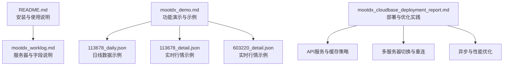
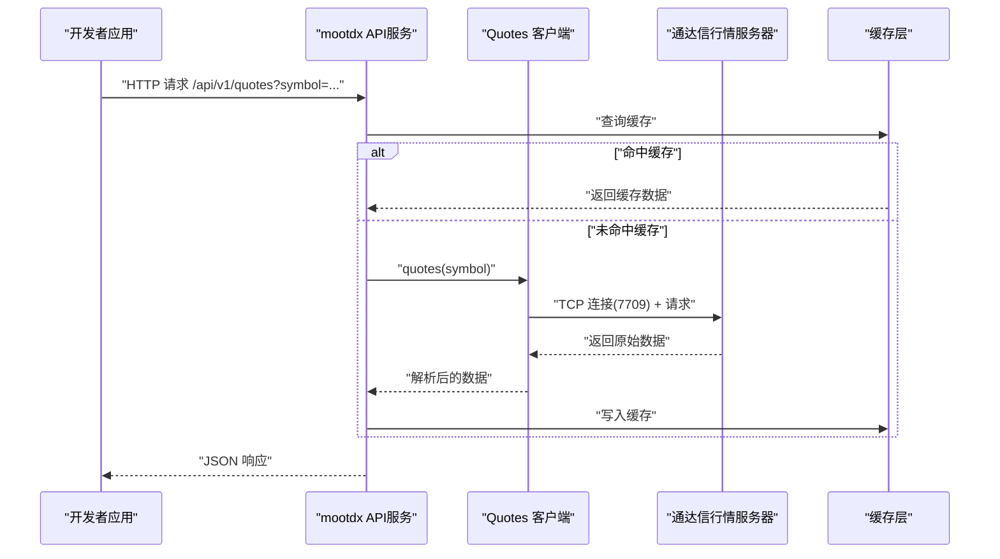
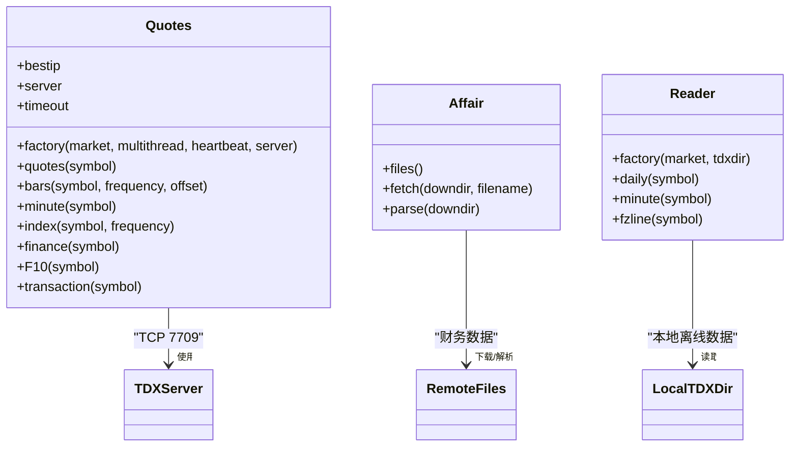
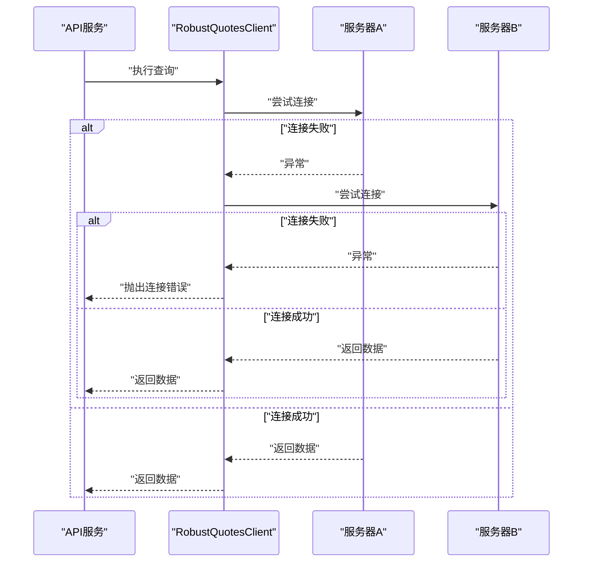
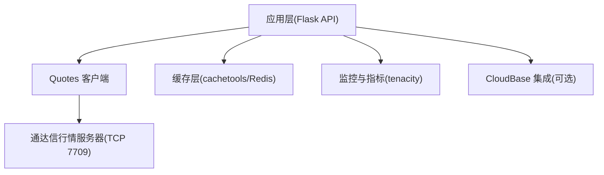

# 技术实现

<cite>
**本文引用的文件**
- [README.md](file://README.md)
- [mootdx_worklog.md](file://mootdx_worklog.md)
- [mootdx_demo.md](file://mootdx_demo.md)
- [mootdx_cloudbase_deployment_report.md](file://mootdx_cloudbase_deployment_report.md)
- [113678_daily.json](file://113678_daily.json)
- [113678_detail.json](file://113678_detail.json)
- [603220_detail.json](file://603220_detail.json)
</cite>

## 目录
1. [引言](#引言)
2. [项目结构](#项目结构)
3. [核心组件](#核心组件)
4. [架构总览](#架构总览)
5. [详细组件分析](#详细组件分析)
6. [依赖分析](#依赖分析)
7. [性能考虑](#性能考虑)
8. [故障排查指南](#故障排查指南)
9. [结论](#结论)
10. [附录](#附录)

## 引言
本文件面向开发者，系统化阐述 mootdx 数据获取的技术实现，覆盖底层工作机制、客户端-服务器通信模式、错误处理与重连策略、性能优化、调试与故障诊断，以及扩展与定制指导。文档基于仓库中的使用说明、工作记录、演示文档与部署报告进行归纳总结，并结合示例数据文件帮助理解数据形态与字段含义。

## 项目结构
仓库包含以下关键内容：
- 使用说明与示例：README.md 提供安装、使用与常见问题说明
- 工作记录与数据字段说明：mootdx_worklog.md 记录了服务器信息、数据对象清单、字段说明与代码示例
- 功能演示与数据样例：mootdx_demo.md 展示了实时行情、K线、分钟线、指数、财务与F10等数据获取示例
- 部署与优化实践：mootdx_cloudbase_deployment_report.md 提供了API服务、缓存策略、多服务器切换、异步处理、监控与容错等工程实践
- 示例数据文件：113678_daily.json、113678_detail.json、603220_detail.json 展示了日线与实时行情数据形态

图表来源
- [README.md:1-129](file://README.md#L1-L129)
- [mootdx_worklog.md:1-134](file://mootdx_worklog.md#L1-L134)
- [mootdx_demo.md:1-411](file://mootdx_demo.md#L1-L411)
- [mootdx_cloudbase_deployment_report.md:218-1522](file://mootdx_cloudbase_deployment_report.md#L218-L1522)

章节来源
- [README.md:1-129](file://README.md#L1-L129)
- [mootdx_worklog.md:1-134](file://mootdx_worklog.md#L1-L134)
- [mootdx_demo.md:1-411](file://mootdx_demo.md#L1-L411)
- [mootdx_cloudbase_deployment_report.md:218-1522](file://mootdx_cloudbase_deployment_report.md#L218-L1522)

## 核心组件
- Quotes 客户端：负责与通达信行情服务器交互，提供实时行情、K线、分钟线、指数、财务与F10等数据获取能力；支持多线程与心跳保活
- Affair 服务：提供财务数据文件列表、下载与解析能力
- Reader：用于读取通达信本地离线数据（日线、分钟、时间线）

章节来源
- [README.md:61-112](file://README.md#L61-L112)
- [mootdx_demo.md:391-411](file://mootdx_demo.md#L391-L411)

## 架构总览
mootdx 的典型数据获取路径如下：
- 客户端通过 Quotes.factory 创建行情客户端，选择市场、是否启用多线程与心跳
- 客户端连接通达信行情服务器（默认端口7709），发送请求并接收响应
- 服务器返回原始数据，客户端解析为结构化数据（如DataFrame或字典）
- 业务层可对数据进行缓存、裁剪与序列化，输出API响应

图表来源
- [mootdx_cloudbase_deployment_report.md:218-579](file://mootdx_cloudbase_deployment_report.md#L218-L579)
- [mootdx_cloudbase_deployment_report.md:757-837](file://mootdx_cloudbase_deployment_report.md#L757-L837)

章节来源
- [mootdx_cloudbase_deployment_report.md:218-579](file://mootdx_cloudbase_deployment_report.md#L218-L579)
- [mootdx_cloudbase_deployment_report.md:757-837](file://mootdx_cloudbase_deployment_report.md#L757-L837)

## 详细组件分析

### Quotes 客户端与服务器通信
- 工厂方法：通过 Quotes.factory(market, multithread, heartbeat, server) 创建客户端
- 连接特性：multithread=True 启用多线程；heartbeat=True 启用心跳保活；server 可指定服务器地址与端口
- 数据接口：quotes、bars、minute、index、finance、F10、transaction 等
- 服务器信息：client.bestip、client.server、client.timeout 等属性可用于诊断与配置

图表来源
- [README.md:61-112](file://README.md#L61-L112)
- [mootdx_demo.md:391-411](file://mootdx_demo.md#L391-L411)

章节来源
- [README.md:61-112](file://README.md#L61-L112)
- [mootdx_demo.md:391-411](file://mootdx_demo.md#L391-L411)

### 数据请求与响应处理流程
- 实时行情：client.quotes(symbol) 返回包含市场、代码、价格、昨收、开盘、最高、最低、成交量、成交额、买卖盘等字段的字典
- K线数据：client.bars(symbol, frequency, offset) 返回按偏移条数组织的日线/周线/月线数据
- 分钟线：client.minute(symbol) 返回分钟级数据
- 指数：client.index(symbol, frequency) 返回指数数据
- 财务与F10：client.finance(symbol)、client.F10(symbol) 返回结构化财务与基本面数据

图表来源
- [mootdx_demo.md:122-411](file://mootdx_demo.md#L122-L411)
- [mootdx_cloudbase_deployment_report.md:218-579](file://mootdx_cloudbase_deployment_report.md#L218-L579)

章节来源
- [mootdx_demo.md:122-411](file://mootdx_demo.md#L122-L411)
- [mootdx_cloudbase_deployment_report.md:218-579](file://mootdx_cloudbase_deployment_report.md#L218-L579)

### 错误处理机制、重连策略与异常恢复
- 装饰器与中间件：require_api_key 与 handle_errors 提供统一鉴权与错误捕获
- 自动重试与多服务器切换：RobustQuotesClient 使用 tenacity 的 retry 机制，尝试多个服务器，失败后自动重连
- 健康检查与指标：/health 与 /metrics 提供服务状态与性能指标观测
- 缓存降级：当外部服务不可用时，优先返回缓存数据

图表来源
- [mootdx_cloudbase_deployment_report.md:1345-1407](file://mootdx_cloudbase_deployment_report.md#L1345-L1407)
- [mootdx_cloudbase_deployment_report.md:1270-1328](file://mootdx_cloudbase_deployment_report.md#L1270-L1328)

章节来源
- [mootdx_cloudbase_deployment_report.md:1345-1407](file://mootdx_cloudbase_deployment_report.md#L1345-L1407)
- [mootdx_cloudbase_deployment_report.md:1270-1328](file://mootdx_cloudbase_deployment_report.md#L1270-L1328)

### 性能优化建议
- 连接池与复用：维护 Quotes 客户端连接池，避免重复创建与握手开销
- 多服务器自动切换：随机打乱候选服务器列表，快速探测可用节点
- 异步与并发：使用线程池并发拉取多个标的，提升吞吐
- 缓存策略：针对不同数据类型设置差异化TTL与容量，热点数据短TTL高频命中
- 数据裁剪：仅保留必要字段，减少序列化与传输体积
- 网络优化：心跳保活、合理超时、限流与熔断

章节来源
- [mootdx_cloudbase_deployment_report.md:757-837](file://mootdx_cloudbase_deployment_report.md#L757-L837)
- [mootdx_cloudbase_deployment_report.md:682-727](file://mootdx_cloudbase_deployment_report.md#L682-L727)

### 调试技巧与故障诊断
- 服务器与超时：通过 client.bestip、client.server、client.timeout 快速确认连接参数
- 健康检查：/health 返回当前连接的服务器与时间戳
- 指标观测：/metrics 返回请求总量、错误率、平均/尾延迟、缓存命中率等
- 日志与异常：handle_errors 将异常记录到日志，便于定位问题
- 离线数据校验：使用 Reader 读取本地通达信数据进行一致性比对

章节来源
- [mootdx_demo.md:261-282](file://mootdx_demo.md#L261-L282)
- [mootdx_cloudbase_deployment_report.md:1270-1328](file://mootdx_cloudbase_deployment_report.md#L1270-L1328)
- [README.md:61-112](file://README.md#L61-L112)

### 扩展与定制指导
- 自定义数据源集成：在现有 Quotes/F10/Finance 等接口基础上，增加新的数据类型或适配器
- API 接口开发：基于 Flask 路由扩展，增加鉴权、限流、缓存与指标埋点
- 云平台集成：与 CloudBase Run/SCF/DB/Storage 集成，实现定时采集、异步更新与持久化
- 多市场支持：根据市场类型调整频率参数（如日线需 frequency=9），并处理扩展市场接口差异

章节来源
- [mootdx_cloudbase_deployment_report.md:991-1208](file://mootdx_cloudbase_deployment_report.md#L991-L1208)
- [mootdx_demo.md:391-411](file://mootdx_demo.md#L391-L411)
- [mootdx_worklog.md:129-134](file://mootdx_worklog.md#L129-L134)

## 依赖分析
- 外部依赖：Flask、cachetools、tenacity、redis（可选）、CloudBase SDK（可选）
- 内部模块：Quotes、Affair、Reader
- 数据依赖：通达信行情服务器（TCP 7709）、财务数据文件（远程ZIP）

图表来源
- [mootdx_cloudbase_deployment_report.md:218-579](file://mootdx_cloudbase_deployment_report.md#L218-L579)
- [mootdx_cloudbase_deployment_report.md:682-727](file://mootdx_cloudbase_deployment_report.md#L682-L727)

章节来源
- [mootdx_cloudbase_deployment_report.md:218-579](file://mootdx_cloudbase_deployment_report.md#L218-L579)
- [mootdx_cloudbase_deployment_report.md:682-727](file://mootdx_cloudbase_deployment_report.md#L682-L727)

## 性能考虑
- 连接复用：避免频繁创建/销毁连接，使用连接池或单例客户端
- 并发拉取：对多标的使用线程池并发请求，缩短总耗时
- 缓存命中：热点数据短TTL、高命中率，降低外部依赖
- 数据裁剪：仅返回前端所需字段，减少序列化与网络传输
- 超时与限流：合理设置超时与最大并发，防止雪崩

## 故障排查指南
- 无法连接服务器：检查网络策略、防火墙与服务器白名单；使用多服务器切换策略
- 响应缓慢：开启缓存、降低请求频率、优化并发度；观察 /metrics 指标
- 数据为空：确认 symbol 是否正确、市场类型是否匹配、频率参数是否符合要求
- 异常处理：启用 handle_errors 记录异常堆栈，定位具体环节

章节来源
- [mootdx_cloudbase_deployment_report.md:1345-1407](file://mootdx_cloudbase_deployment_report.md#L1345-L1407)
- [mootdx_cloudbase_deployment_report.md:1270-1328](file://mootdx_cloudbase_deployment_report.md#L1270-L1328)

## 结论
mootdx 通过简洁的客户端接口与完善的工程实践，实现了对通达信行情数据的稳定获取。结合多服务器切换、心跳保活、缓存与异步并发等手段，可在生产环境中获得良好的稳定性与性能表现。开发者可在此基础上扩展自定义数据源与API接口，并按需集成云平台能力，构建可运维、可观测、可扩展的数据服务。

## 附录

### 数据字段说明（节选）
- 日线数据字段：开盘、收盘、最高、最低、成交量、成交额、时间分解、标准化时间、成交量(volume)
- 实时行情详情字段：市场代码、代码、当前价格、昨收、开盘、最高、最低、成交量、成交额、买卖盘价与量、服务器时间等

章节来源
- [mootdx_worklog.md:26-94](file://mootdx_worklog.md#L26-L94)

### 示例数据文件
- 113678_daily.json：可转债日线数据（示例片段）
- 113678_detail.json：可转债实时行情详情
- 603220_detail.json：正股实时行情详情

章节来源
- [113678_daily.json:1-800](file://113678_daily.json#L1-L800)
- [113678_detail.json:1-50](file://113678_detail.json#L1-L50)
- [603220_detail.json:1-50](file://603220_detail.json#L1-L50)