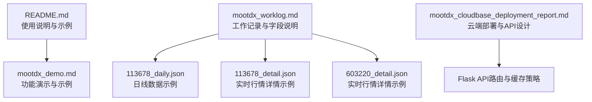
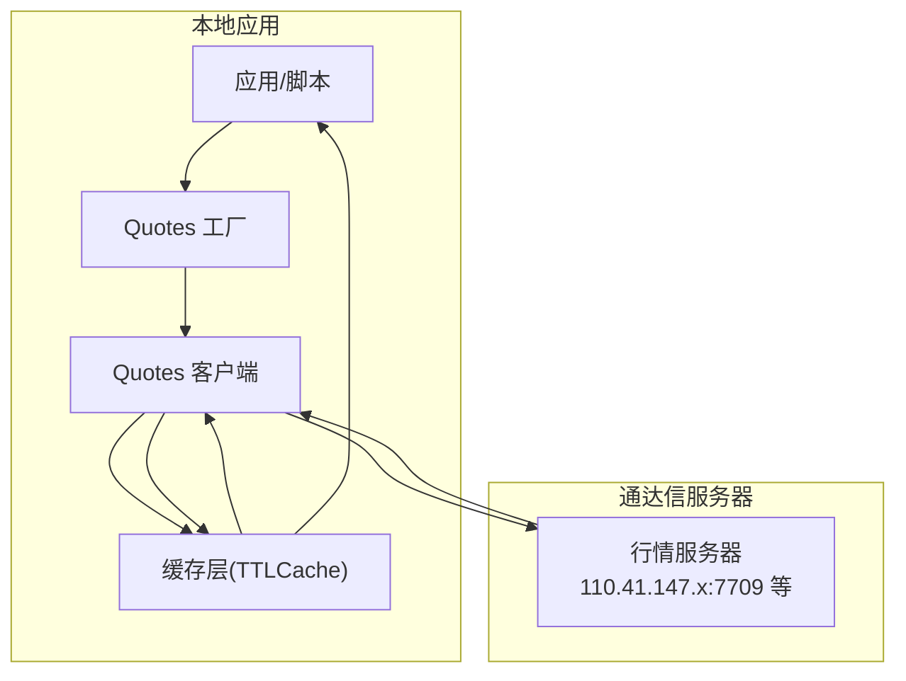
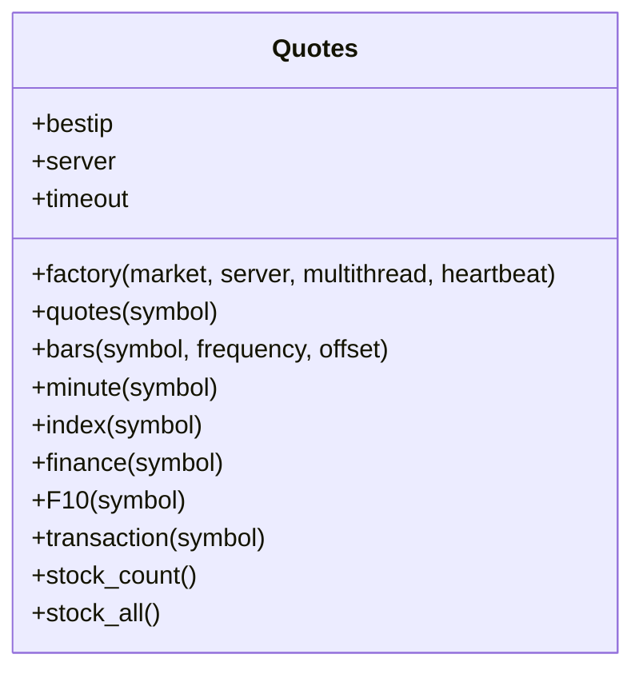
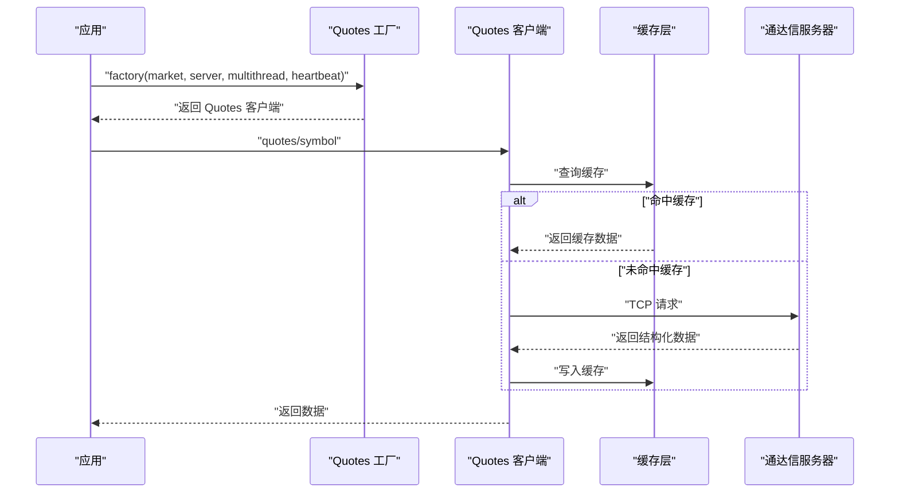
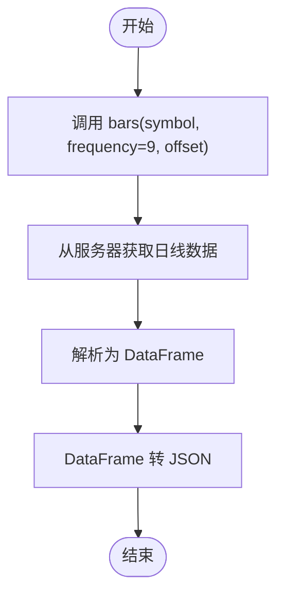
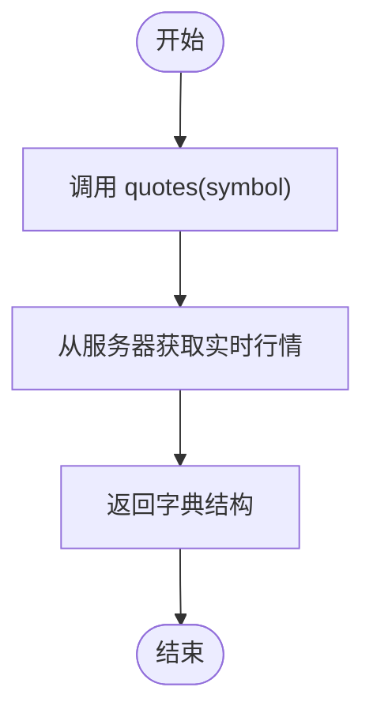
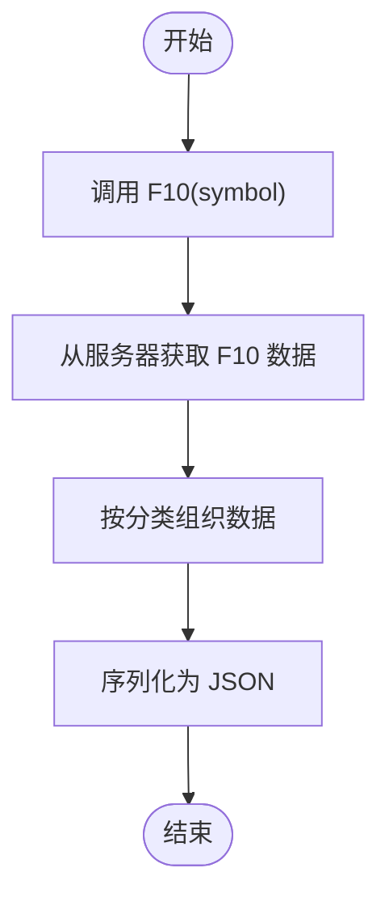
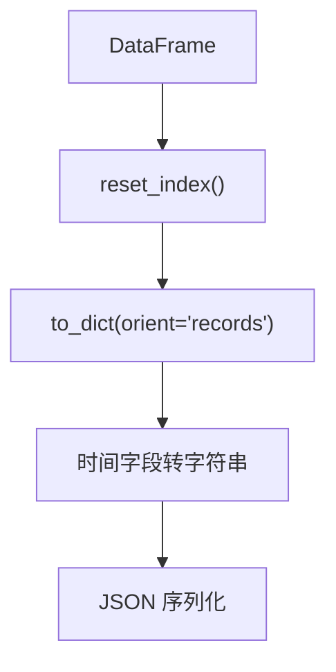
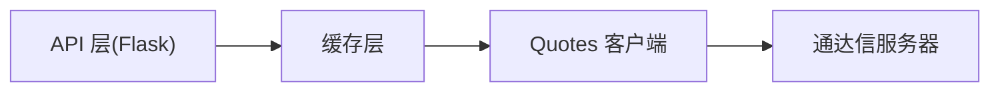

# 数据获取原理

<cite>
**本文引用的文件**
- [README.md](file://README.md)
- [mootdx_worklog.md](file://mootdx_worklog.md)
- [mootdx_demo.md](file://mootdx_demo.md)
- [mootdx_cloudbase_deployment_report.md](file://mootdx_cloudbase_deployment_report.md)
- [113678_daily.json](file://113678_daily.json)
- [113678_detail.json](file://113678_detail.json)
- [603220_detail.json](file://603220_detail.json)
</cite>

## 目录
1. [简介](#简介)
2. [项目结构](#项目结构)
3. [核心组件](#核心组件)
4. [架构总览](#架构总览)
5. [详细组件分析](#详细组件分析)
6. [依赖分析](#依赖分析)
7. [性能考虑](#性能考虑)
8. [故障排查指南](#故障排查指南)
9. [结论](#结论)
10. [附录](#附录)

## 简介
本文件围绕 mootdx 的数据获取原理展开，系统阐述其核心工作机制、客户端-服务器通信协议、数据类型获取逻辑（日线、实时行情、F10），并结合仓库中的示例与工作记录，给出频率参数的选择原则、DataFrame 到 JSON 的转换过程、最佳实践与性能优化建议。读者可据此快速掌握如何使用 mootdx 进行数据获取，并在生产环境中安全、高效地集成。

## 项目结构
仓库包含三类内容：
- 使用说明与示例：README.md、mootdx_demo.md
- 工作记录与字段说明：mootdx_worklog.md
- 示例输出数据：113678_daily.json、113678_detail.json、603220_detail.json
- 云端部署与 API 设计：mootdx_cloudbase_deployment_report.md

图表来源
- [README.md](file://README.md)
- [mootdx_demo.md](file://mootdx_demo.md)
- [mootdx_worklog.md](file://mootdx_worklog.md)
- [113678_daily.json](file://113678_daily.json)
- [113678_detail.json](file://113678_detail.json)
- [603220_detail.json](file://603220_detail.json)
- [mootdx_cloudbase_deployment_report.md](file://mootdx_cloudbase_deployment_report.md)

章节来源
- [README.md](file://README.md)
- [mootdx_demo.md](file://mootdx_demo.md)
- [mootdx_worklog.md](file://mootdx_worklog.md)

## 核心组件
- Quotes 工厂与客户端
  - 通过工厂方法创建 Quotes 客户端，支持标准市场与扩展市场，支持多线程与心跳保活。
  - 提供实时行情、K线、分钟线、指数、财务、F10、交易明细等接口。
- Affair 财务数据
  - 提供远程财务文件列表、下载与解析能力。
- 示例输出
  - 日线数据、实时行情详情、F10 分类与字段说明，帮助理解返回结构与字段含义。

章节来源
- [README.md](file://README.md)
- [mootdx_demo.md](file://mootdx_demo.md)
- [mootdx_worklog.md](file://mootdx_worklog.md)

## 架构总览
mootdx 的数据获取采用“本地应用 + 通达信行情服务器”的架构。客户端通过 Quotes 工厂创建实例，连接指定服务器（默认自动选择最佳 IP），发起请求后接收结构化数据（通常为 DataFrame 或字典），最终在应用侧转换为 JSON 返回。

图表来源
- [mootdx_cloudbase_deployment_report.md](file://mootdx_cloudbase_deployment_report.md)

## 详细组件分析

### Quotes 工厂与客户端
- 工厂方法
  - 支持 market 参数（标准市场 std、扩展市场 ext）、server 参数（可指定 IP:端口）、multithread、heartbeat 等。
  - 示例路径：[README.md](file://README.md)，[mootdx_demo.md](file://mootdx_demo.md)
- 客户端方法族
  - 实时行情：quotes(symbol)
  - K线：bars(symbol, frequency, offset)
  - 分钟线：minute(symbol)
  - 指数：index(symbol)
  - 财务：finance(symbol)
  - F10：F10(symbol)
  - 示例路径：[README.md](file://README.md)，[mootdx_demo.md](file://mootdx_demo.md)

图表来源
- [README.md](file://README.md)
- [mootdx_demo.md](file://mootdx_demo.md)

章节来源
- [README.md](file://README.md)
- [mootdx_demo.md](file://mootdx_demo.md)

### 客户端-服务器通信协议与工作流程
- 服务器与端口
  - 通达信行情服务器 IP 范围与端口：110.41.147.x、123.125.108.x 等，端口 7709。
  - 示例路径：[mootdx_cloudbase_deployment_report.md](file://mootdx_cloudbase_deployment_report.md)
- 连接建立与保活
  - 通过 heartbeat 参数维持长连接，减少频繁握手开销。
  - 示例路径：[mootdx_cloudbase_deployment_report.md](file://mootdx_cloudbase_deployment_report.md)
- 请求与响应
  - 客户端发送查询请求，服务器返回结构化数据；应用侧将 DataFrame 转为 JSON。
  - 示例路径：[mootdx_cloudbase_deployment_report.md](file://mootdx_cloudbase_deployment_report.md)

图表来源
- [mootdx_cloudbase_deployment_report.md](file://mootdx_cloudbase_deployment_report.md)

章节来源
- [mootdx_cloudbase_deployment_report.md](file://mootdx_cloudbase_deployment_report.md)

### 不同数据类型的获取原理

#### 日线数据（bars）
- 获取方式
  - bars(symbol, frequency=9, offset=N)：其中 frequency=9 表示日线。
  - 示例路径：[mootdx_worklog.md](file://mootdx_worklog.md)，[README.md](file://README.md)
- 输出结构
  - DataFrame，包含 open、close、high、low、vol、amount、datetime 等字段。
  - 示例路径：[113678_daily.json](file://113678_daily.json)

图表来源
- [mootdx_worklog.md](file://mootdx_worklog.md)
- [113678_daily.json](file://113678_daily.json)

章节来源
- [mootdx_worklog.md](file://mootdx_worklog.md)
- [113678_daily.json](file://113678_daily.json)

#### 实时行情（quotes）
- 获取方式
  - quotes(symbol)：返回当前市场行情，包含价格、昨收、开盘、最高、最低、买卖盘等。
  - 示例路径：[README.md](file://README.md)，[mootdx_demo.md](file://mootdx_demo.md)
- 输出结构
  - 字典，字段如 market、code、price、last_close、open、high、low、vol、amount、bidN、askN 等。
  - 示例路径：[113678_detail.json](file://113678_detail.json)，[603220_detail.json](file://603220_detail.json)

图表来源
- [README.md](file://README.md)
- [mootdx_demo.md](file://mootdx_demo.md)
- [113678_detail.json](file://113678_detail.json)
- [603220_detail.json](file://603220_detail.json)

章节来源
- [README.md](file://README.md)
- [mootdx_demo.md](file://mootdx_demo.md)
- [113678_detail.json](file://113678_detail.json)
- [603220_detail.json](file://603220_detail.json)

#### F10 基本面数据（F10）
- 获取方式
  - F10(symbol)：返回公司基本面数据，按分类组织（如债券概况、财务分析、付息情况、转股情况、利率情况、债券条款、公告等）。
  - 示例路径：[mootdx_worklog.md](file://mootdx_worklog.md)，[mootdx_demo.md](file://mootdx_demo.md)
- 输出结构
  - 字典，键为分类名称，值为 DataFrame 或字典，便于后续序列化为 JSON。
  - 示例路径：[mootdx_worklog.md](file://mootdx_worklog.md)

图表来源
- [mootdx_worklog.md](file://mootdx_worklog.md)
- [mootdx_demo.md](file://mootdx_demo.md)

章节来源
- [mootdx_worklog.md](file://mootdx_worklog.md)
- [mootdx_demo.md](file://mootdx_demo.md)

### 频率参数的作用与选择原则
- 频率参数（frequency）
  - 日线：frequency=9
  - 周线：frequency=5
  - 月线：frequency=6
  - 示例路径：[mootdx_worklog.md](file://mootdx_worklog.md)，[README.md](file://README.md)
- 选择原则
  - 根据业务需求选择合适周期；日线适合趋势分析，周/月线适合宏观视角。
  - 控制 offset，避免一次性请求过多历史数据导致超时或内存压力。

章节来源
- [mootdx_worklog.md](file://mootdx_worklog.md)
- [README.md](file://README.md)

### DataFrame 到 JSON 的转换过程
- 转换策略
  - 将 DataFrame reset_index 后，使用 to_dict(orient='records') 转为列表字典。
  - 对时间字段（datetime、year、month、day）统一转为字符串，确保 JSON 可序列化。
  - 示例路径：[mootdx_cloudbase_deployment_report.md](file://mootdx_cloudbase_deployment_report.md)
- F10 的特殊处理
  - 若某分类为 DataFrame，则调用其 to_dict(orient='records')；若为字典则递归转为字符串键值；否则转为字符串。
  - 示例路径：[mootdx_cloudbase_deployment_report.md](file://mootdx_cloudbase_deployment_report.md)

图表来源
- [mootdx_cloudbase_deployment_report.md](file://mootdx_cloudbase_deployment_report.md)

章节来源
- [mootdx_cloudbase_deployment_report.md](file://mootdx_cloudbase_deployment_report.md)

### 代码示例与参数配置
- Quotes 工厂与参数
  - market：std/ext
  - server：[IP, 端口]
  - multithread：启用多线程
  - heartbeat：启用心跳保活
  - 示例路径：[README.md](file://README.md)，[mootdx_demo.md](file://mootdx_demo.md)
- 获取日线、实时行情、F10 的示例
  - 示例路径：[README.md](file://README.md)，[mootdx_worklog.md](file://mootdx_worklog.md)

章节来源
- [README.md](file://README.md)
- [mootdx_demo.md](file://mootdx_demo.md)
- [mootdx_worklog.md](file://mootdx_worklog.md)

## 依赖分析
- 外部依赖
  - 通达信行情服务器（IP 范围与端口见部署报告）
  - Python 运行时与相关库（详见 README 安装说明）
- 内部依赖
  - Quotes 工厂 -> Quotes 客户端 -> 服务器
  - API 层 -> 缓存层 -> Quotes 客户端 -> 服务器

图表来源
- [mootdx_cloudbase_deployment_report.md](file://mootdx_cloudbase_deployment_report.md)

章节来源
- [mootdx_cloudbase_deployment_report.md](file://mootdx_cloudbase_deployment_report.md)

## 性能考虑
- 缓存策略
  - 使用 TTLCache 缓存热点数据，降低重复请求与外部依赖。
  - 示例路径：[mootdx_cloudbase_deployment_report.md](file://mootdx_cloudbase_deployment_report.md)
- 多服务器自动切换
  - 随机选择候选服务器并进行连通性测试，提升可用性。
  - 示例路径：[mootdx_cloudbase_deployment_report.md](file://mootdx_cloudbase_deployment_report.md)
- 连接池与心跳保活
  - 复用连接、启用心跳，减少握手与重连开销。
  - 示例路径：[mootdx_cloudbase_deployment_report.md](file://mootdx_cloudbase_deployment_report.md)
- 异步与并发
  - 使用线程池并发拉取多个标的，提升吞吐。
  - 示例路径：[mootdx_cloudbase_deployment_report.md](file://mootdx_cloudbase_deployment_report.md)
- 数据裁剪
  - 仅保留必要字段，减少传输体积。
  - 示例路径：[mootdx_cloudbase_deployment_report.md](file://mootdx_cloudbase_deployment_report.md)

章节来源
- [mootdx_cloudbase_deployment_report.md](file://mootdx_cloudbase_deployment_report.md)

## 故障排查指南
- 服务器不可达
  - 部分服务器可能无法连接，需测试可用服务器或启用自动切换。
  - 示例路径：[mootdx_worklog.md](file://mootdx_worklog.md)
- 扩展市场接口失效
  - ext 接口目前失效，建议使用 std。
  - 示例路径：[mootdx_worklog.md](file://mootdx_worklog.md)
- 日线数据频率
  - 日线需使用 frequency=9。
  - 示例路径：[mootdx_worklog.md](file://mootdx_worklog.md)
- DataFrame 转 JSON
  - 注意时间字段的字符串化，避免 Timestamp 序列化异常。
  - 示例路径：[mootdx_worklog.md](file://mootdx_worklog.md)

章节来源
- [mootdx_worklog.md](file://mootdx_worklog.md)

## 结论
mootdx 通过稳定的工厂与客户端模型，实现了对通达信行情服务器的高效访问。结合缓存、心跳保活、多服务器切换与异步并发等手段，可在生产环境中获得良好的稳定性与性能。开发者可依据本文档的频率参数选择、DataFrame 到 JSON 的转换流程与最佳实践，快速构建可靠的数据获取体系。

## 附录
- 字段说明与示例输出
  - 日线字段：open、close、high、low、vol、amount、datetime 等
  - 实时行情字段：market、code、price、last_close、open、high、low、vol、amount、bidN/askN 等
  - F10 分类：债券概况、财务分析、付息情况、转股情况、利率情况、公告等
  - 示例路径：[mootdx_worklog.md](file://mootdx_worklog.md)，[113678_daily.json](file://113678_daily.json)，[113678_detail.json](file://113678_detail.json)，[603220_detail.json](file://603220_detail.json)

章节来源
- [mootdx_worklog.md](file://mootdx_worklog.md)
- [113678_daily.json](file://113678_daily.json)
- [113678_detail.json](file://113678_detail.json)
- [603220_detail.json](file://603220_detail.json)