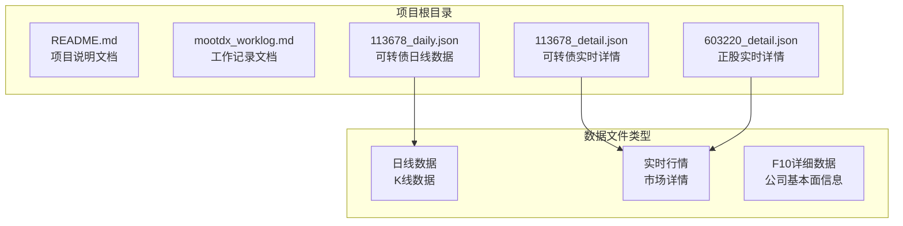
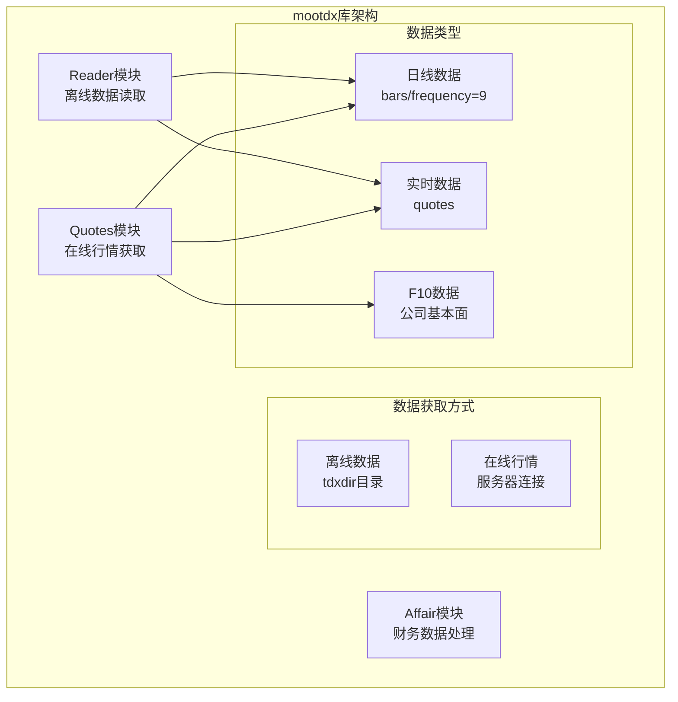
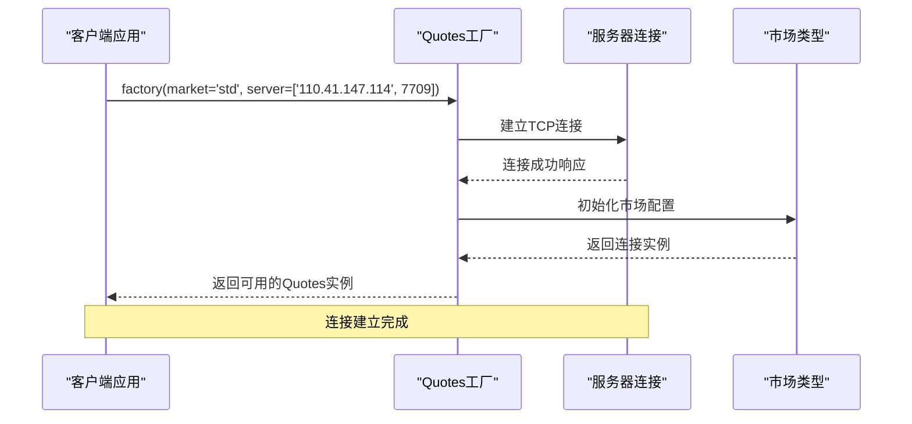
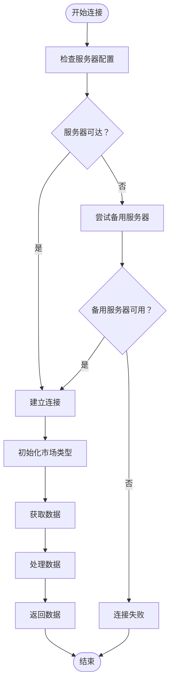
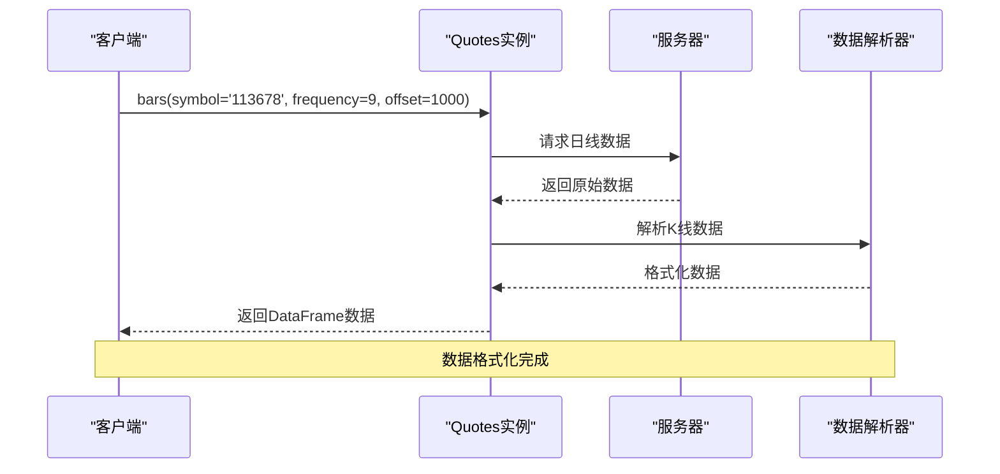
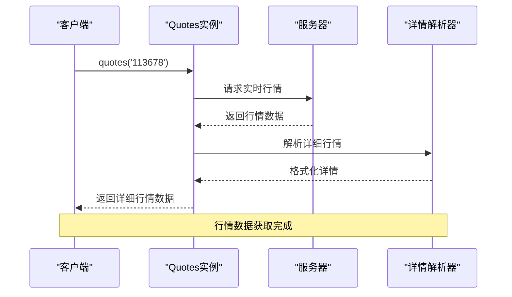
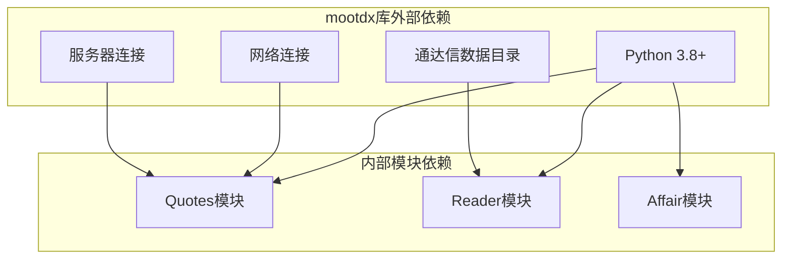
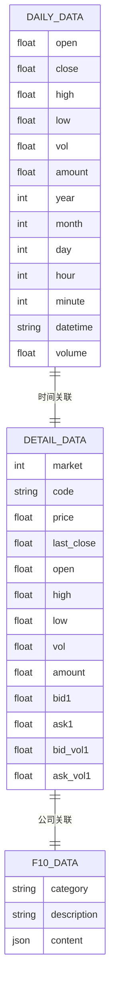
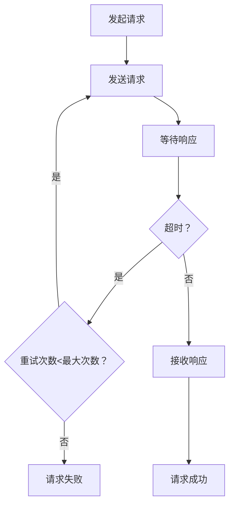

# 服务器连接配置

<cite>
**本文档引用的文件**
- [README.md](file://README.md)
- [mootdx_worklog.md](file://mootdx_worklog.md)
- [113678_daily.json](file://113678_daily.json)
- [113678_detail.json](file://113678_detail.json)
- [603220_detail.json](file://603220_detail.json)
</cite>

## 目录
1. [简介](#简介)
2. [项目结构](#项目结构)
3. [核心组件](#核心组件)
4. [架构概览](#架构概览)
5. [详细组件分析](#详细组件分析)
6. [依赖关系分析](#依赖关系分析)
7. [性能考虑](#性能考虑)
8. [故障排除指南](#故障排除指南)
9. [结论](#结论)

## 简介

本文档详细说明了mootdx库的服务器连接配置，包括服务器地址配置、端口设置和连接参数。mootdx是一个用于读取通达信数据的Python库，支持离线数据读取和在线行情获取。

根据项目文档，mootdx库提供了两种市场类型：
- **std市场（标准市场）**：股票市场
- **ext市场（扩展市场）**：期货、黄金等衍生品市场

需要注意的是，ext接口目前已被标记为失效状态。

## 项目结构

该项目采用简洁的结构设计，主要包含以下组件：



**图表来源**
- [README.md:1-129](file://README.md#L1-L129)
- [mootdx_worklog.md:1-134](file://mootdx_worklog.md#L1-L134)

**章节来源**
- [README.md:1-129](file://README.md#L1-L129)
- [mootdx_worklog.md:1-134](file://mootdx_worklog.md#L1-L134)

## 核心组件

### 服务器连接配置

根据项目文档，mootdx库的服务器连接配置具有以下特点：

#### 基本连接语法
```python
from mootdx.quotes import Quotes

# 标准市场连接
client = Quotes.factory(market='std', multithread=True, heartbeat=True)

# 扩展市场连接（已失效）
client_ext = Quotes.factory(market='ext')
```

#### 服务器地址配置
项目文档显示了具体的服务器配置示例：
- 服务器地址：110.41.147.114
- 端口号：7709

#### 连接参数详解
- `market`：市场类型参数，支持'std'和'ext'
- `multithread`：多线程支持参数
- `heartbeat`：心跳检测参数
- `server`：服务器配置参数，格式为['IP地址', 端口号]

**章节来源**
- [README.md:81-97](file://README.md#L81-L97)
- [mootdx_worklog.md:97-103](file://mootdx_worklog.md#L97-L103)

### 市场类型差异

#### 标准市场（std）
- **功能**：支持股票市场的日线、分钟线、指数等数据获取
- **适用场景**：股票投资分析、技术分析
- **数据类型**：日线数据、分钟数据、指数数据

#### 扩展市场（ext）
- **状态**：根据工作记录文档，扩展市场接口目前已失效
- **原功能**：支持期货、黄金等衍生品市场的数据获取
- **当前状态**：不推荐使用，存在连接失败风险

**章节来源**
- [README.md:66-79](file://README.md#L66-L79)
- [mootdx_worklog.md:132](file://mootdx_worklog.md#L132)

## 架构概览

mootdx库采用模块化架构设计，主要包含以下核心模块：



**图表来源**
- [README.md:61-112](file://README.md#L61-L112)

## 详细组件分析

### 连接配置组件

#### 服务器地址配置流程



**图表来源**
- [mootdx_worklog.md:97-103](file://mootdx_worklog.md#L97-L103)

#### 数据获取组件



**图表来源**
- [mootdx_worklog.md:129-134](file://mootdx_worklog.md#L129-L134)

**章节来源**
- [mootdx_worklog.md:97-127](file://mootdx_worklog.md#L97-L127)

### 数据处理组件

#### 日线数据获取流程



**图表来源**
- [mootdx_worklog.md:105-109](file://mootdx_worklog.md#L105-L109)

#### 实时行情获取流程



**图表来源**
- [mootdx_worklog.md:111-115](file://mootdx_worklog.md#L111-L115)

**章节来源**
- [mootdx_worklog.md:105-127](file://mootdx_worklog.md#L105-L127)

## 依赖关系分析

### 外部依赖关系



**图表来源**
- [README.md:24-28](file://README.md#L24-L28)

### 数据文件依赖关系



**图表来源**
- [mootdx_worklog.md:28-94](file://mootdx_worklog.md#L28-L94)

**章节来源**
- [README.md:24-28](file://README.md#L24-L28)
- [mootdx_worklog.md:28-94](file://mootdx_worklog.md#L28-L94)

## 性能考虑

### 连接性能优化

基于项目文档中的使用模式，以下是性能优化建议：

#### 连接池管理
- **多线程支持**：启用`multithread=True`参数以提高并发处理能力
- **心跳检测**：启用`heartbeat=True`参数保持连接活跃状态
- **连接复用**：在长时间运行的应用中复用Quotes实例而非频繁创建新连接

#### 数据获取优化
- **批量数据请求**：合理设置`offset`参数获取所需的历史数据量
- **频率选择**：使用`frequency=9`参数获取日线数据
- **数据缓存**：对频繁访问的数据进行本地缓存

#### 服务器选择策略
- **优先级排序**：根据服务器响应时间和稳定性选择最优服务器
- **备用服务器**：当主服务器不可用时自动切换到备用服务器
- **地理位置**：选择地理位置较近的服务器以减少网络延迟

**章节来源**
- [README.md:87](file://README.md#L87)
- [mootdx_worklog.md:131](file://mootdx_worklog.md#L131)

## 故障排除指南

### 常见连接问题

#### 服务器连接失败
**问题描述**：无法连接到指定的服务器地址
**解决方案**：
1. 验证服务器地址和端口配置是否正确
2. 检查网络连接状态
3. 尝试使用备用服务器地址
4. 确认防火墙设置允许出站连接

#### 扩展市场接口失效
**问题描述**：使用`market='ext'`参数时连接失败
**解决方案**：
1. 改用`market='std'`参数连接标准市场
2. 等待官方修复扩展市场接口
3. 关注项目更新日志获取最新状态

#### 数据获取异常
**问题描述**：连接成功但无法获取预期数据
**解决方案**：
1. 验证股票代码格式是否正确
2. 检查数据频率参数设置
3. 确认目标数据类型是否存在

### 连接超时和重试机制

#### 超时设置
- **连接超时**：建议设置合理的连接超时时间（如30秒）
- **读取超时**：为数据读取操作设置适当的超时限制
- **心跳间隔**：根据网络状况调整心跳检测间隔

#### 重试策略


**图表来源**
- [mootdx_worklog.md:131](file://mootdx_worklog.md#L131)

### 数据转换问题

#### JSON数据转换
**问题描述**：将DataFrame转换为JSON时出现Timestamp类型问题
**解决方案**：
1. 使用`datetime`字段进行时间戳转换
2. 在转换前将时间列转换为字符串格式
3. 使用适当的JSON序列化库处理特殊数据类型

**章节来源**
- [mootdx_worklog.md:129-134](file://mootdx_worklog.md#L129-L134)

## 结论

mootdx库提供了完整的通达信数据获取解决方案，支持离线数据读取和在线行情获取。通过合理的服务器连接配置和优化策略，可以有效提升数据获取的稳定性和性能。

### 关键要点总结

1. **服务器配置**：使用`Quotes.factory()`方法配置服务器连接，支持自定义服务器地址和端口
2. **市场选择**：优先使用标准市场（std），避免使用已失效的扩展市场（ext）
3. **性能优化**：启用多线程支持和心跳检测，合理设置连接参数
4. **故障处理**：建立完善的错误处理和重试机制
5. **数据质量**：注意数据格式转换和时间戳处理

### 最佳实践建议

1. **连接管理**：在应用启动时建立连接，在应用关闭时释放连接
2. **错误监控**：记录连接失败和数据获取异常的日志
3. **性能监控**：监控数据获取的响应时间和成功率
4. **版本兼容**：关注mootdx库的版本更新，及时适配新的API变化
5. **备份策略**：准备多个备用服务器地址以提高连接成功率

通过遵循这些配置和最佳实践，开发者可以构建稳定可靠的通达信数据获取系统。