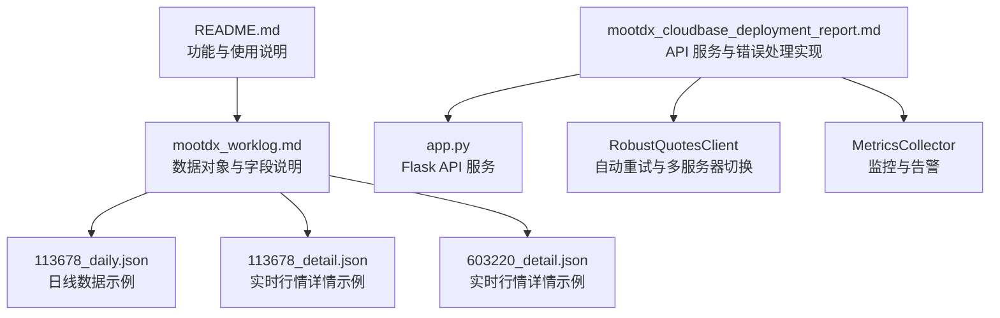
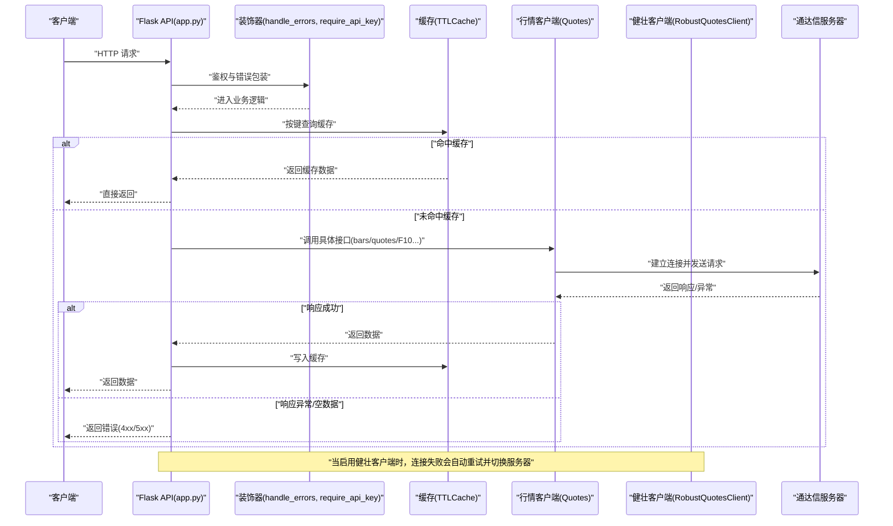
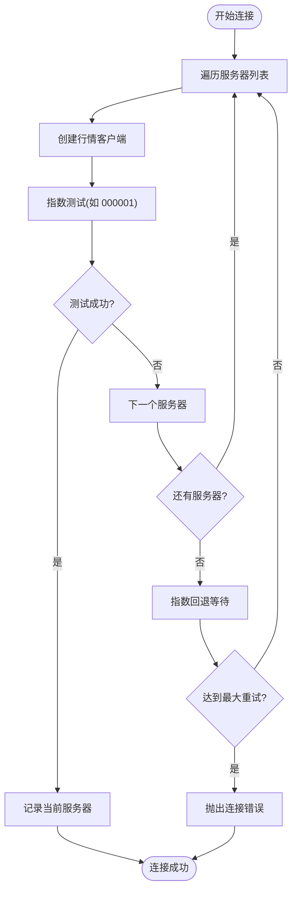
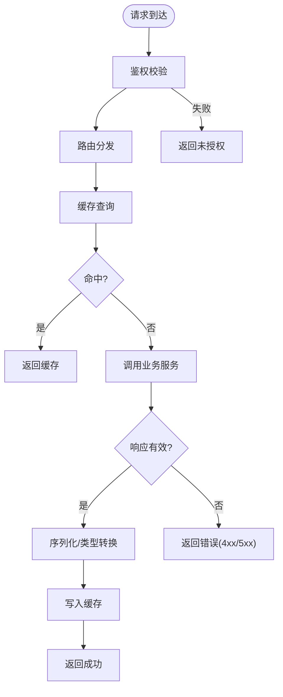
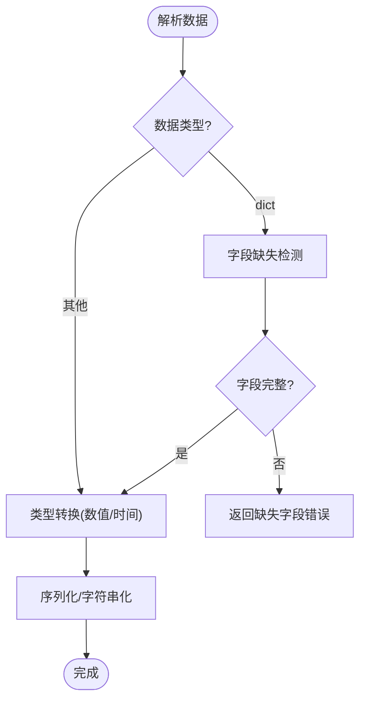
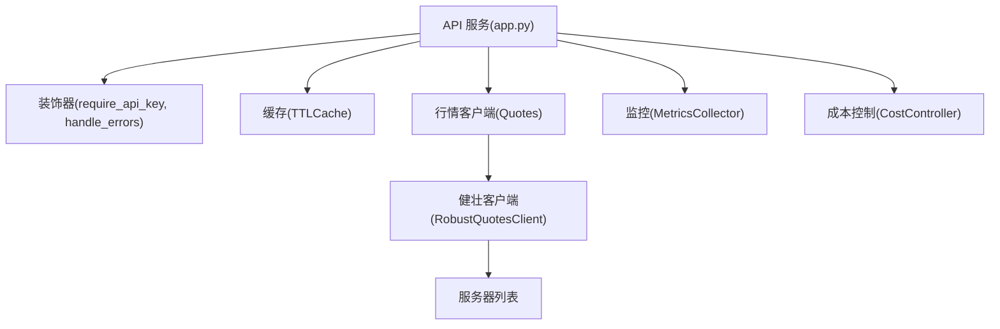

# 错误处理与恢复

<cite>
**本文引用的文件**
- [README.md](file://README.md)
- [mootdx_worklog.md](file://mootdx_worklog.md)
- [mootdx_cloudbase_deployment_report.md](file://mootdx_cloudbase_deployment_report.md)
- [113678_daily.json](file://113678_daily.json)
- [113678_detail.json](file://113678_detail.json)
- [603220_detail.json](file://603220_detail.json)
</cite>

## 目录
1. [简介](#简介)
2. [项目结构](#项目结构)
3. [核心组件](#核心组件)
4. [架构总览](#架构总览)
5. [详细组件分析](#详细组件分析)
6. [依赖分析](#依赖分析)
7. [性能考虑](#性能考虑)
8. [故障排查指南](#故障排查指南)
9. [结论](#结论)
10. [附录](#附录)

## 简介
本文件聚焦于 mootdx 在数据获取过程中的“错误处理与恢复”机制，结合仓库中提供的 API 服务实现、部署报告与示例数据，系统阐述如下主题：
- 可能遇到的错误类型：网络连接错误、服务器响应错误、数据解析错误
- 错误处理策略与异常恢复方案：自动重试、多服务器切换、降级返回、缓存兜底
- 数据完整性检查与验证方法：字段校验、类型转换、空值处理
- 日志记录与调试技巧：结构化日志、错误装饰器、健康检查
- 性能监控与告警建议：指标采集、健康状态判断、成本控制

## 项目结构
该仓库包含：
- README 文档：介绍 mootdx 的功能与使用方式
- 工作记录文档：记录了数据对象、字段说明、示例代码与注意事项
- 部署报告文档：包含完整的 API 服务实现、错误处理、监控与告警、成本控制等
- 示例数据文件：日线与实时行情 JSON，用于验证数据结构与完整性

**图表来源**
- [README.md:56-112](file://README.md#L56-L112)
- [mootdx_worklog.md:1-134](file://mootdx_worklog.md#L1-L134)
- [mootdx_cloudbase_deployment_report.md:220-578](file://mootdx_cloudbase_deployment_report.md#L220-L578)

**章节来源**
- [README.md:56-112](file://README.md#L56-L112)
- [mootdx_worklog.md:1-134](file://mootdx_worklog.md#L1-L134)
- [mootdx_cloudbase_deployment_report.md:220-578](file://mootdx_cloudbase_deployment_report.md#L220-L578)

## 核心组件
围绕错误处理与恢复，关键组件包括：
- API 服务与路由：统一入口、参数校验、错误装饰器、缓存与降级
- 行情客户端与自动重试：多服务器列表、指数测试、指数回退
- 数据验证与转换：字段缺失检测、类型安全转换、序列化兼容
- 监控与告警：指标采集、健康检查、状态判定
- 成本控制：预算阈值检查与使用记录

**章节来源**
- [mootdx_cloudbase_deployment_report.md:220-578](file://mootdx_cloudbase_deployment_report.md#L220-L578)
- [mootdx_cloudbase_deployment_report.md:1270-1328](file://mootdx_cloudbase_deployment_report.md#L1270-L1328)
- [mootdx_cloudbase_deployment_report.md:1347-1407](file://mootdx_cloudbase_deployment_report.md#L1347-L1407)
- [mootdx_cloudbase_deployment_report.md:1409-1471](file://mootdx_cloudbase_deployment_report.md#L1409-L1471)

## 架构总览
下图展示了从客户端请求到数据返回的完整流程，重点标注错误处理与恢复节点。

**图表来源**
- [mootdx_cloudbase_deployment_report.md:220-578](file://mootdx_cloudbase_deployment_report.md#L220-L578)
- [mootdx_cloudbase_deployment_report.md:1347-1407](file://mootdx_cloudbase_deployment_report.md#L1347-L1407)

## 详细组件分析

### 网络连接错误处理与恢复
- 多服务器自动切换：维护服务器列表，逐一尝试连接；通过指数测试确认可用性；失败时指数回退并重试
- 自动重试：指数回退等待，限制最大重试次数
- 心跳保活：启用心跳以维持长连接，减少频繁握手开销

**图表来源**
- [mootdx_cloudbase_deployment_report.md:1347-1407](file://mootdx_cloudbase_deployment_report.md#L1347-L1407)

**章节来源**
- [mootdx_cloudbase_deployment_report.md:1347-1407](file://mootdx_cloudbase_deployment_report.md#L1347-L1407)

### 服务器响应错误与降级处理
- 统一错误装饰器：捕获未预期异常，记录日志并返回标准化错误响应
- 业务层错误码：针对缺失参数、超出批量限制、数据为空等场景返回明确状态码
- 缓存兜底：命中缓存直接返回，避免重复请求外部服务

**图表来源**
- [mootdx_cloudbase_deployment_report.md:278-291](file://mootdx_cloudbase_deployment_report.md#L278-L291)
- [mootdx_cloudbase_deployment_report.md:311-526](file://mootdx_cloudbase_deployment_report.md#L311-L526)

**章节来源**
- [mootdx_cloudbase_deployment_report.md:278-291](file://mootdx_cloudbase_deployment_report.md#L278-L291)
- [mootdx_cloudbase_deployment_report.md:311-526](file://mootdx_cloudbase_deployment_report.md#L311-L526)

### 数据解析错误与完整性校验
- 字段完整性校验：定义期望字段集合，检测缺失字段并返回错误信息
- 类型安全转换：对数值进行整型/浮点转换，避免 JSON 序列化异常
- 序列化兼容：对对象类型进行 to_dict 或字符串化处理，保证输出一致

**图表来源**
- [mootdx_cloudbase_deployment_report.md:1416-1436](file://mootdx_cloudbase_deployment_report.md#L1416-L1436)
- [mootdx_cloudbase_deployment_report.md:430-438](file://mootdx_cloudbase_deployment_report.md#L430-L438)
- [mootdx_cloudbase_deployment_report.md:460-471](file://mootdx_cloudbase_deployment_report.md#L460-L471)

**章节来源**
- [mootdx_cloudbase_deployment_report.md:1416-1436](file://mootdx_cloudbase_deployment_report.md#L1416-L1436)
- [mootdx_cloudbase_deployment_report.md:430-438](file://mootdx_cloudbase_deployment_report.md#L430-L438)
- [mootdx_cloudbase_deployment_report.md:460-471](file://mootdx_cloudbase_deployment_report.md#L460-L471)

### 日志记录与调试技巧
- 结构化日志：统一 INFO/WARN/ERROR 级别，记录请求路径、参数、耗时、异常堆栈
- 错误装饰器：捕获异常并记录详细信息，便于快速定位问题
- 健康检查端点：返回服务状态、服务器地址、时间戳，便于自动化探活
- 本地调试：支持 DEBUG 环境变量开启调试模式，便于开发阶段排障

**章节来源**
- [mootdx_cloudbase_deployment_report.md:235-237](file://mootdx_cloudbase_deployment_report.md#L235-L237)
- [mootdx_cloudbase_deployment_report.md:278-291](file://mootdx_cloudbase_deployment_report.md#L278-L291)
- [mootdx_cloudbase_deployment_report.md:297-308](file://mootdx_cloudbase_deployment_report.md#L297-L308)
- [mootdx_cloudbase_deployment_report.md:575-578](file://mootdx_cloudbase_deployment_report.md#L575-L578)

### 性能监控与告警建议
- 指标采集：请求总数、错误数、延迟分布(P95)、缓存命中率、运行时长
- 健康状态：根据错误率阈值动态判定 healthy/degraded
- 成本控制：每日预算检查与使用记录，超限阻断或告警
- 告警联动：结合 CloudBase 日志检索、预算告警与自动扩缩容策略

**章节来源**
- [mootdx_cloudbase_deployment_report.md:1270-1328](file://mootdx_cloudbase_deployment_report.md#L1270-L1328)
- [mootdx_cloudbase_deployment_report.md:1445-1468](file://mootdx_cloudbase_deployment_report.md#L1445-L1468)

## 依赖分析
- 外部依赖：mootdx、Flask、Gunicorn、cachetools、tenacity、pymongo/collections 等
- 内部耦合：API 层依赖装饰器、缓存、行情客户端；行情客户端依赖通达信服务器
- 风险点：网络波动、服务器不可用、数据格式变化、高并发下的缓存穿透

**图表来源**
- [mootdx_cloudbase_deployment_report.md:220-578](file://mootdx_cloudbase_deployment_report.md#L220-L578)
- [mootdx_cloudbase_deployment_report.md:1270-1328](file://mootdx_cloudbase_deployment_report.md#L1270-L1328)
- [mootdx_cloudbase_deployment_report.md:1445-1468](file://mootdx_cloudbase_deployment_report.md#L1445-L1468)

**章节来源**
- [mootdx_cloudbase_deployment_report.md:220-578](file://mootdx_cloudbase_deployment_report.md#L220-L578)
- [mootdx_cloudbase_deployment_report.md:1270-1328](file://mootdx_cloudbase_deployment_report.md#L1270-L1328)
- [mootdx_cloudbase_deployment_report.md:1445-1468](file://mootdx_cloudbase_deployment_report.md#L1445-L1468)

## 性能考虑
- 缓存策略：合理设置 TTL 与容量，热点数据优先缓存，避免缓存穿透
- 并发与超时：多线程与心跳保活减少连接抖动；请求超时与重试策略平衡稳定性与响应时间
- 数据序列化：批量转换时避免重复类型判断，统一转换逻辑
- 监控与限流：通过指标与告警及时发现异常，配合限流保护下游

## 故障排查指南
- 连接失败
  - 现象：无法连接任何服务器、指数测试失败
  - 排查：检查服务器列表可达性、防火墙策略、网络限制；启用多服务器切换与指数回退
  - 参考路径：[mootdx_cloudbase_deployment_report.md:1347-1407](file://mootdx_cloudbase_deployment_report.md#L1347-L1407)
- 响应为空或数据为空
  - 现象：返回 404 或空数据集
  - 排查：确认 symbol 是否正确、频率参数是否支持、数据是否存在；检查缓存是否过期
  - 参考路径：[mootdx_cloudbase_deployment_report.md:366-408](file://mootdx_cloudbase_deployment_report.md#L366-L408)
- 字段缺失或类型异常
  - 现象：序列化失败或字段缺失
  - 排查：使用字段校验与类型转换函数；对对象类型进行 to_dict 或字符串化
  - 参考路径：[mootdx_cloudbase_deployment_report.md:1416-1436](file://mootdx_cloudbase_deployment_report.md#L1416-L1436)
- 错误过多导致服务不可用
  - 现象：错误率升高、健康检查失败
  - 排查：查看日志、检查监控指标、调整重试策略与告警阈值
  - 参考路径：[mootdx_cloudbase_deployment_report.md:278-291](file://mootdx_cloudbase_deployment_report.md#L278-L291), [mootdx_cloudbase_deployment_report.md:1270-1328](file://mootdx_cloudbase_deployment_report.md#L1270-L1328)
- 成本超支
  - 现象：流量突增导致费用上升
  - 排查：启用预算检查与使用记录，设置告警与限流
  - 参考路径：[mootdx_cloudbase_deployment_report.md:1445-1468](file://mootdx_cloudbase_deployment_report.md#L1445-L1468)

**章节来源**
- [mootdx_cloudbase_deployment_report.md:278-291](file://mootdx_cloudbase_deployment_report.md#L278-L291)
- [mootdx_cloudbase_deployment_report.md:1270-1328](file://mootdx_cloudbase_deployment_report.md#L1270-L1328)
- [mootdx_cloudbase_deployment_report.md:1416-1436](file://mootdx_cloudbase_deployment_report.md#L1416-L1436)
- [mootdx_cloudbase_deployment_report.md:1445-1468](file://mootdx_cloudbase_deployment_report.md#L1445-L1468)

## 结论
通过统一的错误处理与恢复机制，mootdx 在数据获取过程中实现了：
- 稳定的网络连接：多服务器切换与指数回退
- 可靠的业务响应：参数校验、错误装饰器、缓存兜底
- 完整的数据质量：字段校验、类型转换、序列化兼容
- 可观测的系统状态：指标采集、健康检查、成本控制
这些实践可帮助在高并发与不稳定网络环境下，持续稳定地提供高质量的数据服务。

## 附录
- 示例数据字段说明与注意事项可参考工作记录文档
- API 使用示例与注意事项可参考 README 与工作记录文档

**章节来源**
- [mootdx_worklog.md:26-134](file://mootdx_worklog.md#L26-L134)
- [README.md:56-112](file://README.md#L56-L112)