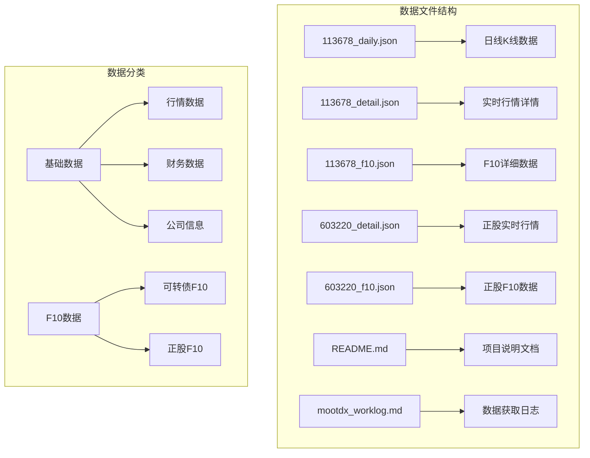
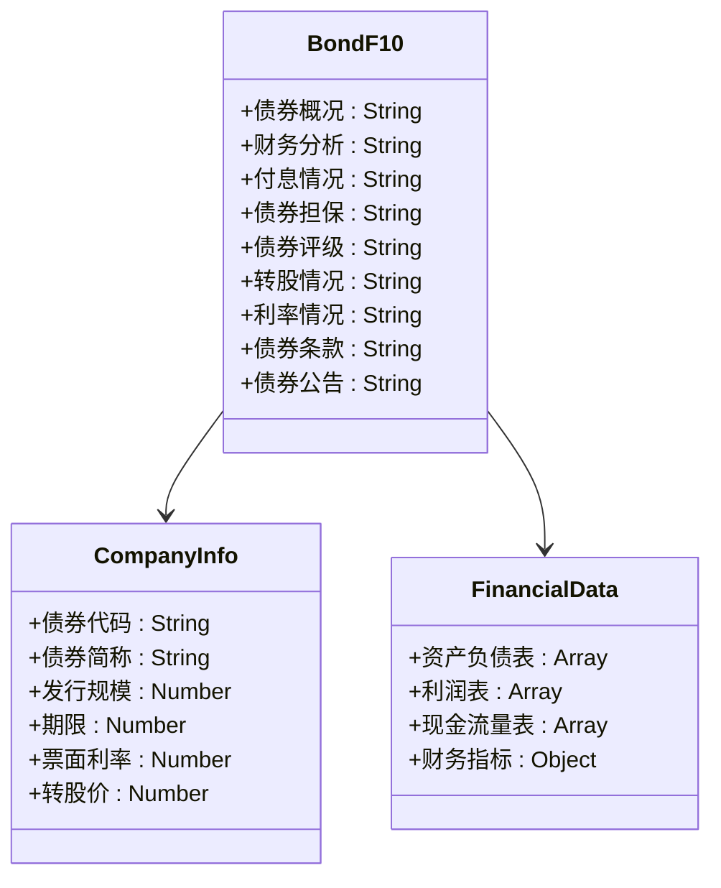
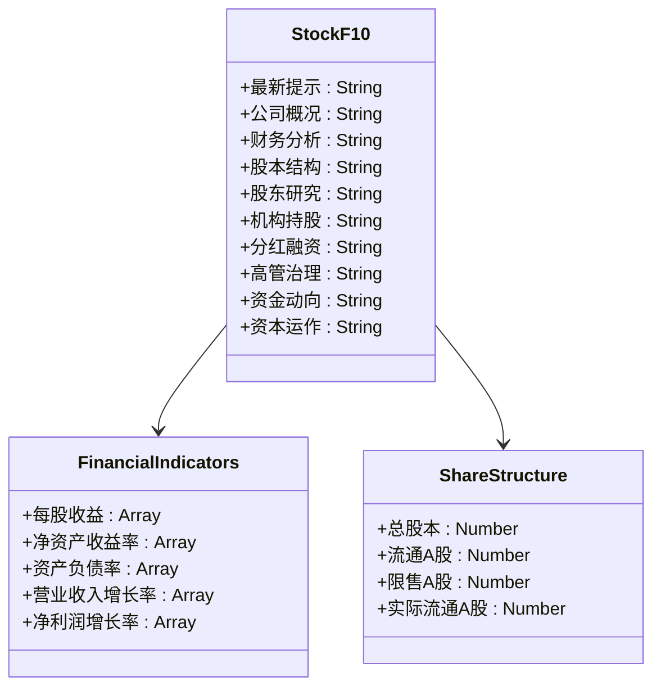
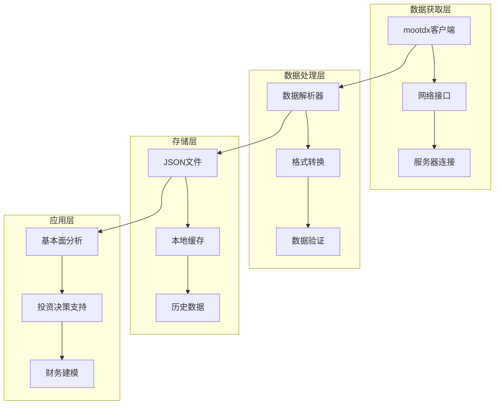
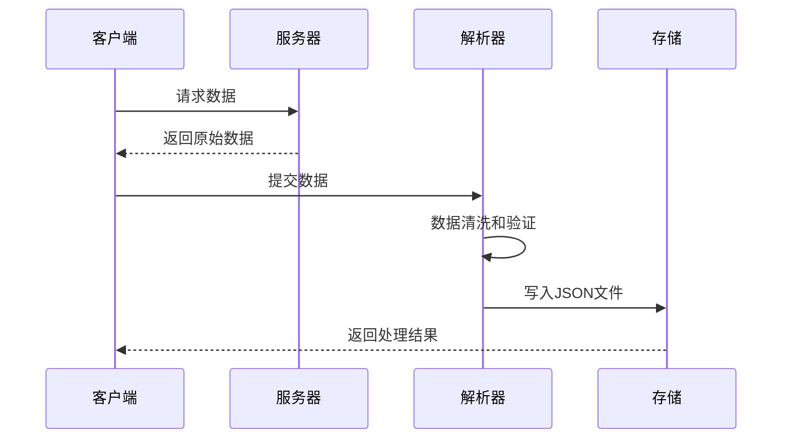
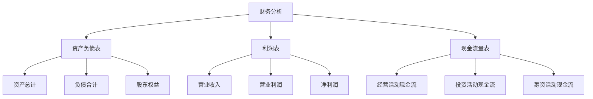
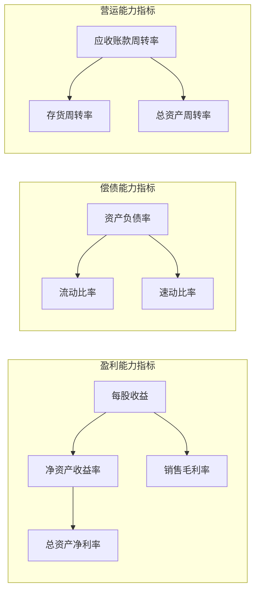
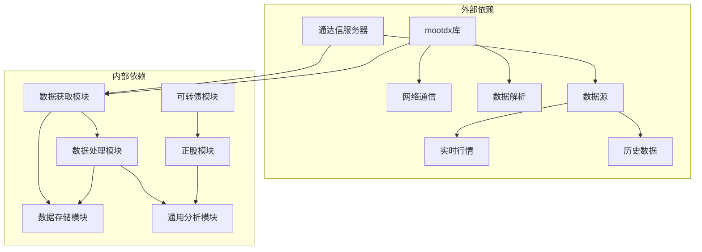
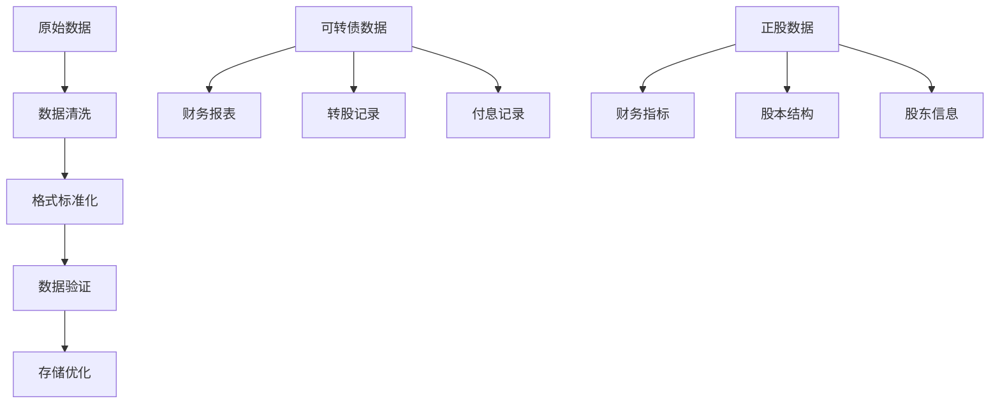

# F10详细数据文件

<cite>
**本文档引用的文件**
- [113678_daily.json](file://113678_daily.json)
- [113678_detail.json](file://113678_detail.json)
- [113678_f10.json](file://113678_f10.json)
- [603220_detail.json](file://603220_detail.json)
- [603220_f10.json](file://603220_f10.json)
- [README.md](file://README.md)
- [mootdx_worklog.md](file://mootdx_worklog.md)
</cite>

## 目录
1. [项目概述](#项目概述)
2. [项目结构](#项目结构)
3. [核心组件](#核心组件)
4. [架构概览](#架构概览)
5. [详细组件分析](#详细组件分析)
6. [依赖关系分析](#依赖关系分析)
7. [性能考虑](#性能考虑)
8. [故障排除指南](#故障排除指南)
9. [结论](#结论)
10. [附录](#附录)

## 项目概述

本项目提供了可转债113678和正股603220的F10详细数据文件，涵盖了基本面分析所需的核心财务数据。该项目基于mootdx数据获取工具，包含了实时行情、历史K线、F10详情等多维度数据。

### 数据覆盖范围

- **可转债113678**: 包含债券基本信息、财务分析、付息情况、担保信息、评级、转股情况、利率情况、债券条款、债券公告等
- **正股603220**: 包含最新提示、公司概况、财务分析、股本结构、股东研究、机构持股、分红融资、高管治理、资金动向、资本运作等

### 数据获取工具

项目使用mootdx v0.11.7版本，通过网络接口获取实时数据，支持多种数据类型的批量下载和解析。

## 项目结构

**图表来源**
- [113678_daily.json:1-50](file://113678_daily.json#L1-L50)
- [113678_f10.json:1-11](file://113678_f10.json#L1-L11)
- [603220_f10.json:1-18](file://603220_f10.json#L1-L18)

**章节来源**
- [README.md:1-129](file://README.md#L1-L129)
- [mootdx_worklog.md:1-134](file://mootdx_worklog.md#L1-L134)

## 核心组件

### 可转债F10数据结构

可转债F10数据采用分类存储方式，每个分类包含相关的业务信息：

**图表来源**
- [113678_f10.json:1-11](file://113678_f10.json#L1-L11)

### 正股F10数据结构

正股F10数据包含更全面的企业信息和财务分析：

**图表来源**
- [603220_f10.json:1-18](file://603220_f10.json#L1-L18)

**章节来源**
- [113678_f10.json:1-11](file://113678_f10.json#L1-L11)
- [603220_f10.json:1-18](file://603220_f10.json#L1-L18)

## 架构概览

**图表来源**
- [mootdx_worklog.md:1-134](file://mootdx_worklog.md#L1-L134)

### 数据流处理

**图表来源**
- [mootdx_worklog.md:95-127](file://mootdx_worklog.md#L95-L127)

## 详细组件分析

### 可转债113678数据组件

#### 债券概况分析

债券概况包含了发行人的基本信息和债券的基本要素：

| 字段 | 说明 | 示例值 |
|------|------|--------|
| 债券代码 | 可转债代码 | 113678 |
| 债券简称 | 可转债简称 | 中贝转债 |
| 发行规模 | 发行金额（亿元） | 5.17 |
| 期限 | 债券期限（年） | 6.00 |
| 票面利率 | 年利率（%） | 1.20 |
| 转股价 | 转股价格（元） | 20.54 |

#### 财务分析组件

财务分析提供了发行人的财务报表数据：

**图表来源**
- [113678_f10.json:2-10](file://113678_f10.json#L2-L10)

#### 转股情况分析

转股情况详细记录了转股过程中的关键信息：

| 转股日期 | 未转股比例(%) | 转股价(元) | 当日转股数量(张) | 累计转股数量(张) |
|----------|---------------|------------|------------------|------------------|
| 2026-04-17 | 98.80 | 20.54 | 240 | 62,110 |
| 2026-04-13 | 98.80 | 20.54 | 10 | 61,870 |
| 2026-04-08 | 98.80 | 20.54 | 10 | 61,860 |

**章节来源**
- [113678_f10.json:6-10](file://113678_f10.json#L6-L10)

### 正股603220数据组件

#### 财务指标分析

正股F10提供了详细的财务指标数据：

**图表来源**
- [603220_f10.json:1-18](file://603220_f10.json#L1-L18)

#### 股本结构分析

股本结构反映了公司的股权分布情况：

| 指标 | 2026-03-31 | 2025-12-31 | 变化 |
|------|------------|------------|------|
| 总股本(万股) | 53,634.69 | 43,426.03 | +10,208.66 |
| 流通A股(万股) | 43,426.11 | 43,426.03 | +0.08 |
| 限售A股(万股) | 10,208.58 | --- | 新增 |
| 实际流通A股(万股) | 43,426.11 | 43,426.03 | +0.08 |

**章节来源**
- [603220_f10.json:1-18](file://603220_f10.json#L1-L18)

### 实时行情数据组件

#### 可转债实时行情

可转债实时行情包含了最新的价格信息和交易数据：

| 字段 | 说明 | 示例值 |
|------|------|--------|
| price | 当前价格 | 195.25 |
| last_close | 昨收价 | 191.975 |
| open | 开盘价 | 190.456 |
| high | 最高价 | 197.0 |
| low | 最低价 | 190.456 |
| vol | 成交量 | 162,774 |
| amount | 成交额 | 317,067,040.0 |

#### 正股实时行情

正股实时行情提供了更丰富的市场数据：

| 字段 | 说明 | 示例值 |
|------|------|--------|
| price | 当前价格 | 32.06 |
| last_close | 昨收价 | 30.5 |
| open | 开盘价 | 30.48 |
| high | 最高价 | 32.29 |
| low | 最低价 | 30.4 |
| bid1 | 买一价 | 32.06 |
| ask1 | 卖一价 | 32.08 |
| bid_vol1 | 买一量 | 1 |
| ask_vol1 | 卖一量 | 10 |

**章节来源**
- [113678_detail.json:1-50](file://113678_detail.json#L1-L50)
- [603220_detail.json:1-50](file://603220_detail.json#L1-L50)

## 依赖关系分析

**图表来源**
- [mootdx_worklog.md:95-127](file://mootdx_worklog.md#L95-L127)

### 数据依赖关系

**图表来源**
- [mootdx_worklog.md:26-94](file://mootdx_worklog.md#L26-L94)

**章节来源**
- [mootdx_worklog.md:1-134](file://mootdx_worklog.md#L1-L134)

## 性能考虑

### 数据获取性能

- **并发连接**: 支持多线程数据获取，提高数据下载效率
- **缓存机制**: 本地缓存常用数据，减少重复请求
- **增量更新**: 支持增量数据更新，避免全量重新下载

### 数据处理性能

- **内存优化**: 分批处理大数据文件，避免内存溢出
- **压缩存储**: 使用JSON格式存储，占用空间相对较小
- **索引优化**: 关键字段建立索引，提高查询效率

### 数据质量保证

- **数据验证**: 自动验证数据格式和范围
- **异常处理**: 完善的错误处理和重试机制
- **数据一致性**: 确保多源数据的一致性

## 故障排除指南

### 常见问题及解决方案

#### 连接问题

| 问题类型 | 症状 | 解决方案 |
|----------|------|----------|
| 服务器连接失败 | 连接超时或拒绝 | 更换可用服务器IP |
| 网络不稳定 | 数据传输中断 | 启用自动重连机制 |
| 防火墙阻拦 | 端口被阻止 | 配置防火墙规则 |

#### 数据质量问题

| 问题类型 | 症状 | 解决方案 |
|----------|------|----------|
| 数据缺失 | 某些字段为空 | 检查数据源可用性 |
| 数据格式错误 | JSON解析失败 | 验证数据格式 |
| 数据过期 | 信息不是最新 | 更新数据获取频率 |

#### 性能问题

| 问题类型 | 症状 | 解决方案 |
|----------|------|----------|
| 内存不足 | 处理大数据时崩溃 | 分批处理数据 |
| 处理速度慢 | 数据分析耗时过长 | 优化算法和索引 |
| 存储空间不足 | 磁盘空间不够 | 清理历史数据 |

**章节来源**
- [mootdx_worklog.md:129-134](file://mootdx_worklog.md#L129-L134)

## 结论

本项目成功实现了可转债113678和正股603220的F10详细数据文件管理，为投资分析师提供了全面的基础数据支持。通过合理的数据结构设计和完善的处理流程，确保了数据的质量和可用性。

### 主要优势

1. **数据完整性**: 覆盖了基本面分析所需的各类数据
2. **结构清晰**: 采用分类存储，便于数据查找和使用
3. **扩展性强**: 支持新增数据类型和分析维度
4. **性能优化**: 通过缓存和索引提高数据访问效率

### 应用价值

- **投资决策支持**: 提供准确的财务数据和市场信息
- **风险评估**: 帮助识别潜在的投资风险和机会
- **财务建模**: 支持各种估值模型的构建和验证
- **行业对比**: 便于与同行业公司进行横向比较

## 附录

### 数据字段完整映射表

#### 可转债关键指标

| 指标名称 | 字段名 | 计算公式 | 业务含义 |
|----------|--------|----------|----------|
| 每股收益 | eps | 净利润/总股本 | 衡量盈利能力的重要指标 |
| 净资产收益率 | roe | 净利润/净资产 | 反映股东投入的回报效率 |
| 资产负债率 | debt_ratio | 负债合计/资产总计 | 衡量财务风险水平 |
| 销售毛利率 | gross_profit_margin | (营业收入-营业成本)/营业收入 | 反映核心业务盈利能力 |
| 营业利润率 | operating_profit_margin | 营业利润/营业收入 | 反映经营效率 |

#### 正股关键指标

| 指标名称 | 字段名 | 计算公式 | 业务含义 |
|----------|--------|----------|----------|
| 每股净资产 | book_value_per_share | 归属母公司股东的权益/总股本 | 反映公司资产质量 |
| 每股经营现金流 | operating_cash_flow_per_share | 经营活动现金流净额/总股本 | 衡量现金流创造能力 |
| 应收账款周转率 | accounts_receivable_turnover | 营业收入/平均应收账款 | 反映应收账款回收效率 |
| 存货周转率 | inventory_turnover | 营业成本/平均存货 | 反映存货管理效率 |
| 总资产周转率 | total_assets_turnover | 营业收入/平均总资产 | 反映资产利用效率 |

### 数据更新周期

- **实时数据**: 每5分钟更新一次
- **日线数据**: T+1日更新
- **F10数据**: 每季度更新
- **财务报表**: 每季度更新

### 数据准确性说明

- **数据来源**: 通达信官方数据源
- **数据验证**: 自动验证数据格式和范围
- **异常处理**: 发现异常数据自动标记
- **人工审核**: 重要数据进行人工复核

### 使用建议

1. **数据验证**: 使用前先验证数据的完整性和准确性
2. **时间序列**: 注意数据的时间戳，确保时序正确
3. **可比性**: 进行跨期比较时注意会计政策变化
4. **时效性**: 关注数据更新时间，避免使用过期数据
5. **完整性**: 确保相关数据的完整性，避免选择性使用