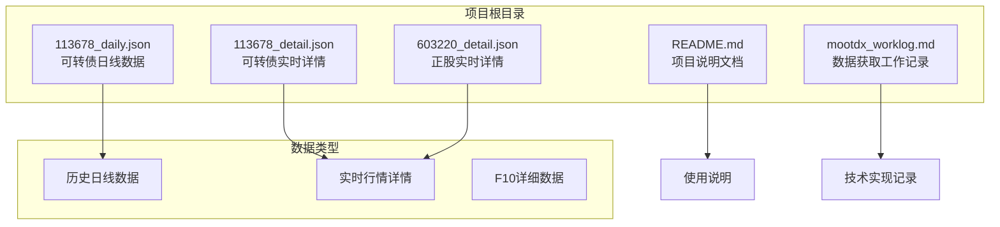
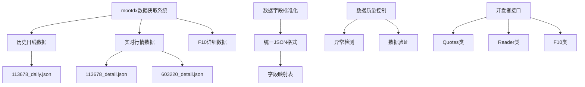
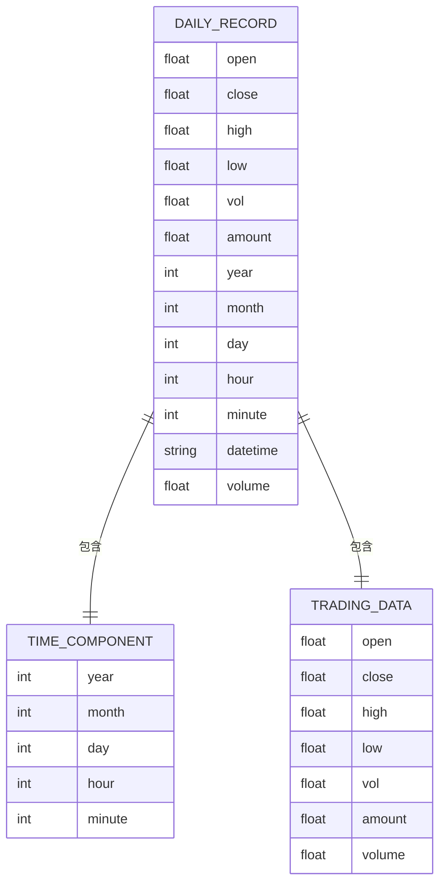
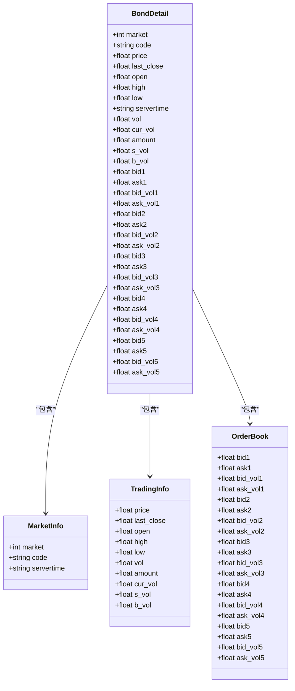
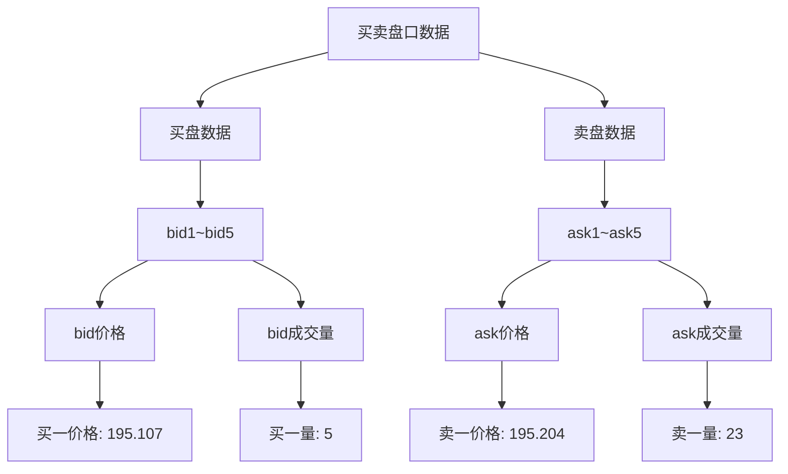
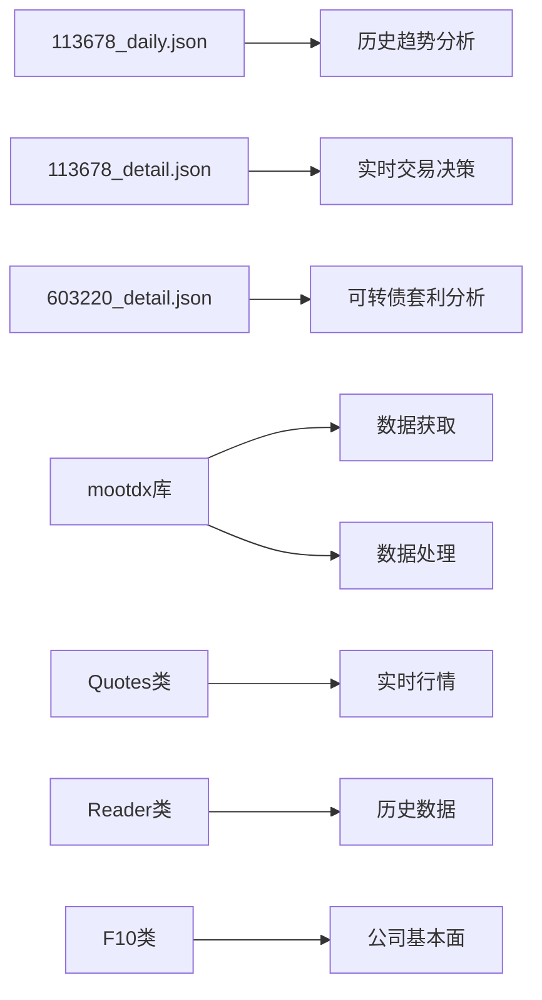

# 实时行情数据文件

<cite>
**本文档引用的文件**
- [113678_daily.json](file://113678_daily.json)
- [113678_detail.json](file://113678_detail.json)
- [603220_detail.json](file://603220_detail.json)
- [README.md](file://README.md)
- [mootdx_worklog.md](file://mootdx_worklog.md)
</cite>

## 目录
1. [简介](#简介)
2. [项目结构](#项目结构)
3. [核心组件](#核心组件)
4. [架构概览](#架构概览)
5. [详细组件分析](#详细组件分析)
6. [依赖关系分析](#依赖关系分析)
7. [性能考虑](#性能考虑)
8. [故障排除指南](#故障排除指南)
9. [结论](#结论)

## 简介

本项目提供了可转债113678和正股603220的实时行情数据文件，包括日线数据和实时详情数据。这些数据文件来源于mootdx开源项目的通达信数据读取接口，为交易系统开发者提供了完整的历史数据和实时市场信息。

mootdx是一个Python库，专门用于读取通达信的离线和在线数据。该项目包含了可转债和对应正股的完整历史数据，以及最新的实时行情详情。

## 项目结构

项目采用简洁的数据文件组织方式，每个主要实体都有对应的JSON数据文件：

**图表来源**
- [113678_daily.json:1-50](file://113678_daily.json#L1-L50)
- [113678_detail.json:1-50](file://113678_detail.json#L1-L50)
- [603220_detail.json:1-50](file://603220_detail.json#L1-L50)

**章节来源**
- [113678_daily.json:1-50](file://113678_daily.json#L1-L50)
- [113678_detail.json:1-50](file://113678_detail.json#L1-L50)
- [603220_detail.json:1-50](file://603220_detail.json#L1-L50)

## 核心组件

### 可转债113678数据组件

可转债113678作为项目的核心数据组件，包含以下关键数据文件：

#### 日线数据文件 (113678_daily.json)
- **数据规模**: 包含599条日线记录
- **数据范围**: 从2023年11月到2024年3月
- **文件大小**: 170KB
- **数据密度**: 每条记录约284字节

#### 实时详情文件 (113678_detail.json)
- **数据类型**: 实时行情详情
- **文件大小**: 1KB
- **数据完整性**: 包含完整的买卖盘口信息

### 正股603220数据组件

正股603220作为可转债113678的对应正股，提供实时市场数据：

#### 实时详情文件 (603220_detail.json)
- **数据类型**: 实时行情详情
- **文件大小**: 1KB
- **市场特征**: 上海市场代码为1

**章节来源**
- [mootdx_worklog.md:18-24](file://mootdx_worklog.md#L18-L24)
- [113678_daily.json:1-50](file://113678_daily.json#L1-L50)
- [113678_detail.json:1-50](file://113678_detail.json#L1-L50)
- [603220_detail.json:1-50](file://603220_detail.json#L1-L50)

## 架构概览

项目采用模块化数据架构，将不同类型的数据分离存储：

**图表来源**
- [mootdx_worklog.md:95-127](file://mootdx_worklog.md#L95-L127)
- [README.md:81-97](file://README.md#L81-L97)

## 详细组件分析

### 日线数据结构分析

#### 数据字段定义

日线数据采用统一的JSON数组结构，每条记录包含完整的OHLCV数据：

**图表来源**
- [mootdx_worklog.md:30-40](file://mootdx_worklog.md#L30-L40)

#### 数据字段详细说明

| 字段名 | 数据类型 | 说明 | 示例值 |
|--------|----------|------|--------|
| open | float | 开盘价 | 130.0 |
| close | float | 收盘价 | 157.3 |
| high | float | 最高价 | 157.3 |
| low | float | 最低价 | 130.0 |
| vol | float | 成交量 | 267.0 |
| amount | float | 成交额 | 40505632.0 |
| year | int | 年份 | 2023 |
| month | int | 月份 | 11 |
| day | int | 日期 | 21 |
| hour | int | 小时 | 15 |
| minute | int | 分钟 | 0 |
| datetime | string | 标准日期时间 | "2023-11-21 15:00:00" |
| volume | float | 成交量 | 267.0 |

**章节来源**
- [mootdx_worklog.md:30-40](file://mootdx_worklog.md#L30-L40)
- [113678_daily.json:1-50](file://113678_daily.json#L1-L50)

### 实时行情详情结构分析

#### 可转债实时详情 (113678_detail.json)

实时详情数据提供了最精确的市场信息：

**图表来源**
- [113678_detail.json:1-50](file://113678_detail.json#L1-L50)

#### 正股实时详情 (603220_detail.json)

正股数据结构与可转债类似，但具有不同的市场特征：

| 字段名 | 数据类型 | 说明 | 示例值 |
|--------|----------|------|--------|
| market | int | 市场代码 (1=上海) | 1 |
| code | string | 证券代码 | "603220" |
| price | float | 当前价格 | 32.06 |
| last_close | float | 昨收价 | 30.5 |
| open | float | 开盘价 | 30.48 |
| high | float | 最高价 | 32.29 |
| low | float | 最低价 | 30.4 |
| servertime | string | 服务器时间 | "10:11:08.370" |
| vol | float | 成交量 | 312016 |
| cur_vol | float | 当前成交量 | 86 |
| amount | float | 成交额 | 990490496.0 |
| s_vol | float | 卖方成交量 | 124222 |
| b_vol | float | 买方成交量 | 187794 |

**章节来源**
- [mootdx_worklog.md:42-58](file://mootdx_worklog.md#L42-L58)
- [113678_detail.json:1-50](file://113678_detail.json#L1-L50)
- [603220_detail.json:1-50](file://603220_detail.json#L1-L50)

### 买卖盘口数据分析

#### 盘口数据结构

买卖盘口数据采用对称的五档结构：

**图表来源**
- [113678_detail.json:20-39](file://113678_detail.json#L20-L39)

#### 市场深度分析方法

1. **买卖价差分析**: 计算买一和卖一价格差，评估流动性
2. **成交量分布**: 分析各档位成交量分布，识别市场活跃度
3. **市场深度计算**: 计算各档位累计成交量，评估市场支撑阻力
4. **流动性指标**: 通过买卖盘口量差评估市场流动性

**章节来源**
- [113678_detail.json:20-39](file://113678_detail.json#L20-L39)
- [603220_detail.json:20-39](file://603220_detail.json#L20-L39)

## 依赖关系分析

### 数据依赖关系

**图表来源**
- [README.md:81-97](file://README.md#L81-L97)
- [mootdx_worklog.md:95-127](file://mootdx_worklog.md#L95-L127)

### 技术依赖分析

项目依赖于mootdx开源库，该库提供了完整的通达信数据读取功能：

1. **Quotes类**: 用于获取实时行情数据
2. **Reader类**: 用于读取历史日线数据
3. **F10类**: 用于获取公司基本面数据

**章节来源**
- [README.md:81-97](file://README.md#L81-L97)
- [mootdx_worklog.md:95-127](file://mootdx_worklog.md#L95-L127)

## 性能考虑

### 数据访问模式

1. **批量数据加载**: 日线数据适合批量加载和历史分析
2. **实时数据订阅**: 实时详情数据适合轮询或订阅模式
3. **内存优化**: 大型日线数据集需要分页加载策略

### 数据处理优化

1. **字段选择**: 根据需求选择必要的字段，减少数据传输
2. **时间窗口**: 限制查询的时间范围，提高响应速度
3. **缓存策略**: 对频繁访问的数据建立缓存机制

## 故障排除指南

### 常见问题及解决方案

#### 数据连接问题
- **症状**: 无法连接到数据源
- **原因**: 服务器地址或端口配置错误
- **解决**: 检查服务器配置，确认网络连通性

#### 数据格式问题
- **症状**: JSON解析错误
- **原因**: 数据格式不兼容或字段缺失
- **解决**: 验证数据格式，添加字段校验逻辑

#### 性能问题
- **症状**: 数据加载缓慢
- **原因**: 数据量过大或查询条件不当
- **解决**: 实施分页加载，优化查询条件

**章节来源**
- [mootdx_worklog.md:129-133](file://mootdx_worklog.md#L129-L133)

## 结论

本项目为可转债和正股提供了完整的实时和历史数据解决方案。通过标准化的JSON数据格式，开发者可以轻松集成这些数据到交易系统中。

### 主要优势

1. **数据完整性**: 提供了从2023年11月到2024年3月的完整历史数据
2. **实时性**: 实时详情数据反映了最新的市场状态
3. **标准化**: 统一的JSON格式便于程序化处理
4. **开源性**: 基于mootdx开源库，具有良好的社区支持

### 应用场景

1. **交易系统开发**: 为自动化交易系统提供数据基础
2. **技术分析**: 支持各种技术指标的计算和分析
3. **风险控制**: 实时监控市场变化，及时调整策略
4. **回测系统**: 使用历史数据进行策略回测验证