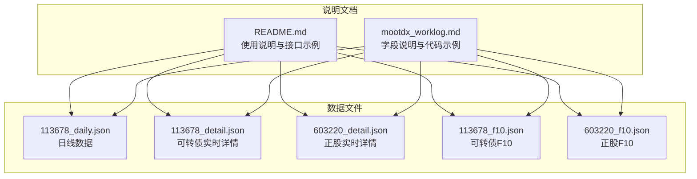
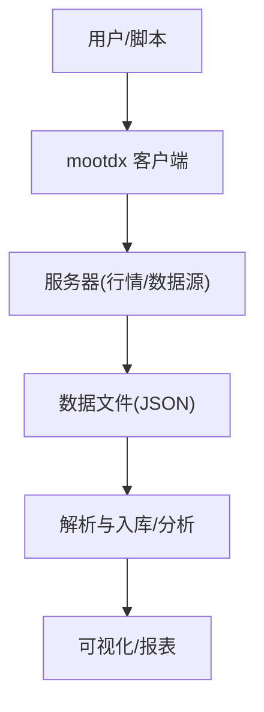
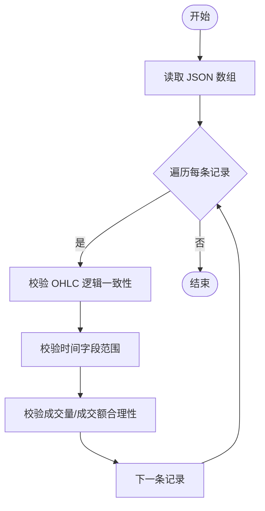
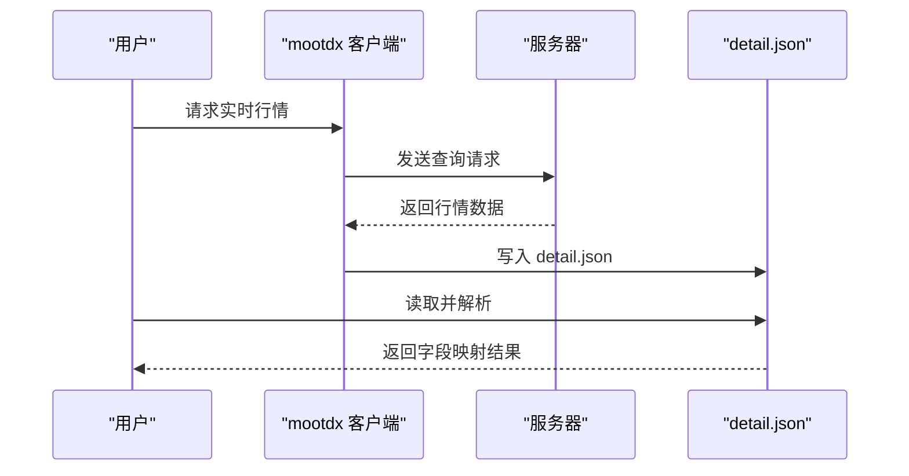
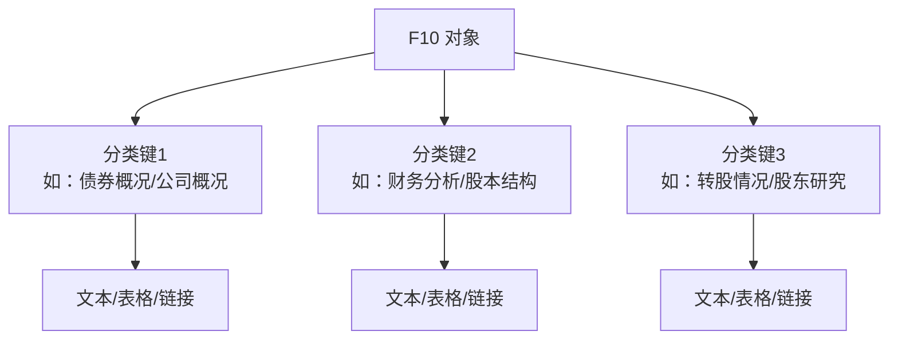
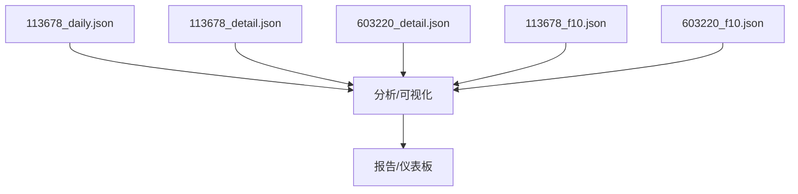

# 数据文件说明

<cite>
**本文引用的文件**
- [113678_daily.json](file://113678_daily.json)
- [113678_detail.json](file://113678_detail.json)
- [603220_detail.json](file://603220_detail.json)
- [113678_f10.json](file://113678_f10.json)
- [603220_f10.json](file://603220_f10.json)
- [README.md](file://README.md)
- [mootdx_worklog.md](file://mootdx_worklog.md)
</cite>

## 目录
1. [简介](#简介)
2. [项目结构](#项目结构)
3. [核心组件](#核心组件)
4. [架构概览](#架构概览)
5. [详细组件分析](#详细组件分析)
6. [依赖分析](#依赖分析)
7. [性能考虑](#性能考虑)
8. [故障排查指南](#故障排查指南)
9. [结论](#结论)
10. [附录](#附录)

## 简介
本文件面向数据分析师与开发者，系统化说明 mootdx 项目中与可转债 113678 与正股 603220 相关的数据文件结构与使用方法。内容覆盖：
- 日线数据、实时行情数据与 F10 详细数据的字段定义、数据类型与业务含义
- 字段映射表与金融术语解释
- 数据文件的生成来源、存储格式与访问方法
- 数据验证规则与质量检查方法
- 使用建议与最佳实践

## 项目结构
本仓库包含如下关键数据文件：
- 113678_daily.json：可转债 113678 的日线行情数据（多条记录）
- 113678_detail.json：可转债 113678 的实时行情详情
- 603220_detail.json：正股 603220 的实时行情详情
- 113678_f10.json：可转债 113678 的 F10 详细数据（多分类）
- 603220_f10.json：正股 603220 的 F10 详细数据（多分类）

图表来源
- [113678_daily.json](file://113678_daily.json)
- [113678_detail.json](file://113678_detail.json)
- [603220_detail.json](file://603220_detail.json)
- [113678_f10.json](file://113678_f10.json)
- [603220_f10.json](file://603220_f10.json)
- [README.md](file://README.md)
- [mootdx_worklog.md](file://mootdx_worklog.md)

章节来源
- [README.md](file://README.md)
- [mootdx_worklog.md](file://mootdx_worklog.md)

## 核心组件
- 日线数据（daily.json）
  - 结构：数组，每条记录为一个交易日的 OHLCV 与时间戳
  - 关键字段：开盘价、收盘价、最高价、最低价、成交量、成交额、年/月/日/时/分、标准日期时间、成交量(volume)
  - 示例路径：[113678_daily.json](file://113678_daily.json)

- 实时行情详情（detail.json）
  - 结构：对象，包含市场代码、代码、价格、昨收、开盘、最高、最低、成交量、成交额、买卖盘口等
  - 示例路径：[113678_detail.json](file://113678_detail.json)、[603220_detail.json](file://603220_detail.json)

- F10 详细数据（f10.json）
  - 结构：对象，键为分类标题（如“债券概况”、“财务分析”、“转股情况”等），值为文本或表格形式的说明
  - 示例路径：[113678_f10.json](file://113678_f10.json)、[603220_f10.json](file://603220_f10.json)

章节来源
- [113678_daily.json](file://113678_daily.json)
- [113678_detail.json](file://113678_detail.json)
- [603220_detail.json](file://603220_detail.json)
- [113678_f10.json](file://113678_f10.json)
- [603220_f10.json](file://603220_f10.json)

## 架构概览
下图展示数据文件与典型使用场景的关系：

说明
- 用户通过 mootdx 客户端获取数据，客户端将返回的原始数据保存为 JSON 文件
- 日线、实时行情与 F10 数据分别对应不同的 JSON 文件
- 解析与入库阶段负责字段校验、类型转换与质量控制

## 详细组件分析

### 日线数据（113678_daily.json）
- 数据形态
  - 数组，元素为对象，每个对象代表一个交易日
- 字段定义与业务含义
  - open/close/high/low：当日开盘/收盘/最高/最低价格
  - vol/amount：当日成交量（手/股）与成交额（元）
  - year/month/day/hour/minute：时间分解字段
  - datetime：标准日期时间字符串
  - volume：成交量（与 vol/amount 的关系取决于数据源口径）
- 数据类型
  - open/close/high/low/vol/amount/volume：数值型
  - year/month/day/hour/minute：整数型
  - datetime：字符串型
- 字段映射表（节选）
  - open → 开盘价
  - close → 收盘价
  - high → 最高价
  - low → 最低价
  - vol → 成交量
  - amount → 成交额
  - year/month/day/hour/minute → 时间分解
  - datetime → 标准日期时间
  - volume → 成交量
- 业务含义
  - 用于 K 线绘制、技术分析、回测与统计
- 访问方法
  - 直接读取 JSON 文件，逐条解析对象
- 质量检查
  - 检查时间序列连续性（缺失日期、重复日期）
  - 校验 OHLC 逻辑一致性（low ≤ min(open, close)，high ≥ max(open, close)）
  - 校验 vol/amount 合理性（非负、与 price 的乘积合理）

图表来源
- [113678_daily.json](file://113678_daily.json)

章节来源
- [113678_daily.json](file://113678_daily.json)
- [mootdx_worklog.md](file://mootdx_worklog.md)

### 实时行情详情（113678_detail.json 与 603220_detail.json）
- 数据形态
  - 对象，包含市场标识、代码、价格、昨收、开盘、最高、最低、成交量、成交额、买卖盘口等
- 字段定义与业务含义
  - market：市场代码（示例值 1 表示上海）
  - code：证券代码
  - price：当前价格
  - last_close：昨收价
  - open/high/low：当日开盘/最高/最低
  - vol/amount：当日成交量/成交额
  - cur_vol：当前成交量（可能为分钟级或实时口径）
  - s_vol/b_vol：主动买入/卖出量（可能为委托口径）
  - bid1~bid5 / ask1~ask5：买卖盘口价格
  - bid_vol1~bid_vol5 / ask_vol1~ask_vol5：买卖盘口量
  - servertime：服务器时间
  - reversed_bytes*：保留字段（二进制/字节序相关，不建议直接业务使用）
- 数据类型
  - market/code/price/last_close/open/high/low/vol/amount/cur_vol/s_vol/b_vol：数值型
  - bid*/ask*：数值型
  - bid_vol*/ask_vol*：数值型
  - servertime：字符串型
  - reversed_bytes*：数值型或数组
- 字段映射表（节选）
  - market → 市场代码
  - code → 证券代码
  - price → 当前价格
  - last_close → 昨收价
  - open/high/low → 开盘/最高/最低
  - vol/amount → 成交量/成交额
  - cur_vol → 当前成交量
  - s_vol/b_vol → 主动买入/卖出量
  - bid1~bid5 / ask1~ask5 → 买卖盘口价格
  - bid_vol1~bid_vol5 / ask_vol1~ask_vol5 → 买卖盘口量
  - servertime → 服务器时间
  - reversed_bytes* → 保留字段
- 业务含义
  - 用于实时行情展示、盘口分析、委托监控
- 访问方法
  - 直接读取 JSON 对象，提取所需字段
- 质量检查
  - bid/ask 价量配对一致性（bidN ≤ askM，bid_volN 与 ask_volM 合理）
  - 价格与昨收的涨跌范围合理性
  - 时间字段与时钟同步性

图表来源
- [113678_detail.json](file://113678_detail.json)
- [603220_detail.json](file://603220_detail.json)
- [README.md](file://README.md)

章节来源
- [113678_detail.json](file://113678_detail.json)
- [603220_detail.json](file://603220_detail.json)
- [mootdx_worklog.md](file://mootdx_worklog.md)

### F10 详细数据（113678_f10.json 与 603220_f10.json）
- 数据形态
  - 对象，键为分类标题（如“债券概况”、“财务分析”、“转股情况”等），值为文本或表格形式的说明
- 字段定义与业务含义
  - 分类键：如“债券概况”、“财务分析”、“付息情况”、“转股情况”、“利率情况”、“债券条款”、“债券公告”等（可转债）
  - 分类键：如“最新提示”、“公司概况”、“财务分析”、“股本结构”、“股东研究”等（正股）
  - 值：文本说明、表格数据、链接等
- 数据类型
  - 键：字符串
  - 值：字符串（文本/表格）、数组（如某些保留字段）
- 业务含义
  - 提供公司基本面、财务状况、治理结构、公告与研究等深度信息
- 访问方法
  - 读取 JSON 对象，按分类键提取对应文本/表格
- 质量检查
  - 文本完整性（避免空值或截断）
  - 表格字段对齐与一致性
  - 链接有效性（如存在）

图表来源
- [113678_f10.json](file://113678_f10.json)
- [603220_f10.json](file://603220_f10.json)

章节来源
- [113678_f10.json](file://113678_f10.json)
- [603220_f10.json](file://603220_f10.json)
- [mootdx_worklog.md](file://mootdx_worklog.md)

## 依赖分析
- 文件间依赖
  - 日线数据与实时详情：无直接依赖，分别用于不同场景
  - F10 数据：与对应标的代码强绑定（113678_f10.json 对应 113678，603220_f10.json 对应 603220）
- 外部依赖
  - 通过 mootdx 客户端获取数据，客户端依赖服务器接口与网络连通性
  - 服务器参数与可用性可能影响数据获取成功率

图表来源
- [113678_daily.json](file://113678_daily.json)
- [113678_detail.json](file://113678_detail.json)
- [603220_detail.json](file://603220_detail.json)
- [113678_f10.json](file://113678_f10.json)
- [603220_f10.json](file://603220_f10.json)

## 性能考虑
- 文件大小与加载
  - 日线数据文件较大（示例显示数千条记录），建议按需分页或分段读取
- 解析效率
  - 使用流式解析或分块读取，避免一次性加载整个文件
- 存储与索引
  - 建议按日期建立索引，加速时间序列查询
- 缓存策略
  - 对高频访问的实时详情设置缓存，降低重复请求

## 故障排查指南
- 无法连接服务器
  - 现象：无法获取数据
  - 排查：更换可用服务器、检查网络连通性
- 字段缺失或异常
  - 现象：字段为空或异常
  - 排查：检查数据文件完整性、确认字段映射与类型
- 时间序列不连续
  - 现象：缺失节假日或周末数据
  - 排查：确认数据源是否剔除休市日，必要时进行插值或填充
- OHLC 逻辑不一致
  - 现象：最低价高于最高价
  - 排查：检查数据清洗与校验流程

章节来源
- [mootdx_worklog.md](file://mootdx_worklog.md)

## 结论
本文系统梳理了 mootdx 项目中可转债 113678 与正股 603220 的数据文件结构与使用方法，提供了字段映射、业务含义、访问与质量控制建议。建议在实际应用中结合业务需求选择合适的数据粒度，并建立完善的校验与缓存机制，确保数据质量与性能。

## 附录

### 字段映射表（日线数据）
- open → 开盘价
- close → 收盘价
- high → 最高价
- low → 最低价
- vol → 成交量
- amount → 成交额
- year/month/day/hour/minute → 时间分解
- datetime → 标准日期时间
- volume → 成交量

章节来源
- [113678_daily.json](file://113678_daily.json)
- [mootdx_worklog.md](file://mootdx_worklog.md)

### 字段映射表（实时行情详情）
- market → 市场代码
- code → 证券代码
- price → 当前价格
- last_close → 昨收价
- open/high/low → 开盘/最高/最低
- vol/amount → 成交量/成交额
- cur_vol → 当前成交量
- s_vol/b_vol → 主动买入/卖出量
- bid1~bid5 / ask1~ask5 → 买卖盘口价格
- bid_vol1~bid_vol5 / ask_vol1~ask_vol5 → 买卖盘口量
- servertime → 服务器时间
- reversed_bytes* → 保留字段

章节来源
- [113678_detail.json](file://113678_detail.json)
- [603220_detail.json](file://603220_detail.json)
- [mootdx_worklog.md](file://mootdx_worklog.md)

### F10 分类概览（可转债）
- 债券概况、财务分析、付息情况、债券担保、债券评级、转股情况、利率情况、债券条款、债券公告

章节来源
- [113678_f10.json](file://113678_f10.json)
- [mootdx_worklog.md](file://mootdx_worklog.md)

### F10 分类概览（正股）
- 最新提示、公司概况、财务分析、股本结构、股东研究、机构持股、分红融资、高管治理、资金动向、资本运作、热点题材、公司公告、公司报道、经营分析、行业分析、研报评级

章节来源
- [603220_f10.json](file://603220_f10.json)
- [mootdx_worklog.md](file://mootdx_worklog.md)