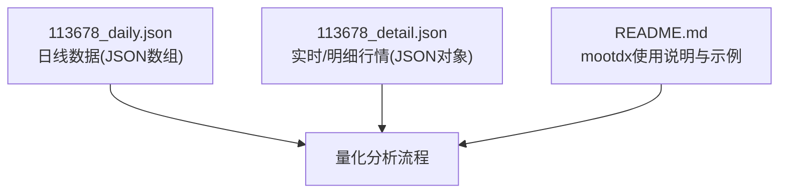
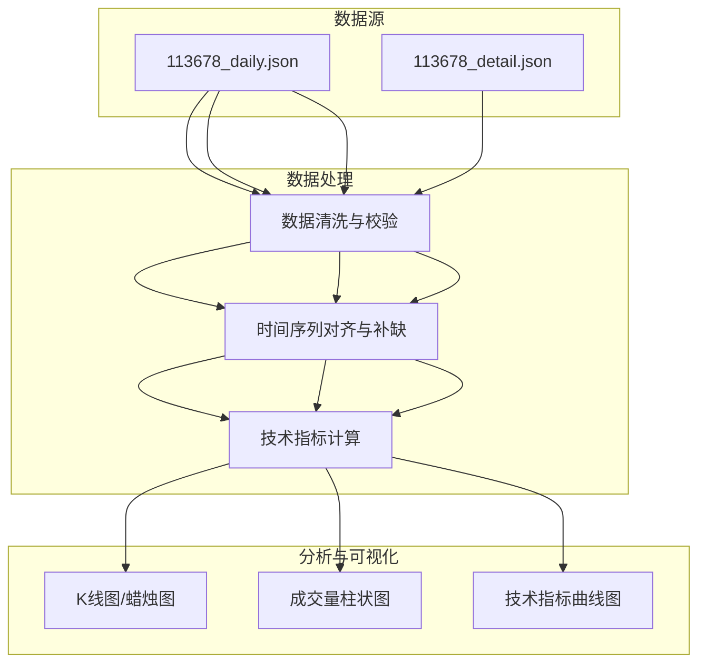
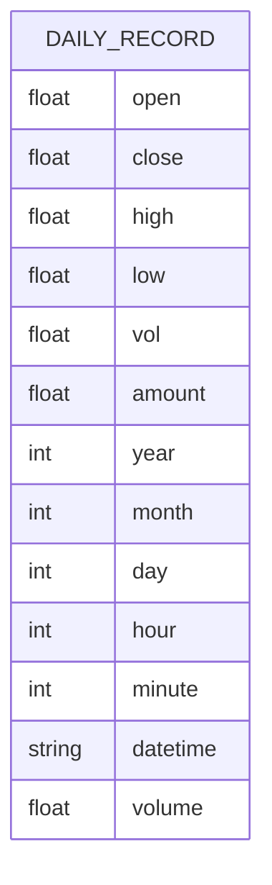
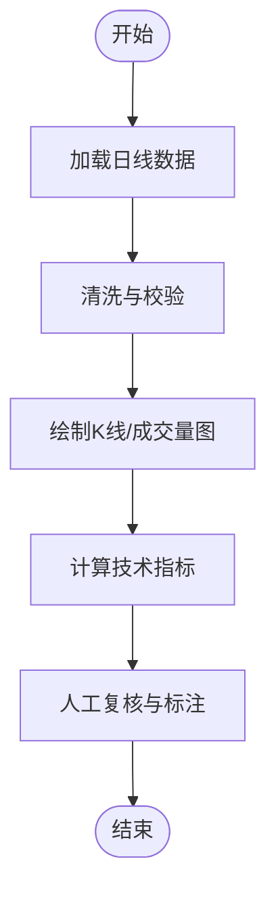
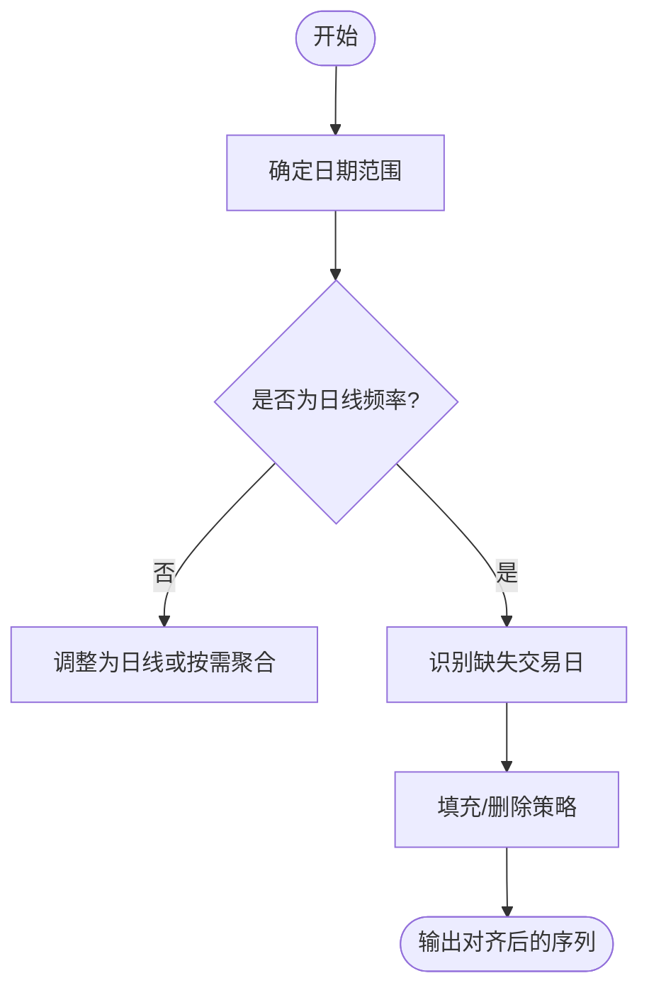
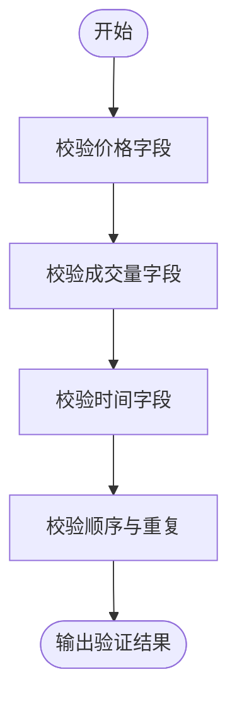
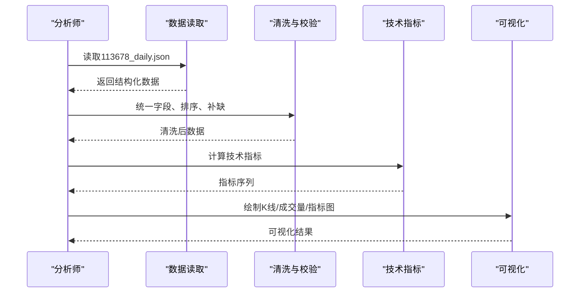
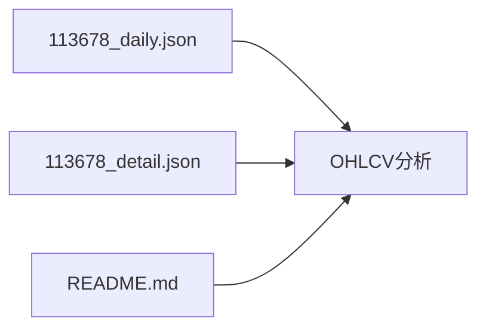

# 日线数据文件

<cite>
**本文引用的文件**
- [113678_daily.json](file://113678_daily.json)
- [113678_detail.json](file://113678_detail.json)
- [README.md](file://README.md)
</cite>

## 目录
1. [简介](#简介)
2. [项目结构](#项目结构)
3. [核心组件](#核心组件)
4. [架构总览](#架构总览)
5. [详细组件分析](#详细组件分析)
6. [依赖分析](#依赖分析)
7. [性能考量](#性能考量)
8. [故障排查指南](#故障排查指南)
9. [结论](#结论)
10. [附录](#附录)

## 简介
本文件面向量化分析师与数据工程师，围绕可转债“113678”的日线数据文件进行系统化技术说明。内容涵盖：
- JSON结构字段定义与数据类型
- OHLCV数据模型在金融分析中的应用
- volume 与 vol 的关系与一致性校验
- 时间序列特征：日期范围、频率、缺失值处理策略
- 数据验证规则：价格字段合理性、成交量逻辑验证
- 使用指南：数据清洗、技术指标计算与可视化方法

## 项目结构
当前工作区包含以下与日线数据相关的文件：
- 113678_daily.json：可转债113678的日线数据（JSON数组，每条记录为一个交易日）
- 113678_detail.json：可转债113678的实时/明细行情快照（包含买卖盘、量能等）
- README.md：mootdx库的使用说明与示例，提供日线数据读取与API调用参考

**图表来源**
- [113678_daily.json](file://113678_daily.json)
- [113678_detail.json](file://113678_detail.json)
- [README.md](file://README.md)

**章节来源**
- [113678_daily.json](file://113678_daily.json)
- [113678_detail.json](file://113678_detail.json)
- [README.md](file://README.md)

## 核心组件
本节聚焦于日线数据JSON结构的关键字段及其语义、数据类型与用途。

- open：当日开盘价，数值型（浮点），单位为价格货币单位
- close：当日收盘价，数值型（浮点），单位为价格货币单位
- high：当日最高价，数值型（浮点），单位为价格货币单位
- low：当日最低价，数值型（浮点），单位为价格货币单位
- vol：当日成交量（原始单位），数值型（浮点），常用于与amount配合推导均价
- amount：当日成交金额（人民币元或等价货币），数值型（浮点）
- year/month/day/hour/minute：时间拆解字段，便于索引与排序
- datetime：标准化时间字符串，格式为“YYYY-MM-DD HH:MM:SS”
- volume：与vol一致的成交量字段，二者应保持数值相等

字段关系与一致性：
- vol 与 volume：两者均为成交量，且在样本中出现的记录中数值完全一致，可视为同一口径的两种表达形式
- open/close/high/low：构成OHLC四价序列，是技术分析的基础
- amount 与 vol：通常存在近似关系 amount ≈ avg_price × vol；可用于异常检测与复核

**章节来源**
- [113678_daily.json](file://113678_daily.json)

## 架构总览
下图展示了从数据源到分析应用的典型路径：日线数据文件作为输入，经过清洗与校验后进入分析与可视化阶段。

[此图为概念性流程示意，不直接映射具体源码文件，故不附“图表来源”]

## 详细组件分析

### 日线数据JSON结构详解
- 数据类型：JSON数组，元素为对象
- 对象字段：
  - open/close/high/low：数值（浮点）
  - vol/amount：数值（浮点）
  - year/month/day/hour/minute：整数
  - datetime：字符串
  - volume：数值（浮点），与vol一致
- 示例字段路径：
  - [113678_daily.json:1-16](file://113678_daily.json#L1-L16)
  - [113678_daily.json:17-31](file://113678_daily.json#L17-L31)
  - [113678_daily.json:32-46](file://113678_daily.json#L32-L46)

**图表来源**
- [113678_daily.json](file://113678_daily.json)

**章节来源**
- [113678_daily.json](file://113678_daily.json)

### OHLCV数据模型在金融分析中的应用
- OHLC序列用于绘制K线图，识别趋势、反转形态与支撑阻力
- Volumn（vol/volume）用于衡量交易活跃度，结合价格形成量价关系分析
- amount 提供成交金额视角，有助于识别异常放量或缩量

[此图为概念性流程示意，不直接映射具体源码文件，故不附“图表来源”]

**章节来源**
- [113678_daily.json](file://113678_daily.json)

### volume 与 vol 的关系
- 在样本中，volume 与 vol 数值一致，二者可互换使用
- 建议统一使用 vol 或 volume 之一，避免混用导致歧义
- 若同时存在两个字段，应进行一致性校验，确保 vol == volume

**章节来源**
- [113678_daily.json](file://113678_daily.json)

### 时间序列特征
- 日期范围：从最早记录的 year/month/day 到最晚记录的 year/month/day
- 数据频率：日线（每个交易日一条记录）
- 时间戳：datetime 字段提供统一格式；year/month/day/hour/minute 便于按日/按年筛选
- 缺失值处理：
  - 逐日补缺：若某交易日无记录，则补空值或删除该日，视分析需求而定
  - 插值：对连续交易日的价格序列可采用前复权/后复权方式处理
  - 异常日期：剔除非法日期（如跨年/跨月边界异常）

[此图为概念性流程示意，不直接映射具体源码文件，故不附“图表来源”]

**章节来源**
- [113678_daily.json](file://113678_daily.json)

### 数据验证规则
- 价格字段合理性：
  - open/close/high/low 必须为正值
  - high ≥ max(open, close)
  - low ≤ min(open, close)
  - 若出现异常（如负值、高/低越界），标记为异常并记录原因
- 成交量逻辑验证：
  - vol ≥ 0；volume 与 vol 应一致
  - amount ≥ 0；若 amount 为 0，需核查 vol 是否也为 0
- 时间字段一致性：
  - year/month/day/hour/minute 与 datetime 字符串一致
  - datetime 严格遵循“YYYY-MM-DD HH:MM:SS”
- 重复与顺序：
  - 按 datetime 升序排列
  - 去重：若同一天出现多条记录，保留一条或合并

[此图为概念性流程示意，不直接映射具体源码文件，故不附“图表来源”]

**章节来源**
- [113678_daily.json](file://113678_daily.json)

### 量化分析师使用指南
- 数据清洗：
  - 读取JSON文件，转换为结构化数据框（如 pandas.DataFrame）
  - 标准化列名，统一使用 vol 或 volume
  - 按 datetime 排序，去重并补齐缺失交易日
- 技术指标计算：
  - 常用指标：移动平均线（MA）、相对强弱指数（RSI）、布林带（BOLL）、MACD、成交量指标（OBV）
  - 注意：部分指标对缺失值敏感，需先补齐或剔除
- 可视化方法：
  - K线图：使用 candlestick 图或 OHLC 图
  - 成交量：叠加柱状图或面积图
  - 指标：叠加折线图，注意坐标轴对齐

[此图为概念性流程示意，不直接映射具体源码文件，故不附“图表来源”]

**章节来源**
- [README.md](file://README.md)

## 依赖分析
- 113678_daily.json：日线数据主体，字段丰富，适合构建完整的OHLCV分析体系
- 113678_detail.json：提供实时/明细行情，可与日线数据进行交叉验证（如对比当日均价、买卖盘深度）
- README.md：提供mootdx库的使用示例，便于通过程序化方式获取日线数据或进行批量处理

**图表来源**
- [113678_daily.json](file://113678_daily.json)
- [113678_detail.json](file://113678_detail.json)
- [README.md](file://README.md)

**章节来源**
- [113678_daily.json](file://113678_daily.json)
- [113678_detail.json](file://113678_detail.json)
- [README.md](file://README.md)

## 性能考量
- 数据规模：日线数据通常体量适中，但在长周期回测时需关注内存占用与IO性能
- 并行处理：对多个标的进行批量分析时，可采用多进程/多线程并行
- 缓存策略：对高频访问的中间结果（如指标序列）进行缓存，减少重复计算
- I/O优化：优先使用二进制格式（如 parquet）存储中间结果，提升读写效率

[本节为通用性能建议，不直接分析具体文件，故不附“章节来源”]

## 故障排查指南
- 字段缺失或类型异常：
  - 检查JSON语法与字段命名一致性
  - 核对 vol 与 volume 是否一致
- 时间字段不一致：
  - 对比 datetime 与 year/month/day/hour/minute
  - 确保时间字符串格式正确
- 指标计算异常：
  - 检查缺失值处理策略
  - 确认数据排序与去重是否正确
- 可视化异常：
  - 确认坐标轴设置与数据范围
  - 检查是否正确区分K线与成交量图层

**章节来源**
- [113678_daily.json](file://113678_daily.json)

## 结论
113678的日线数据文件提供了完整的OHLCV序列与时间戳，具备良好的分析价值。通过统一字段、严格校验与合理的缺失值处理策略，可高效完成清洗、指标计算与可视化，支撑后续的量化研究与交易策略验证。

[本节为总结性内容，不直接分析具体文件，故不附“章节来源”]

## 附录
- 相关文件路径与关键行号：
  - [113678_daily.json:1-16](file://113678_daily.json#L1-L16)
  - [113678_daily.json:17-31](file://113678_daily.json#L17-L31)
  - [113678_daily.json:32-46](file://113678_daily.json#L32-L46)
  - [113678_detail.json:1-50](file://113678_detail.json#L1-L50)
  - [README.md:63-79](file://README.md#L63-L79)
  - [README.md:84-97](file://README.md#L84-L97)