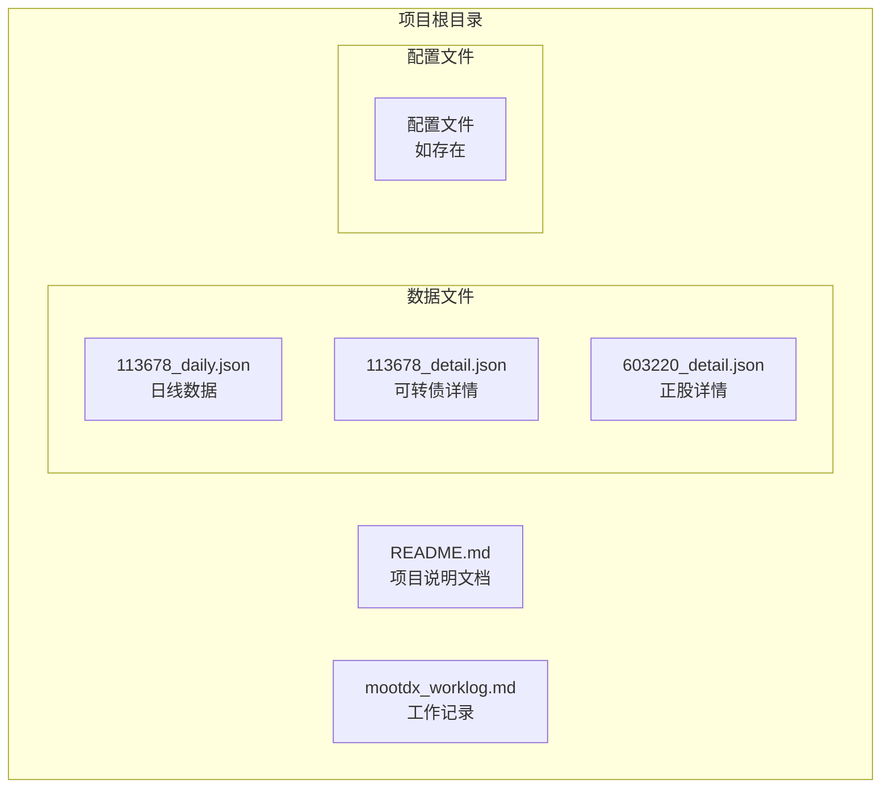
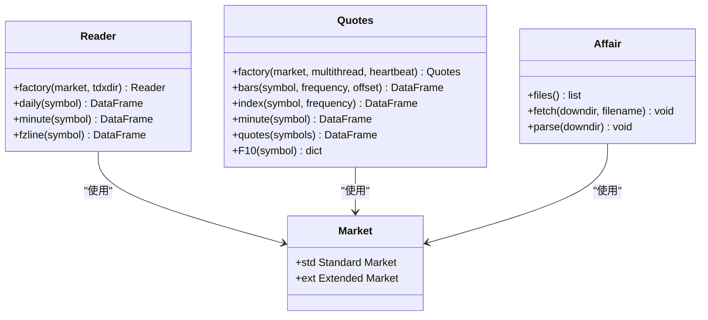
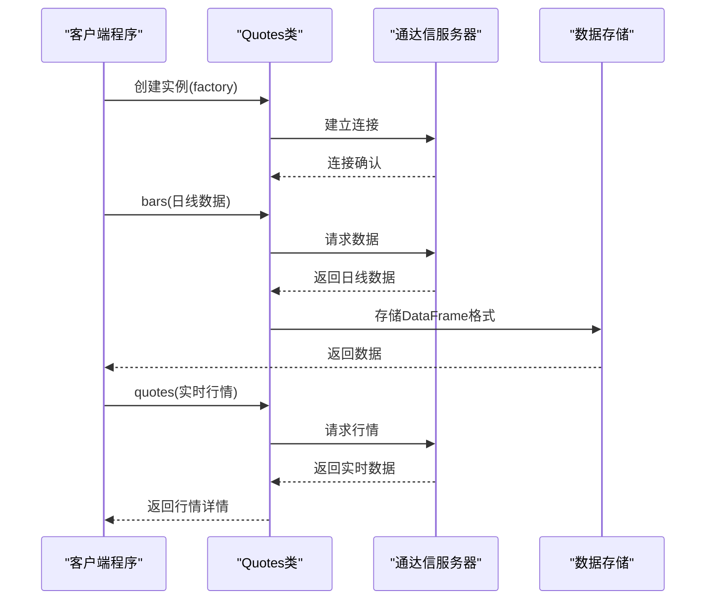
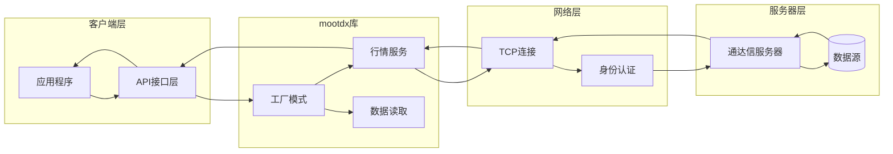
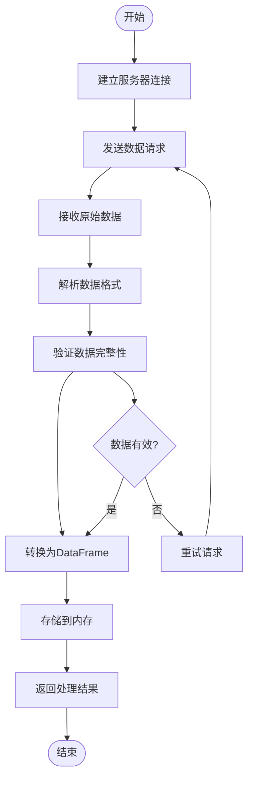
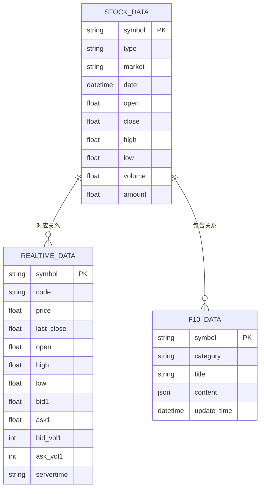
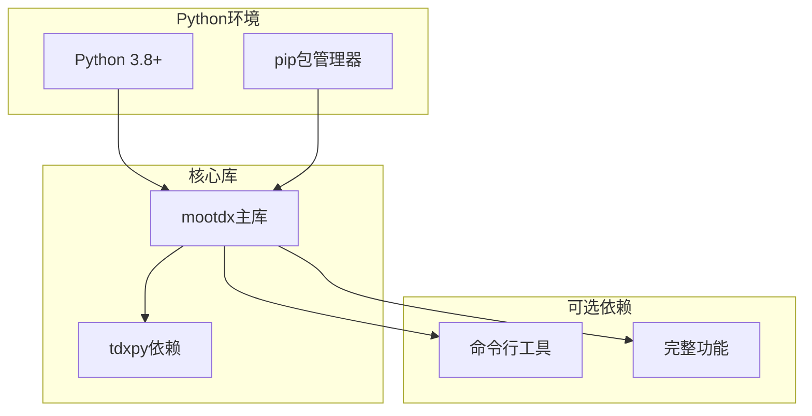
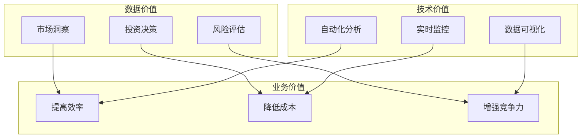
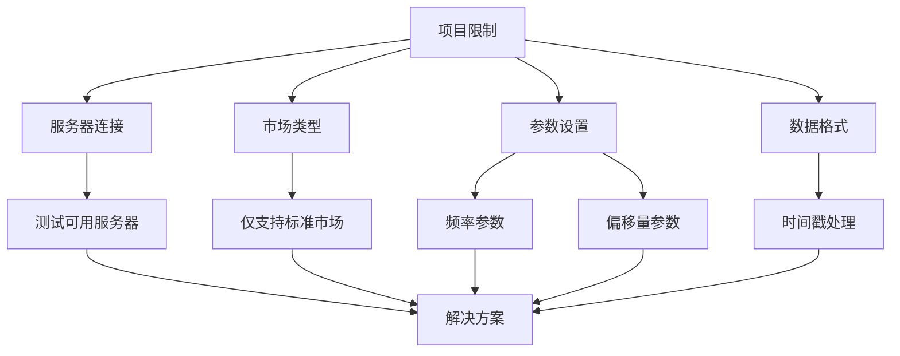
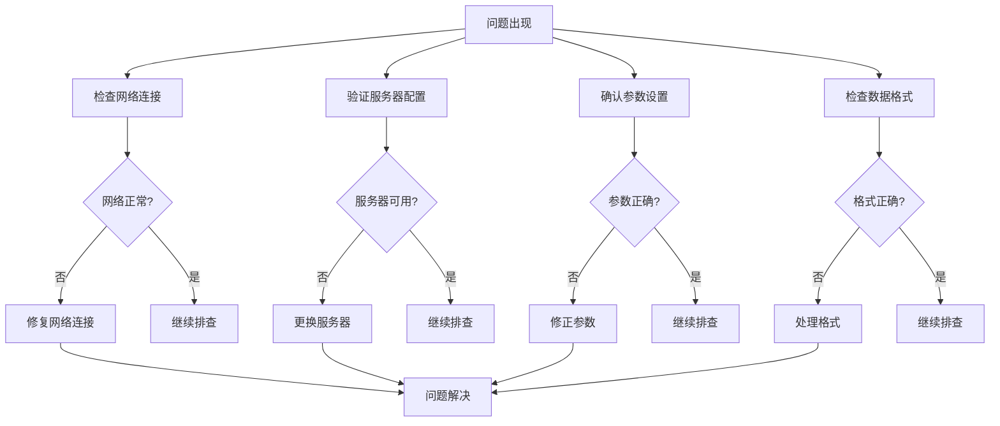

# 项目概述

<cite>
**本文档引用的文件**
- [README.md](file://README.md)
- [mootdx_worklog.md](file://mootdx_worklog.md)
- [113678_daily.json](file://113678_daily.json)
- [113678_detail.json](file://113678_detail.json)
- [603220_detail.json](file://603220_detail.json)
</cite>

## 目录
1. [项目简介](#项目简介)
2. [项目结构](#项目结构)
3. [核心组件](#核心组件)
4. [架构设计](#架构设计)
5. [数据获取能力](#数据获取能力)
6. [技术栈概览](#技术栈概览)
7. [使用场景与应用](#使用场景与应用)
8. [限制条件与注意事项](#限制条件与注意事项)
9. [最佳实践建议](#最佳实践建议)
10. [故障排除指南](#故障排除指南)
11. [结论](#结论)

## 项目简介

mootdx数据获取演示项目是一个基于Python的A股市场数据获取工具，专门用于从通达信数据源中提取和处理金融数据。该项目的核心目标是为开发者提供一个简单易用的接口，能够获取包括可转债和正股在内的A股市场实时和历史数据。

### 项目特点

- **开源免费**：采用MIT开源协议，完全免费使用
- **多平台支持**：支持Windows、MacOS、Linux操作系统
- **数据丰富**：涵盖日线数据、实时行情、F10详细数据等多种类型
- **易于集成**：提供简洁的API接口，便于二次开发

### 项目用途

本项目主要用于：
- A股市场数据获取和分析
- 可转债和正股的行情监控
- 金融数据研究和算法交易
- 投资决策支持系统

## 项目结构

项目采用简洁的文件组织结构，主要包含以下几类文件：



**图表来源**
- [README.md:1-129](file://README.md#L1-L129)
- [mootdx_worklog.md:1-134](file://mootdx_worklog.md#L1-L134)

### 文件组织说明

- **README.md**：项目的主要说明文档，包含安装指南、使用方法和API示例
- **mootdx_worklog.md**：详细的工作记录，包含数据字段说明和代码示例
- **JSON数据文件**：实际获取到的A股市场数据，包括日线数据和实时行情

**章节来源**
- [README.md:1-129](file://README.md#L1-L129)
- [mootdx_worklog.md:1-134](file://mootdx_worklog.md#L1-L134)

## 核心组件

### mootdx库架构

mootdx库提供了三个主要的数据获取模块：



**图表来源**
- [README.md:63-112](file://README.md#L63-L112)

### 数据获取流程



**图表来源**
- [README.md:81-97](file://README.md#L81-L97)
- [mootdx_worklog.md:97-127](file://mootdx_worklog.md#L97-L127)

**章节来源**
- [README.md:63-112](file://README.md#L63-L112)
- [mootdx_worklog.md:95-127](file://mootdx_worklog.md#L95-L127)

## 架构设计

### 客户端-服务器通信模式

项目采用经典的客户端-服务器架构，通过网络连接获取实时市场数据：



**图表来源**
- [README.md:81-97](file://README.md#L81-L97)
- [mootdx_worklog.md:5-8](file://mootdx_worklog.md#L5-L8)

### 数据处理流程



**图表来源**
- [mootdx_worklog.md:129-134](file://mootdx_worklog.md#L129-L134)

**章节来源**
- [README.md:81-97](file://README.md#L81-L97)
- [mootdx_worklog.md:5-8](file://mootdx_worklog.md#L5-L8)

## 数据获取能力

### 支持的数据类型

项目展示了对多种A股数据类型的获取能力：



**图表来源**
- [mootdx_worklog.md:28-94](file://mootdx_worklog.md#L28-L94)

### 具体数据示例

#### 可转债数据示例

项目包含了113678可转债的具体数据示例：

- **日线数据**：包含开盘价、收盘价、最高价、最低价、成交量等字段
- **实时详情**：包含当前价格、买卖盘口、成交量等实时信息
- **F10详情**：包含债券概况、财务分析、付息情况等多个维度

#### 正股数据示例

项目还包含了603220正股的数据示例：

- **实时详情**：展示完整的五档买卖盘口信息
- **F10详情**：包含公司概况、财务分析、股本结构等详细信息

**章节来源**
- [mootdx_worklog.md:26-94](file://mootdx_worklog.md#L26-L94)
- [113678_daily.json:1-800](file://113678_daily.json#L1-L800)
- [113678_detail.json:1-50](file://113678_detail.json#L1-L50)
- [603220_detail.json:1-50](file://603220_detail.json#L1-L50)

## 技术栈概览

### 环境要求

项目的技术栈相对简洁，主要依赖如下：



**图表来源**
- [README.md:24-54](file://README.md#L24-L54)

### 版本信息

根据工作记录显示：
- **mootdx版本**：v0.11.7
- **服务器地址**：110.41.147.114:7709
- **获取日期**：2026-05-15

### 安装配置

项目提供了灵活的安装选项：

1. **基础安装**：`pip install 'mootdx'`
2. **CLI安装**：`pip install 'mootdx[cli]'`
3. **完整安装**：`pip install 'mootdx[all]'`

**章节来源**
- [README.md:24-54](file://README.md#L24-L54)
- [mootdx_worklog.md:5-6](file://mootdx_worklog.md#L5-L6)

## 使用场景与应用

### 适用场景

基于项目展示的数据类型和功能，主要适用于以下场景：

#### 1. 金融数据分析
- A股市场趋势分析
- 可转债投资策略研究
- 正股基本面分析

#### 2. 实时监控系统
- 股票价格实时监控
- 交易信号生成
- 风险控制预警

#### 3. 算法交易
- 历史数据回测
- 实时数据驱动的交易策略
- 量化分析模型构建

### 应用价值



## 限制条件与注意事项

### 已知限制

根据工作记录，项目存在以下限制条件：

1. **服务器连接限制**
   - 部分服务器可能无法连接
   - 需要测试可用的服务器

2. **市场类型限制**
   - 扩展市场(ext)接口目前已失效
   - 仅支持标准市场(std)

3. **数据获取参数**
   - 日线数据需要通过`frequency=9`参数获取
   - 需要正确设置offset参数

4. **数据格式处理**
   - DataFrame转换为JSON时需处理Timestamp类型

### 技术约束



**图表来源**
- [mootdx_worklog.md:129-134](file://mootdx_worklog.md#L129-L134)

**章节来源**
- [mootdx_worklog.md:129-134](file://mootdx_worklog.md#L129-L134)

## 最佳实践建议

### 开发实践

基于项目展示的最佳实践建议：

#### 1. 错误处理
```python
# 建议的错误处理模式
try:
    client = Quotes.factory(market='std', server=['110.41.147.114', 7709])
    data = client.bars(symbol='113678', frequency=9, offset=1000)
except Exception as e:
    print(f"数据获取失败: {e}")
    # 尝试备用服务器或重新连接
```

#### 2. 数据验证
```python
# 建议的数据验证步骤
def validate_data(data):
    if data is None or len(data) == 0:
        raise ValueError("数据为空")
    
    # 验证关键字段
    required_fields = ['open', 'close', 'high', 'low', 'vol']
    for field in required_fields:
        if field not in data.columns:
            raise ValueError(f"缺少必要字段: {field}")
```

#### 3. 性能优化
```python
# 建议的性能优化策略
# 1. 合理设置offset参数
# 2. 批量数据获取
# 3. 适当的数据缓存
# 4. 并发连接管理
```

### 数据处理建议

#### 1. 数据清洗
- 处理缺失值和异常值
- 标准化数据格式
- 验证数据完整性

#### 2. 数据存储
- 选择合适的存储格式(JSON/CSV/数据库)
- 建立索引以提高查询性能
- 定期备份重要数据

#### 3. 数据安全
- 敏感数据加密存储
- 访问权限控制
- 数据传输安全

## 故障排除指南

### 常见问题诊断



### 具体解决方案

#### 1. 服务器连接问题
- 测试多个服务器地址
- 检查防火墙设置
- 验证网络连通性

#### 2. 数据获取失败
- 检查symbol代码格式
- 验证market参数设置
- 确认权限和配额

#### 3. 数据格式问题
- 处理Timestamp类型转换
- 验证JSON格式有效性
- 检查编码格式

**章节来源**
- [mootdx_worklog.md:129-134](file://mootdx_worklog.md#L129-L134)

## 结论

mootdx数据获取演示项目为A股市场数据获取提供了一个简洁而强大的解决方案。通过其清晰的架构设计和丰富的数据获取能力，该项目能够满足从初学者到专业开发者的不同需求。

### 项目优势

1. **易用性强**：提供简洁的API接口，学习成本低
2. **功能丰富**：支持多种数据类型和获取方式
3. **扩展性好**：基于工厂模式设计，易于扩展新功能
4. **社区活跃**：开源项目，持续维护和更新

### 发展前景

随着中国资本市场的不断发展，mootdx项目在以下方面具有良好的发展前景：
- 更完善的数据覆盖范围
- 更智能的数据分析功能
- 更友好的用户界面
- 更强大的算法交易支持

该项目为金融数据获取和分析奠定了坚实的基础，值得进一步深入学习和应用。